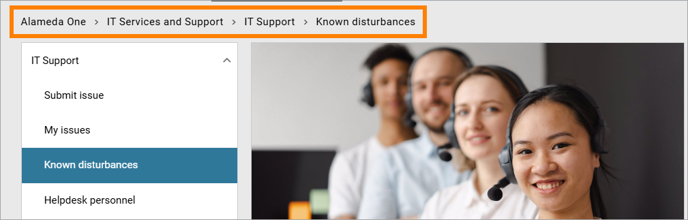
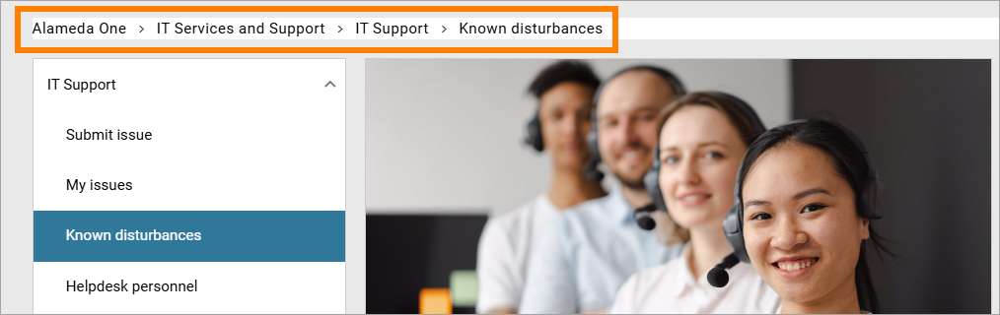
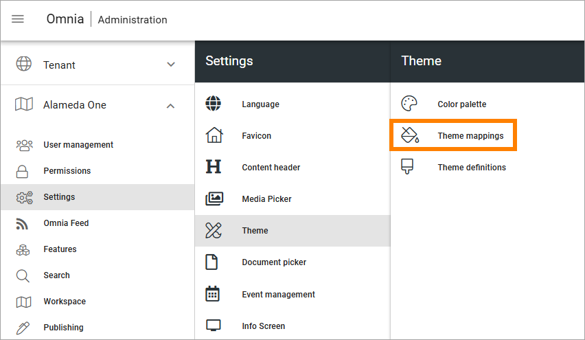
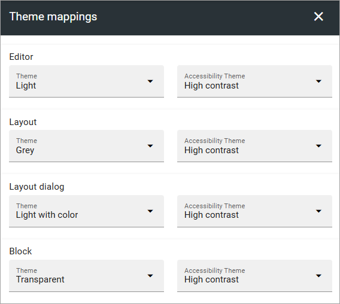

Accessibility
===========================================

**This page is being updated.**

Omnia is WCAG 2.1aa compliant. The accessibility features are available from start. A user can decide to turn these on at any time.

It's up to each user to do that in the User profile menu:

.. image:: accessability-profile.png

Select "Use accessibility features".

.. image:: accessability-profile-select.png

How visible the differences are can differ a lot depending on how the default themes for the business profile are set up, and how the themes are used for blocks and for backgrounds on pages, but generally contrasts are higher. Here's an example for the breadcrump.

Accessibility not turned on:

Accessibility turned on:

It's a small but important difference.

Generally, it's up to administrators of a specific, customer implementation, to set up look and feel in a way that high accessibility is achieved. 

In Omnia admin, theme mappings can be set up between the "accessibility theme" and other themes, if needed. That option can be used by a business profile administrator and is found here, for a business profile:

Here's an examaple of a mapping:
   

