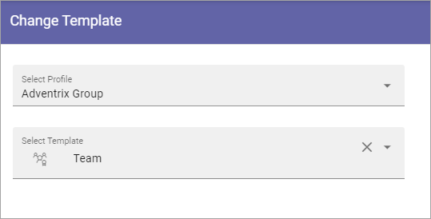

App settings
==============

There are a few settings available on App level (site level). Here's what can be available:

.. image:: app-settings.png

To reach these settings you must do the following:

1. Go to the site.
2. Go to Omnia Admin.
3. Select the App.

Features
***********
Here you activate, update or remove features for the App (site), for example:

.. image:: app-settings-features.png

An example: If your organization is using Document Management, you must go here to activate the Controlled Documents library for sites where working with Controlled Documents should be possible. (In this example Controlled Documents is already activated). If any updates to that Features is needed, you go here as well.

Security
**********
Use Permissions to add or remove App Administrators.

.. image:: app-settings-security.png

Settings
**********
Under Settings, the following is available:

.. image:: app-settings-settings.png

Edit settings
---------------
Here you can edit the settings for the App (site), which was set when the App was created. The settings available depends on the Provisioning Template selected for the App. See this page for more information: :doc:`Provisioning Templates </admin-settings/business-group-settings/provisioning-templates/index>`

.. image:: app-settings-settings-edit-1.png

Switching Template
-------------------
If necessary, you can change to another Provisiong Template for the App (site) here, but the recommendation is that you do that only for Apps that are not really used yet.

First select Profile and then select Template for the profile. (Available templates depend on the profle chosen).

