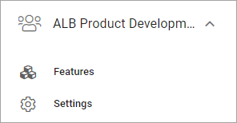
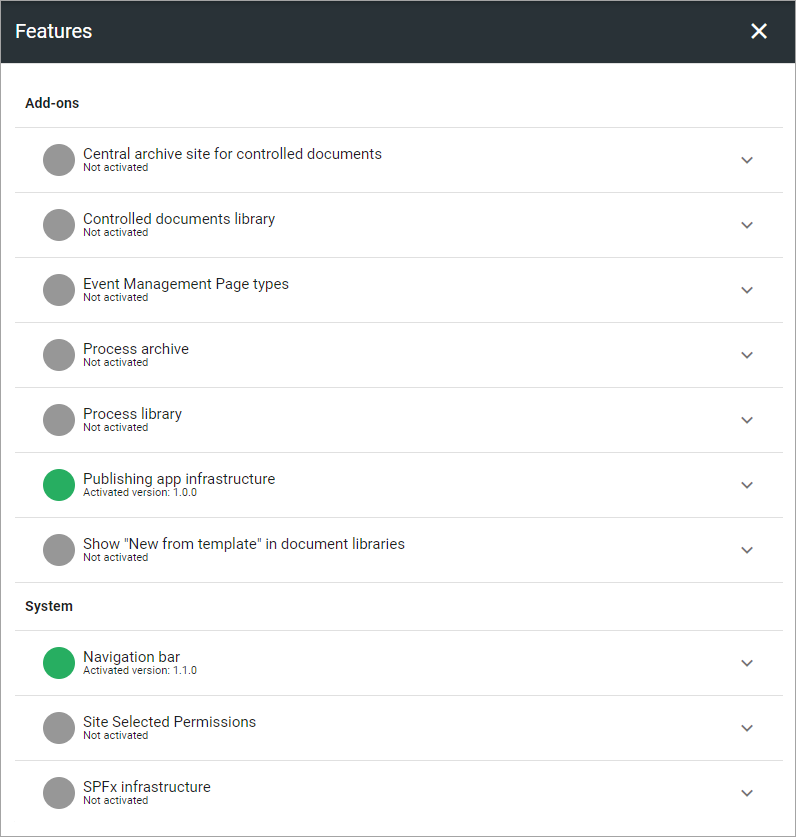
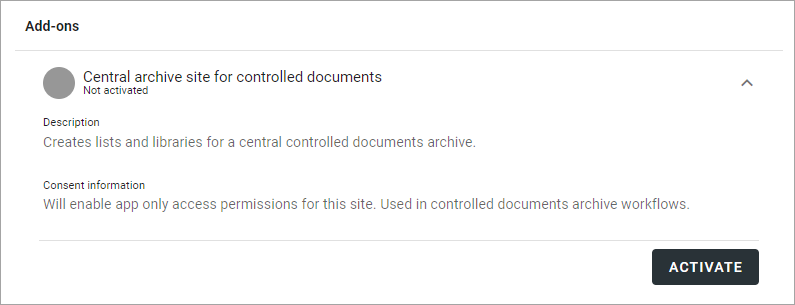
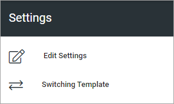
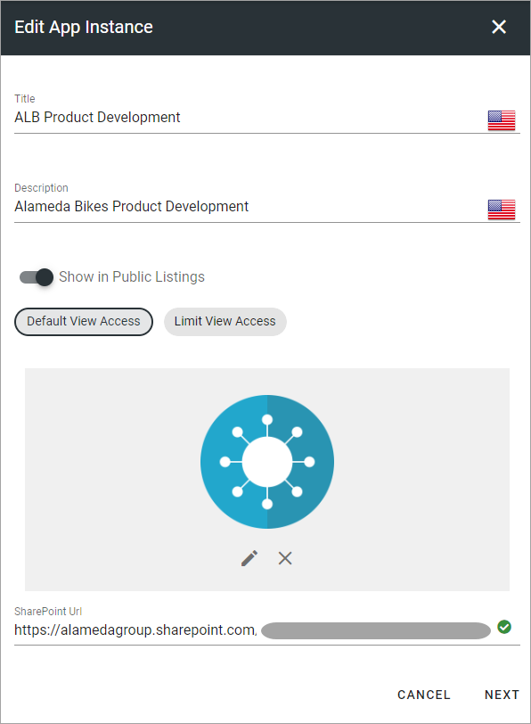
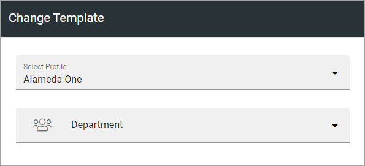

App settings
==============

There are a few settings available on App level (site level). Here's what can be available:

To reach the App settings as described here, you must do the following:

1. Go to the site.
2. Go to Omnia Admin.
3. Select the App.

Features
***********
Here you activate, update or remove features for the App, for example (image from Omia 7.0):

An example: If your organization is using Document Management, you must go here to activate the Controlled Documents library for sites where working with Controlled Documents should be possible. If any updates to that Features is needed, you go here as well.

Descriptions and options
---------------------------
For a description of a feature, and when using any option, expand the feature (available in Omnia 7.0 and later):

Settings
**********
Under Settings, the following is available:

Edit settings
---------------
Here you can edit the settings for the App, which was set when the App was created. The settings available depends on the template selected for the App. (Image from Omnia 7.0).

If you select "Limit View Access" you can change view permissions for the app to specific users.

Switching Template
-------------------
If necessary, you can change to another template for the App here, but the recommendation is that you do that only for Apps that are not really used yet.

First select Profile and then select Template for the profile. (Available templates depend on the profile chosen).

See this page for more information: :doc:`Templates for Publishing Apps </admin-settings/business-group-settings/publishing-apps/publishing-65/templates/index>`

