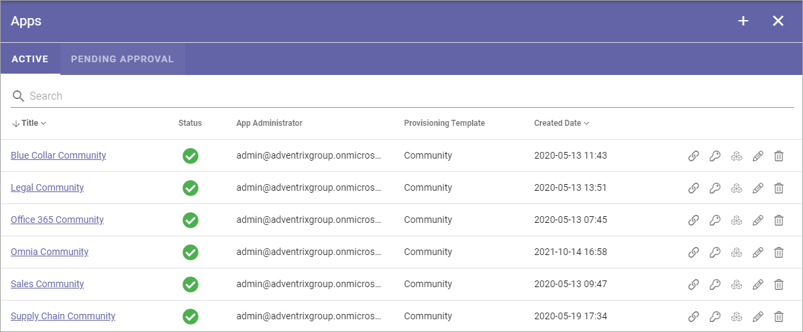
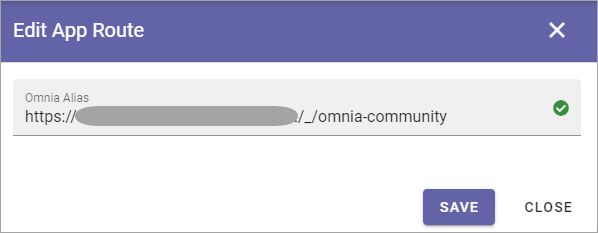
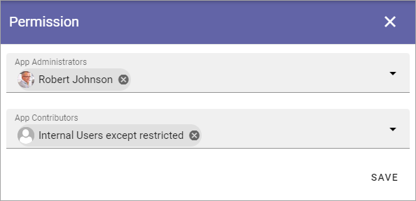
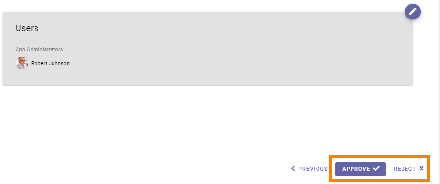
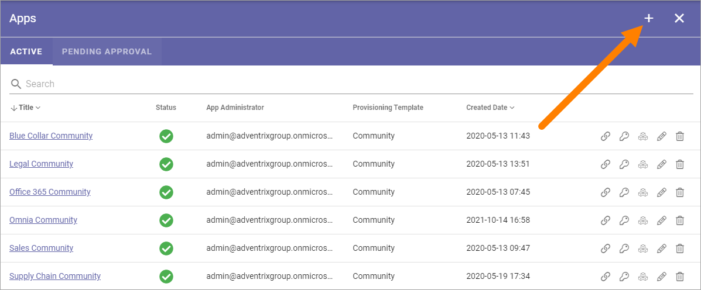
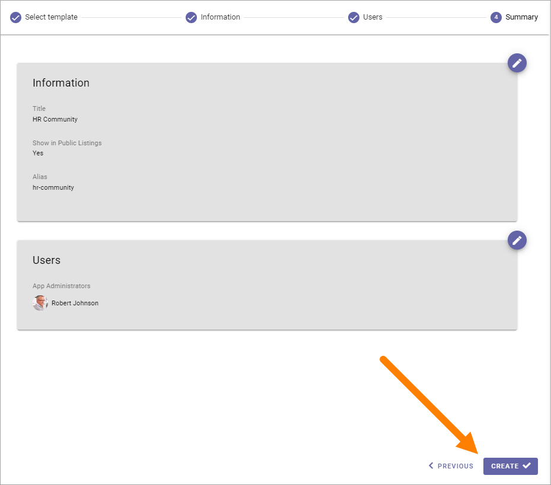

Communities apps
======================

Within a business profile several community apps can be active for different settings. To be able to create a Community App, at least one template for this purpose must be available. If none are, create a template first.

Here you will see a list of community apps in the business profile, for example:

You can click the link to go to an app.

Use the icons this way:

+ The left-most icon to edit the app route, if needed.
+ The key to add or remove app administrators.
+ The boxes to activate, deactivate or upgrade features.
+ The pen to edit the settings (same as when creating a new, see below).
+ The dust bin to delete a community app.

**Note!** To be able to delete a community app, you must be app administrator for the community.

Edit app route
*****************
If it should be needed to edit the app route, click the icon and the following is shown:

Edit the app route and save.

Edit permissions
*****************
If you need to add or remove administrator(s) or contributors for a community app, you do it here:

Contributor permissions is needed if colleagues should be able to add comments to community pages.

Don't forget to save when you're done.

Edit features
**************
If it's needed to upgrade a feature for a community app, you go here. You also go here to activate or remove a feature.

.. image:: publishing-apps-app-features-community-612-new.png

Pending approval
*****************
If approval for creation is activated for the template that is used when creating a new communities app, an administrator uses this list to work with approval or rejection.

The list can look like this:

.. image:: community-pending-approval-611.png

To approve or reject, click the link and browse the settings. And here you decide:

If you click "Approve", the community app is created and the colleague requesting the approval is notified. If you click "Reject" you add a comment of what needs to be done before it can be approved:

.. image:: community-pending-approval-comment-611.png

**Note!** Requesting an app must always be done from start each time. If rejected, nothing from the request is saved.

Create a new community app
*****************************
Do the following:

1. Click the plus.

2. Select a template (can be one or more).

.. image:: community-app-template-611.png

3. Use the settings:

.. image:: community-app-template-settings-611.png

Available settings depends on how the template is set up. Here are some common examples:

+ **Title**: Add a title for the community app.
+ **Description**: Add a Description if needed.
+ **Add image**: The editor setting up a Community Rollup can choose to show an image for communities, both for List and for Card display. Here you can select an image to be shown there, using the media picker. When an image has been selected it can be deleted or edited using the X and the pen that is shown then.
+ **Show in public listings**: If a link to the app should be available in public listings (meaning listings in Omnia), should be available, select this option. If this option is deselected, the app can only be reached by specific links, for example in a workspace navigation.
+ **Omnia alias**: The last part of the address to the site is created automatically but can be edited if necessary. If the name (address) already exists an alternative address is suggested.

4. Click "Next" and use the following settings:

.. image:: community-apps-settings-611.png

+ **App administrators**: The active administrator (you) is automatically added as app administrator. Add or delete administrators as needed (must always be at least one). 

5. Click NEXT.

6. Check the info added and edit if necessary.

7. Click "CREATE" to create the Community App.

When the community is created (with approval needed or not), it can be a good idea to check the settings to see if anything needs to be edited there, before the community is used.

8. Go to the publishing app settings.

.. image:: community-apps-settings-612-new.png

9. Edit the settings if needed.

Settings for a community app are the same as for any publishing app. For more information, see: :doc:`Publishing app settings </pages/page-settings/index>`.

