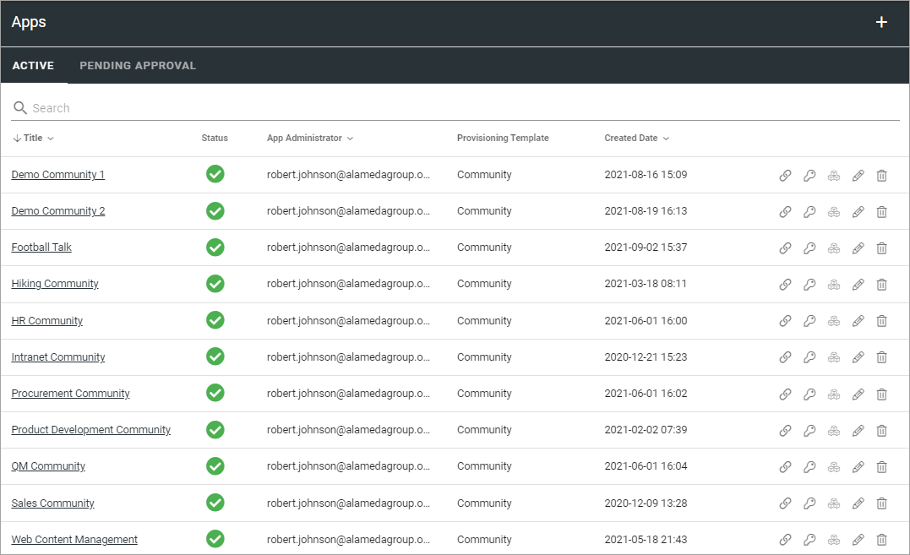
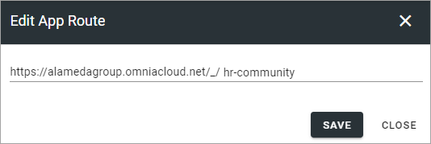
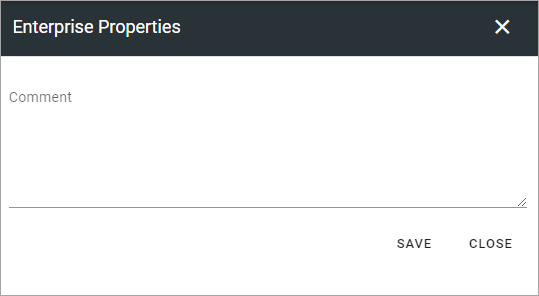
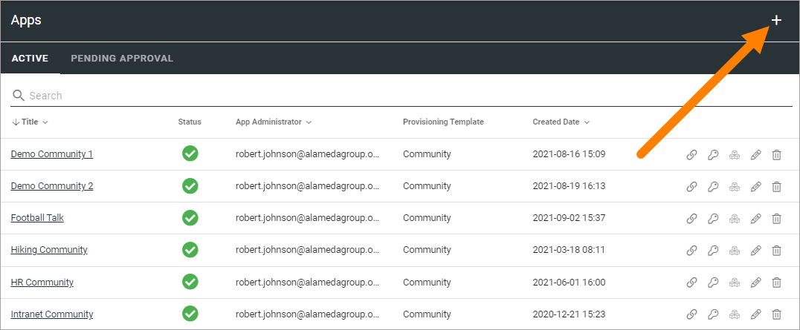
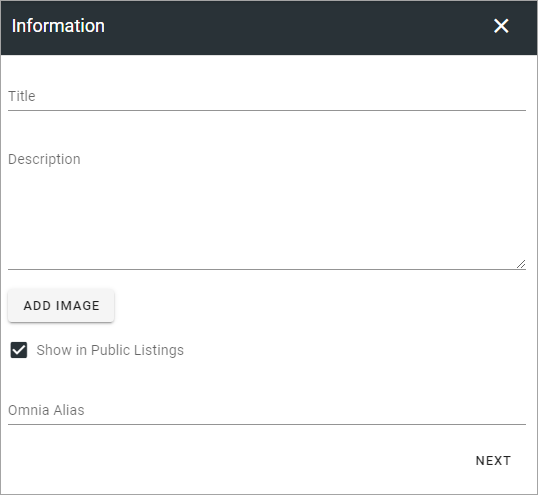

Apps
========

This is an ongoing, preliminary documentation for functionality to come in Omnia 6.5.

Within a Business Profile several Community Apps can be active for different settings. To be able to create a Community App, at least one template for this purpose must be available. If none are, create a template first.

Here you will see a list of Community Apps in the Business Profile, for example:

You can click the link to go to the app.

Use the icons this way:

+ The left-most icon to edit the app route, if needed.
+ The key to add or remove App Administrators.
+ The boxes to activate, deactivate or upgrade features.
+ The pen to edit the settings (same as when creating a new, see below).
+ The dust bin to delete a Publishing App that has been created by mistake.

Edit App Route
*****************
If it should be needed to edit the App Route, click the icon and the following is shown:

Edit Permissions
*****************
If you need to add or remove Administrator(s) for an app, you do it here:

.. image:: publishing-apps-app-premissions-community-65.png

Don't forget to save when you're done.

Edit Features
**************
If it's needed to upgrade a feature for a Community App, you need to go here. You also go here to activate or remove a feature.

.. image:: publishing-apps-app-features-community-65.png

Pending Approval
*****************
If Approval for creation is activated for the template, an administrator uses this list to work with approval or rejection.

The list can look like this:

.. image:: community-pending-approval.png

To approve or reject, click the link and browse the settings. And here you decide:

.. image:: community-pending-approval-approve.png

If you click Approve, the Community App is created and the colleague requesting the approval is notified. If you click Reject you add a comment of what needs to be done before it can be approved:

**Note!** Requesting an app must always be done from start each time. If rejected, nothing from the request is saved.

Create a new Community App
*****************************
Do the following:

1. Click the plus.

2. Select a template.

.. image:: community-app-template-65.png

3. Use the following settings:

Available settings depends on how the template is set up. Here are some common examples:

+ **Title**: Add a Title for the Community App.
+ **Description**: Add a Description if needed.
+ **Add Image**: (A description will be added soon).
+ **Show in Public Listings**: If a link to the app should be available in public listings (meaning listings in Omnia), should be available, select this option. If this option is deselected, the app can only be reached by specific links, for example in a Workplace navigation.
+ **Omnia Alias**: The last part of the address to the site is created automatically but can be edited if necessary. If the name (address) already exists an alternative address is suggested.

4. Click "Next" and use the following settings:

.. image:: community-apps-settings-65.png

+ **App Administrators**: The active Administrator (you) is automatically added as App Administrator. Add or delete administrators as needed. 

3. Click "CREATE" to create the Community App.

Next step can be to add some properties, for example:

.. image:: community-apps-properties-65.png

In this example, you can see that each option is indicated by a star, indicating they are mandatory.

4. Add information to the fields and select "Is Active".

In this example the template stipulates that Communities must be approved by an administrator, hence SEND FOR APPROVAL. If self service is selected for the template, it would say CREATE.

5. Create the Community or send for approval, depending on how the template is set up.

Community App settings
*************************
Settings for a Community App is the same as a Publishing App, and it's done in the Settings menu for the Community, see: :doc:`Publishing App Settings </pages/page-settings/index>`.

