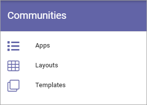

Communities
====================================

Here you can work with apps and templates for Communities. You can also find ready made layouts for Community start pages.

Prerequisite: The Tenant featurer "Process Management" must be active for any community options to be available. A tip: There are example community templates to activate in features for the business profile.

Select section for more information:

.. toctree::
   :titlesonly:

   apps/index
   layout/index
   templates/index

A Community Rollup block is also available: :doc:`Community Rollup block </blocks/community-rollup/index>`

