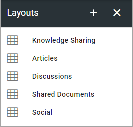
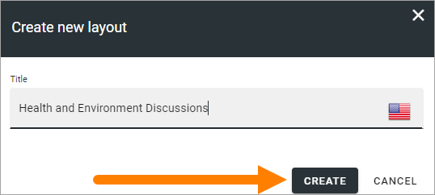
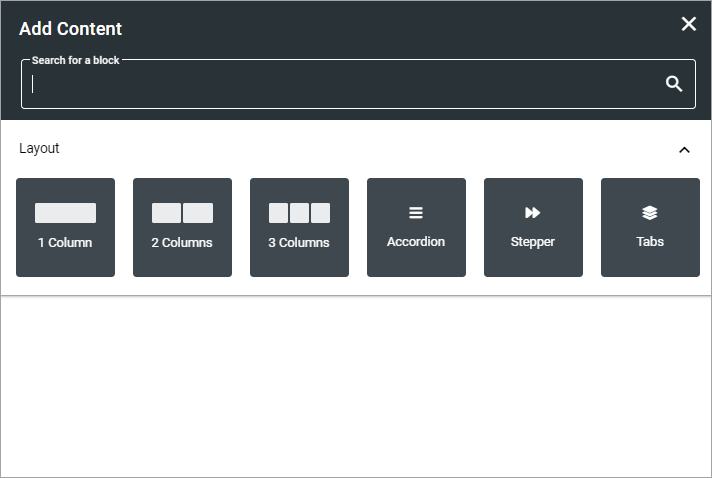
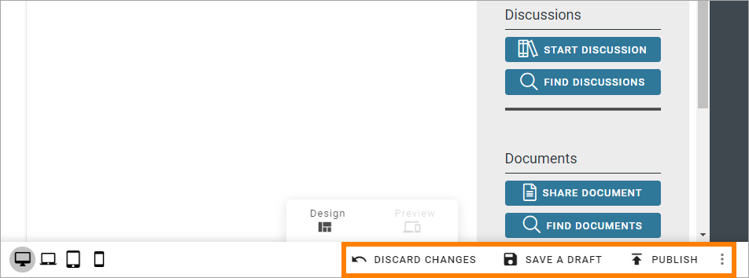
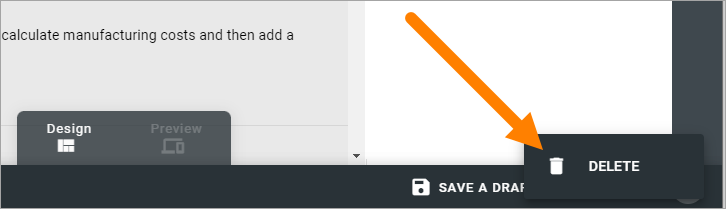

Layouts for Communities
==========================

Here you can work with ready made layouts for Community start pages, which can be created for any language, that can be chosen when a Page Collection for a Community is created. Here's an example of a list of layouts for communities:

To create a new layout, do the following:

1. Click the plus.

.. image:: layout-click-plus-612.png

2. Add a name for the layout in any or all the available tenant languages (click the flag to change language).
3. Click Create.

To start working on the layout, continue this way:

4. Click on the name.

.. image:: layout-click-name-612.png

5. Use this work area to create the layout. 

.. image:: layout-click-work-area-612.png

You work with the layout in a similar way to Page Types. You can use all sections and blocks available.

Start by adding a section layout, just like you would do when working with a Page Type.

Then continue building up the layout using sections and blocks.

For more information, see these pages:

+ :doc:`Working with sections and blocks </pages/page-types/working-with-sections-and-blocks/index>`
+ :doc:`Settings for sections </pages/page-types/section-settings/index>`
+ :doc:`Working with blocks </blocks/working-with-blocks/index>`

Also note the previews for the different screen sizes:

.. image:: layout-click-work-area-screen-new.png

Saving a draft and publishing
---------------------------------
Saving a draft, discarding changes and finally publishing the layout, works very similar to working with pages.

For more information, see these pages:

+ :doc:`Edit a page </pages/edit-page/index>`
+ :doc:`Publish page changes </pages/publish-page-changes/index>`

But note that it's very similar, not exactly the same. Some options for pages are not available here (like scheduled publishing).

One thing that is perhaps not that obvious is how to delete a layout, if needed. You will find that option in the menu:

