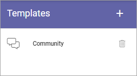
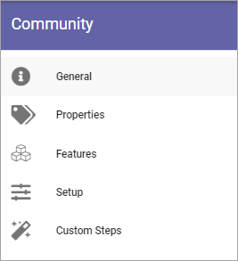
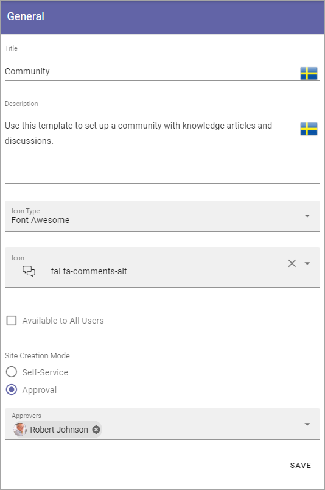
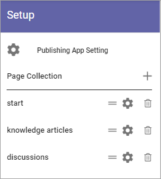

Templates
===========

This is an ongoing, preliminary documentation för functionality to come in Omnia 6.5.

In Omnia 6.5 the option Provisioning templates will be removed. Instead, templates will be administrated under each main option, so here  you can work with templates for Communities.

To edit a template, click the name - to delete, click the dust bin.

Creating a new Community template
*************************************
To create a new template, do the following:

1. Click the plus.

.. image:: community-template-click-plus.png

Use the following settings:

.. image:: community-template-settings.png

+ **Title**: Add a Title for the Template. You can add titles in a number of the languages available in the tenant. Default language is mandatory.
+ **Description**: Add a Description if needed. 
+ **Icon Type**: An icon is always shown for a template. If you would like another icon for this template, select the set of icons here: Font Awesome, Microsoft, Flags or Custom. When selecting Custom you can choose any image as the icon.
+ **Icon**: When you have select Icon Type, use this list to select the icon. If you select Custom, a Url field is shown, where you enter the Url for the image.
+ **Available to All Users**: Select this option if the template should be available for other's than administrators, for example in the user Wizard for creating new teamworks. If this option is NOT selected, the template will be available only for administrators to use in Omnia Admin.
+ **Property Set**: You can select a property set here, to be used for the template, meaning a number of properties that the colleague creating the site will or will have to fill in when the template is used.  
+ **Site Creation Mode**: Here you select if approval is required when users create sites from this template. 

Settings for the template
***************************
There are a lot of settings you can do for the template when it's created.

1. Click the template to edit.

The following is shown:

General
----------
Here you can edit the information you added and the options you selected when creating the template:

See above for a description.

Properties
------------
You can add a property set to the template. 

.. image:: community-edit-properties.png

The properties in the set can or will have to be filled in when a community is created from this template.

The property sets are set up using the Tenant settings. See this page for more information: :doc:`Property sets </admin-settings/tenant-settings/properties/property-sets/index>`

Features
----------
Select the features that should be available for the community (all are not shown in the image):

.. image:: community-edit-features.png

Setup
-------
Using the options here you can set which parts of a community that should be created when this template is used:

(More information about this will be added soon).

Custom steps
---------------
If any custom steps has been developed for the creation of communities, you can select them using this option.

.. image:: community-edit-custom-steps.png
