Directory of communities in Omnia v7
=====================================

Within a business profile several communities can be active for different settings. To be able to create a community, at least one template for this purpose must be available. If none are, create a template first.

Here you will see a list of communities in the Business Profile, for example:

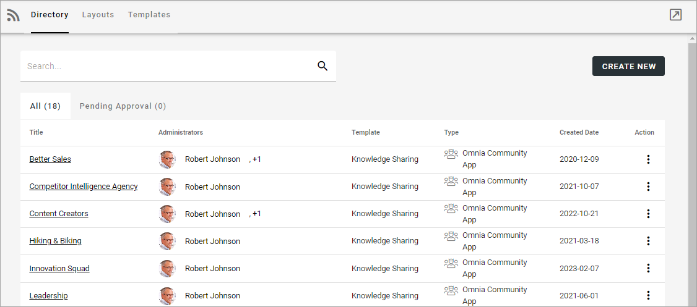

Use this icon to close the menu to the left and work in full window mode:

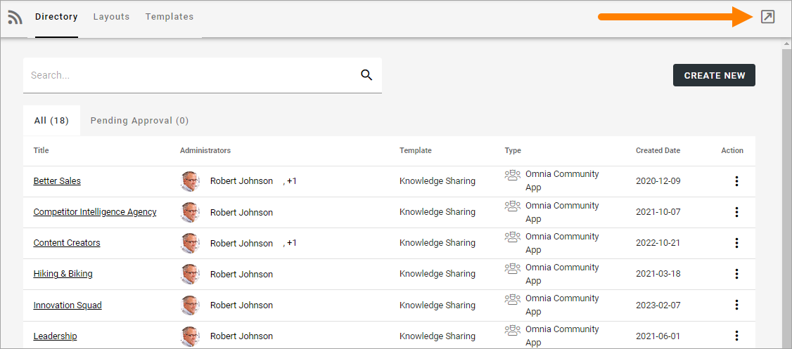

You can click the link to go to a community. You can search for a community and use the headings "Title", "Template" and "Created Date" to sort the list.

The following actions, using the dot menu to the right, are available for a community in the "All" list:

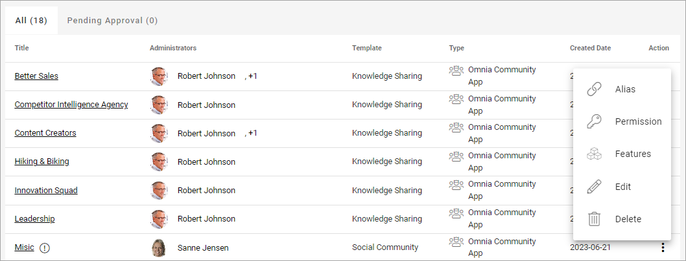

**Note!** To be able to delete a community, you must be App Administrator for the community. Also note that deleting a community from this list does not delete 
the connected Sharepoint site.

For more information, see below.

Create a community
***********************
To create a community from here, do the following:

1. Click CREATE NEW.
2. Select template. 

Here's an example:

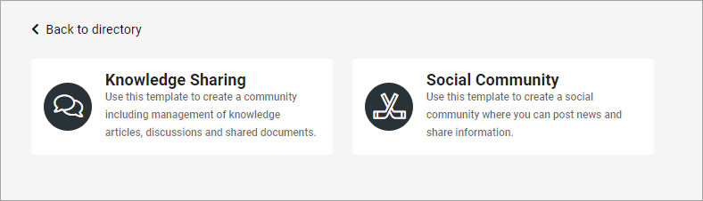

3. Add the information needed. (All steps in the setup may not be needed for a certain template. Here's a common example).

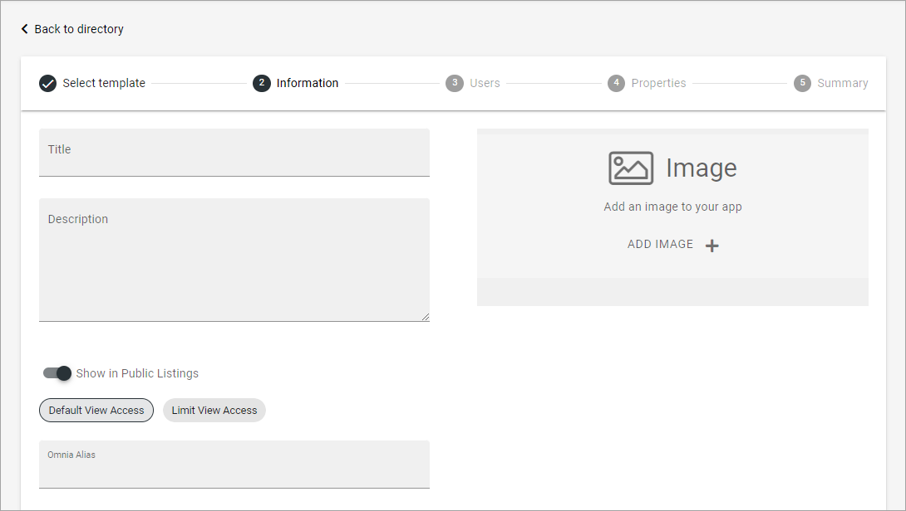

Available settings depend on how the template is set up. 

+ **Title**: Add a title for the community.
+ **Description**: Add a dscription if needed.
+ **Show in Public Listings**: If a link to the community should be available in public listings (meaning listings in Omnia) select this option. If this option is deselected, the community can only be reached by specific links, for example in a Workspace navigation.
+ **Default View Access/Limit View Acess**: If you select “Limit View Access” you can change view permissions for the community to specific users.
+ **Alias**: The last part of the address to the site is created automatically but can be edited if necessary. If the name (address) already exists an alternative address is suggested.
+ **Languages**: The same language as the main business profile language is suggested. Another language can be selected if needed.  
+ **ADD IMAGE**: The editor setting up a Community Rollup can choose to show images for the communities, both for List and for Card display. Here you can select an image to be shown there, using the Media Picker. When an image has been selected it can be deleted or edited using the X and the pen that is shown then.

4. Click "Next" and use the following settings:

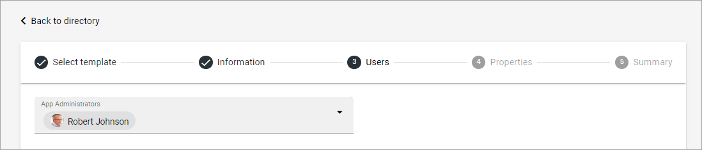

+ **App Administrators**: The active administrator (you) is automatically added as app administrator. Add or delete administrators as needed. There must always be at least one.

5. The Properties step may be different in different templates, or maybe not be needed at all. Here's an example. Note that a star indicates if that the property is mandatory.

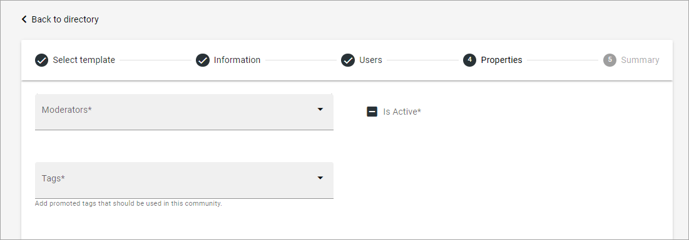

When you click NEXT, a summary is shown, where you can click the pen the edit any of the steps.

6. Click CREATE to create the community or SEND FOR APPROVAL, depending on how the template has been set up.

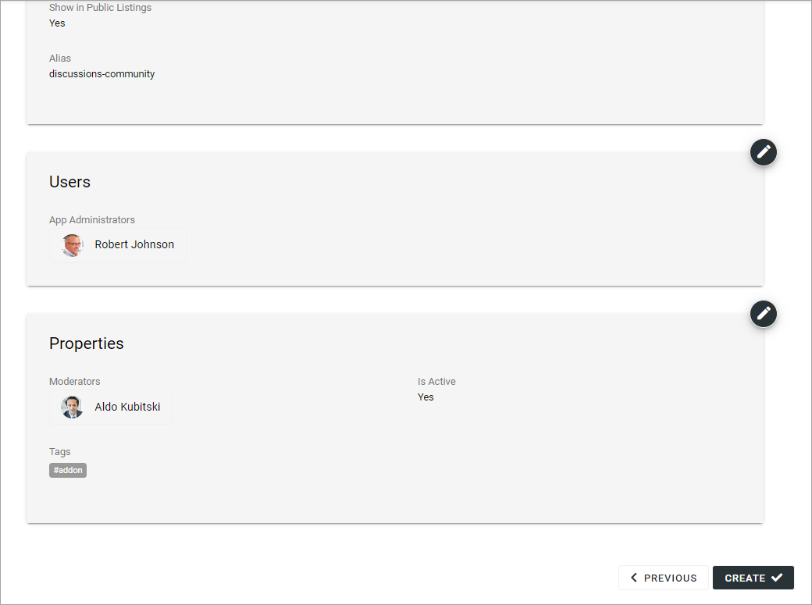

Edit settings for a community
**********************************
Using the action EDIT you can edit the settings for a community. What can be edited can depend on the template. Here's an example:

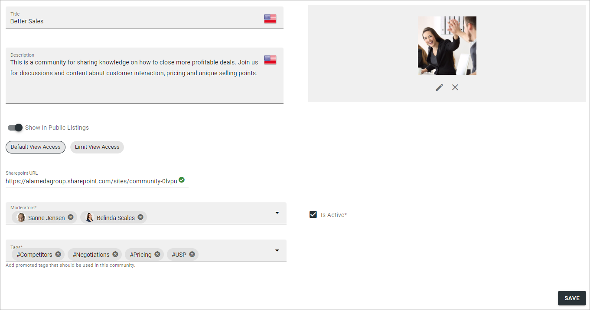

+ **Sharepoint URL**: The app instance connected site's URL can be edited here, if needed.

For a description of the rest of the options, see above.

Edit App Route
****************
If it should be needed to edit the app route, Select "Alias" in the dot menu for the community and the following is shown:

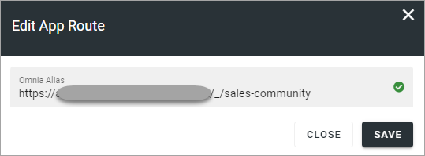

Edit the app route and save.

Edit Permissions
******************
If you need to add or remove owners (administrators) or contributors for a community, select "Permission" in the dot menu for the community.

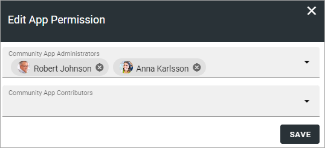

Don't forget to save when you're done.

**Note!** A user or a group must be permissions enabled to show up in the list.

Edit Features
***************
If it's needed to upgrade a feature for the community, you need to go here. You also go here to activate or deactivate a feature. Available features can differ depending on how Omnia is set up. Here's an example:

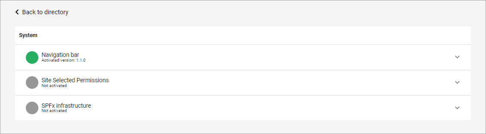

For more information about a feature, expand it.

Pending Approval
*****************
When a user creates a community where approval is needed, an administrator uses this list to approve or reject. Here's an example from a test environment:

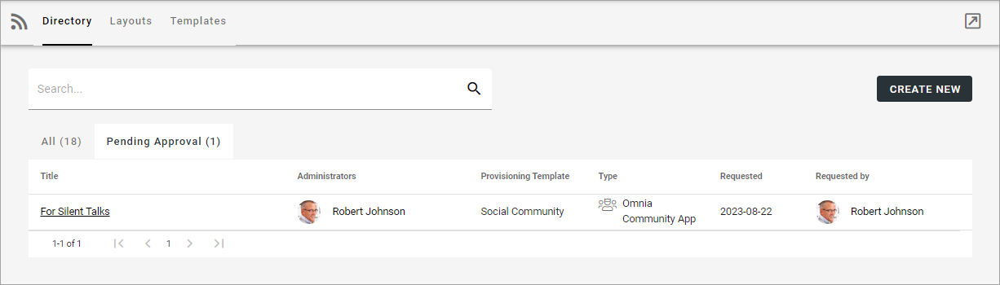

Approval or rejection is done this way:

1. Click the link for the community.
2. Check the name, settings and so on.
3. If everything is OK, click "Approve", or if changes are needed, click "Reject".

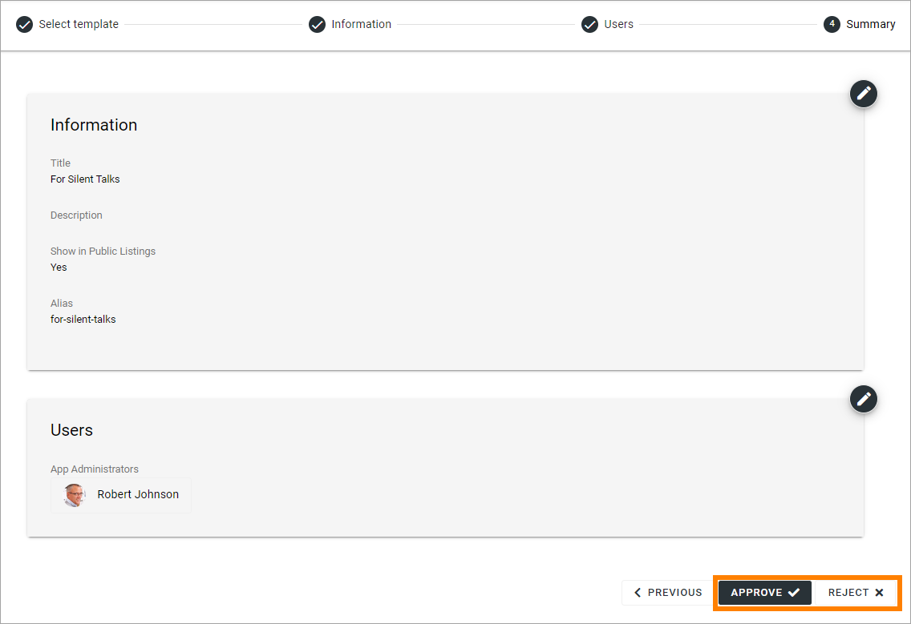

If you approve the creation of the community, a message is sent to the person requesting it, and the community is created.

If you reject, the following is shown:
 
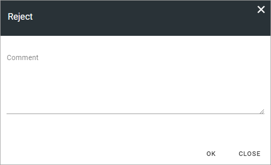

4. Type a message stating what needs to be done for approval, and click "Save" to send the message.

The person requesting the community receives the message and can then start a new community creation with your comments in mind. 

**Note!** Requesting a community must always be done from start each time. If rejected, nothing from the request is saved.

