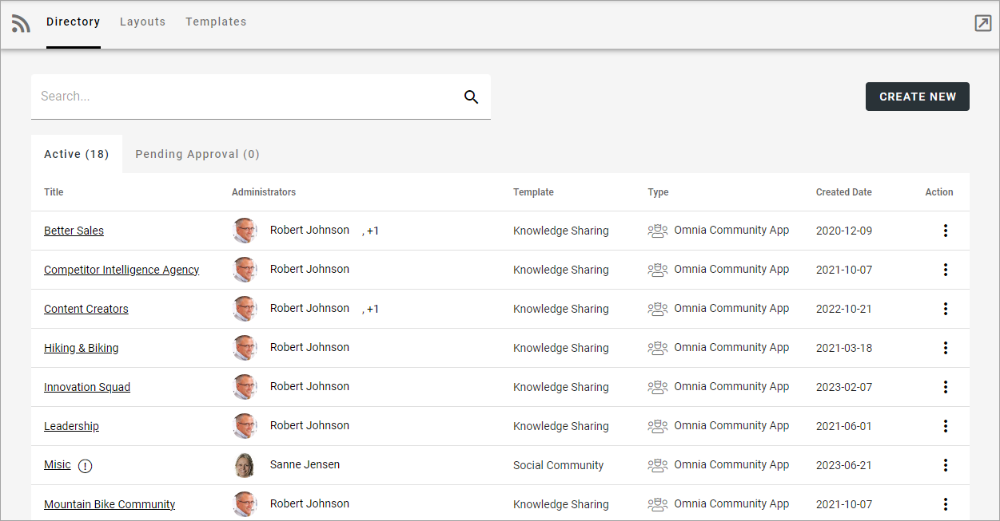

Communities settings in Omnia v7
================================================

This page and the pages available here, describes how these options work in Omnia 7.0 and later. For Omnia 6.13, see this page: :doc:`Communities settings in Omnnia 6.13 </admin-settings/business-group-settings/communities/communities-65/index>`

The following settings are available in Omnia 7.0 and later:

Select section for more information:

.. toctree::
   :titlesonly:

   directory/index
   layouts/index
   templates/index

A Community rollup block is also available: :doc:`Community rollup block </blocks/community-rollup/index>`

