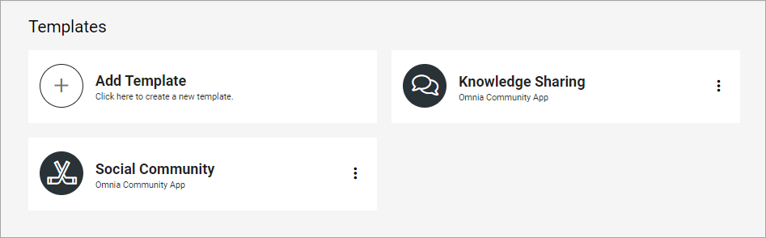
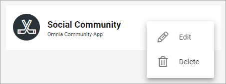
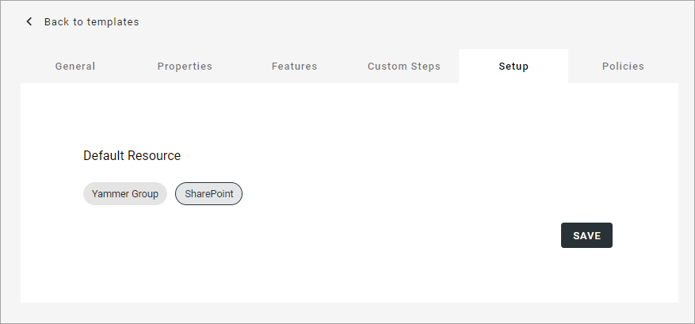

Templates for communities in Omnia v7
=======================================

Here  you can work with templates for communities - Omnia Community Apps and Yammer Communities. The first list displays all templates that has been created so far, for example:

The following actions are available in the dot menu for a template:

To edit a template, you can also just click the name. When you edit a template, all options that are described below are available.

You create templates for publishing apps, community sites and teamwork the same way, see this page: :doc:`Creating app templates in Omnia v7 </general-assets/creating-app-templates/index>`

All settings for Omnia Community Apps works as described on the page linked above, even if available property sets and available features can differ. Creating a template for a Yammer Community is slightly different. The differences are explained here.

Creating a template for a Yammer Community
********************************************
Firstly, there are no features available for a yammer community template. Besides that, the only settings that are available in the Setup step are these:

Select either Yammer Group or Sharepoint as default resource.

