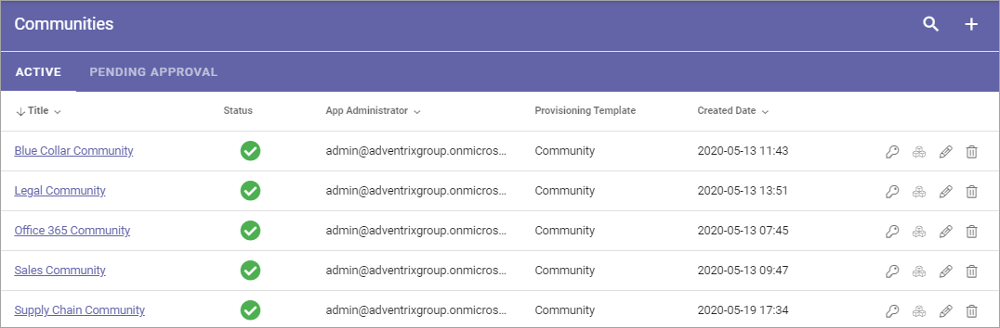
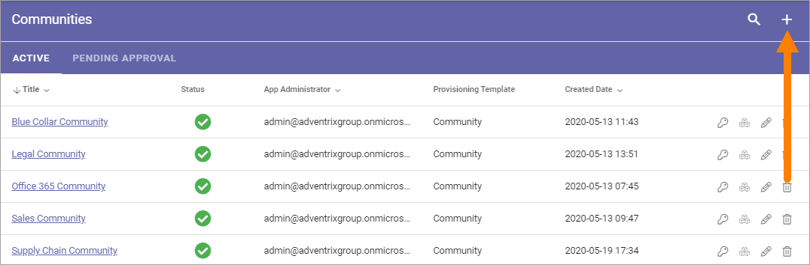

Communities
============

Use these settings to go to any community site to, for example, edit settings. You can also create a new community site from here.

For Community sites with "Approval" as site creation mode, you use the "Pending Approval" list to approve or reject creation of a site.

Use the icons this way:

+ The key to edit permissions.
+ The boxes to activate, deactivate and upgrade features.
+ The pen to edit some settings.
+ The dust bin to delete the site. 

You can use the headings for Title, App Administrator, Provisioning Template and Created Date to sort the list.

You can also search the list.

.. image:: communities-search-new.png

Create a Community Site
*************************
To create a Community Site from here, do the following:

1. Click the plus.

2. Select provisioning template. See this page for more information: :doc:`Provisioning Templates </admin-settings/business-group-settings/provisioning-templates/index>`

.. image:: community-new2-new.png

3. Set the following settings:

.. image:: community-new2x-new.png

Available options depend on the template chosen. Here's some common ones:

+ **Title**: Add a Title (name) for the community site here.
+ **Description**: It's a good idea to add a description of the site's purpose here, but it's not mandatory.
+ **Show in public listings**: If links to this community should show up in listings available for all colleagues, select this option. Default: selected.
+ **Omnia Alias**: The last part of the address to the site is created automatically but can be edited if necessary. If the name (address) already exists an alternative address is suggested.
+ **Enable discussion**: If the Discussion functionality should be used in the community, select this option. Note that this can't be edited later, you must decide now.
+ **Enable knowledge articles**: If the Knowledge article functionality should be used in the community, select this option. Note that this can't be edited later, you must decide now.

4. When done, click "Next".
5. Now, set the following:

.. image:: community-new3-new.png

+ **App Administrator**: You are automatically added as the administrator of the site. Add or remove administrators as needed.

6. Click "CREATE" to create the Community site.

(If approval is needed, the option is "SEND FOR APPROVAL").

.. note.. When the community site has been created, the above settings can not be edited here.

Edit settings
--------------
When you click the pen for a community, the following settings are available for editing:

.. image:: community-settings-edit.png

+ **Title**: The Title (name) for the community site can be edited here.
+ **Description**: The Description can be edited (added).
+ **Show in public listings**: Se above for an explanation.
+ **Document Library Url**: If you use a Document Library in the Community, the Url can be edited here.
+ **Allow User Upload Document**: Select this option if users should be able to upload documents to the library.

Features for the community
***************************
To activate, remove or upgrade features for a community, you click the boxes icon. Something like the following is then shown (can vary depending on available functionality).

.. image:: community-features-new.png

What you can do is self explanatory, even though not that many features are actually relevant for a community, but be careful here and make sure you know exactly what will happen, especially if you plan to remove or upgrade a feature.

Pending Approval
*****************
When a user creates a Community site where Approval is needed, as set in the provisional template, an administrator uses this list to approve or reject creation of the site. Here's an example:

.. image:: pending-approval-community-new.png

Approval (or Rejection) is done this way:

1. Click the link for the site.
2. Check the name, settings and so on for the site.
3. If everything is OK, click "Approve", or if changes are needed, click "Reject".

.. image:: pending-approval-approve-community-new.png

If you approve the creation of the community site a message is sent to the colleague requesting the site, and the site is created.

If you reject, the following is shown:

.. image:: pending-approval-reject-community-new.png

4. Type a message stating what needs to be done for approval, and click "Save" to send the message.

The colleague requesting the site receives the message and can then start a new community site creation with your comments in mind. 

.. note .. Requesting a site must always be done from start each time. If rejected, nothing from the request is saved.