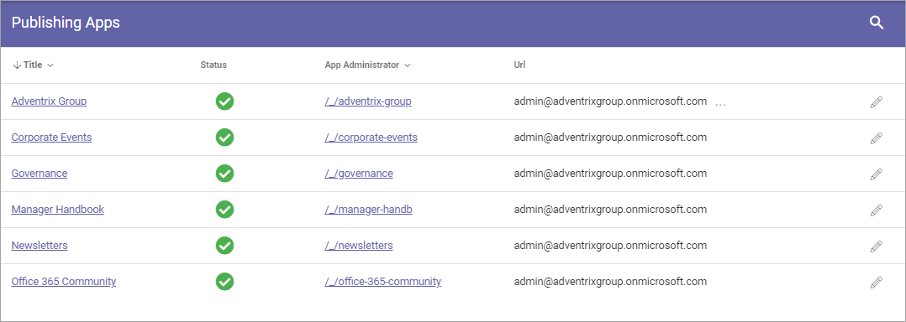

Event Management
===================
Under Event Management you can select Publishing Apps in the Business Profile, to edit settings for Event Management.

Here's an example of a list of Publishing Apps:

You can click a link to go to the Publishing App, for example to check that it is the one you plan to edit.

To edit settings for Event Management, click the pen for the Publishing App.

.. image:: bp-event-management-pen.png

The Page Collections in the Publishing App is now shown, for example:

.. image:: bp-event-management-collections.png

You can click a link to go the Page Collection, for example to check that it is the one you plan to edit.

To edit Event Management settings, click the cogwheel for the Page Collection.

Here's the settings for Event Management:

.. image:: bp-event-management-collections-settings.png

Use them this way:

+ **Calendar**: Select the calendar for Event Managements in this Page C ollection.
+ **Description**: (Will be added soon.)
+ **Location** (A description will be added soon.)

Don't forget to save when you're done.

