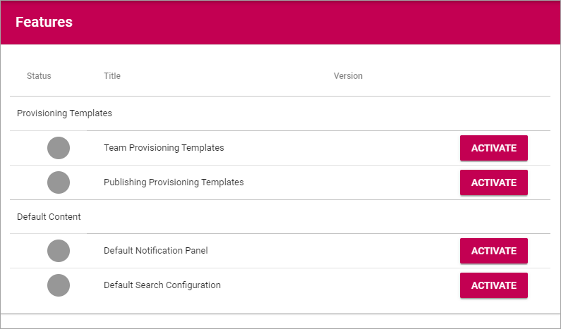

Features - Business Profile
===========================================

All available Features for the Business Profile is listed here and can be activated, deactivated and updated. Here's an example:

Provisioning Templates
*********************
The purpose of these features is to provide a number of Provisioning Templates for an easy starting point. You can then edit the templates for your organization's needs, and of course add additional templates. Add the templates you would like to have in your Business Profile, by clicking "ACTIVATE".

Default Content
****************
Here you can add some default content for an easy starting point. Activate the content you want in the Business Profile. The Noticification Panel settings can easily be edited for your organization's needs, see: :doc:`Notification Panel </admin-settings/business-group-settings/notification-panel/index>`
