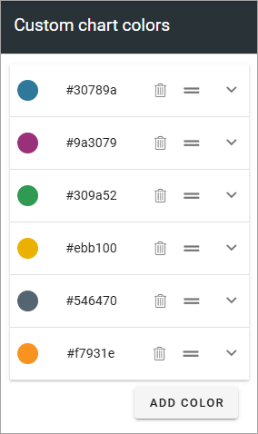
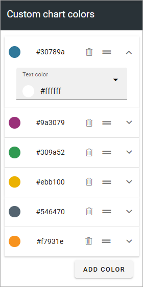
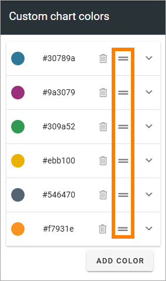
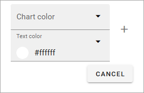
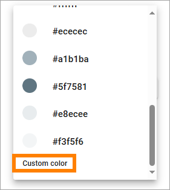

Custom charts colors
========================

Here you can edit the chart colors:

To edit a text color for any of the chart colors, expand the settings and select another color:

Remove a color you don't want by clicking the dustbin. The edit the order in which editors will see the colors. grab and move using this icon:

Too add a new color, click ADD COLOR and set chart color and text color:

Also note that you can create custom colors. Find that option at the very bottom of the list:

