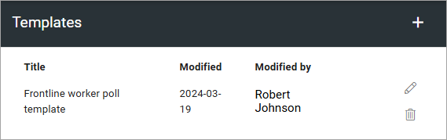
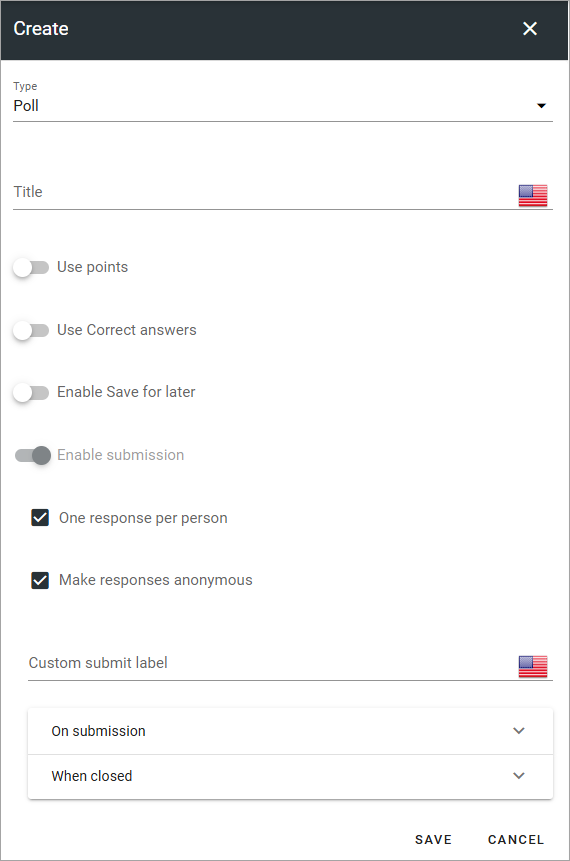

Templates for forms
========================

This option is available inb Omnia 7.6 and later. You can create templates for all three types of forms, to make it easier to consistently create forms of a certain type.

If any forms are created, they are shwon in this list.

All settings can be edited by clicking the pen, see below. Click the dustbin to delete a template. To create a new template, click the plus.

Settings for a template
********************************
The following settings are available when creating a new template or editing an existing one:

+ **Type**: Select type of form for the template: Poll, Survey or Checkup.
+ **Title**: Add a title for the template here (required).
+ **Use points**: Selected per default for Surveys, but can be changed.
+ **Use correct answer**: If it should be possible to show correct answers, after the user has submitted answers, select this option. Selected per default for checkups.
+ **Enable "Check your answers"**: Available for checkups only. Available when "Use correct answer" is selected. When this option is selected, users can click "Check your answers" to see the answers.
+ **Enable Save for for later**: If the user should be able to save the progress so far and continue later, select this option. If not selected, users have to finish the Survey/Poll/Checkup in one go.
+ **Enable submission**: If it should be possible for users to submit an answer, and just not read the information, select this option. It's always selected and can't be unchecked for surrveys and polls. For checkups it's unchecked per default.
+ **One respons per person**: When "Enable submission" is selected, you can schoose if a user should be able to submit answers just once, or several times. Selected per default for surveys. 
+ **Make responses anonymus**: When "Enable submission" is selected, you can schoose to make answers anonymus. If you do, it's not possible for administrators on any level to trace user submissions. Selected per default for polls.
+ **Custom submit label**: When "Enable submission" is selected, you can add a label here if needed. ot available for checkups).
+ **On submission**: When "Enable submission" is selected, you select what will happen on submission: "Show message" meaning the message you can add above, "Show user respone" and/or "Show all responses" - meaning all user responses for this surevy or poll, so far. 
+ **When closed**: Here you can choose what will happen when the form is closed. Same options as above.

Don't forget to save the settings.

