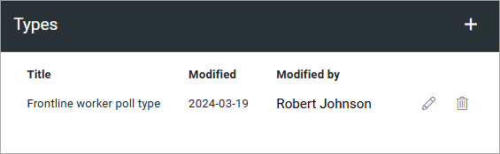
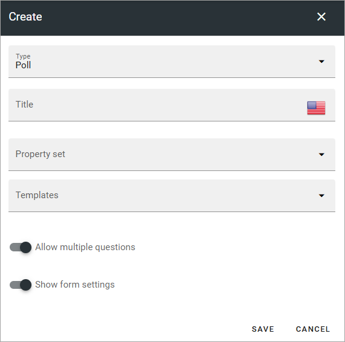

Types for forms
========================

This option is available in Omni 7.6 and later.

Here you can create a type, which in this case is a property set and a template, available when creating forms using the action button. This will make it easier, and faster, for an amdinistrator to create a form.

If any post is created here, it's shown in the list:

All settings can be edited by clicking the pen, see below. Click the dustbin to delete a template. To create a new template, click the plus.

Settings for a type
*********************
The settings available when creating a new type or editing an existing are these:

+ **Type**: Select the type of form to create type settings for.
+ **Title**: Add a title for the type (required).
+ **Property set**: You can select a property set for the type. Property sets are set up under Properties (Tenant). When creating a form, the administrator must fill in the properties from the set. This can, for example, be used to select type of users, or parts of the organization, the form should be available for.
+ **Templates**: You can select a template for the type.
+ **Allow multiple questions**: If it should be possible to create several questions, select the option. If not, only one question can be created.
+ **Show form settings**: If the form settings should be shown so the administrator can edit them, when creating a form, select this option.

For more information about property sets, see: :doc:`Property sets </admin-settings/tenant-settings/properties/property-sets/index>`

For more information about form templates, see: :doc:`Templates for forms </admin-settings/business-group-settings/forms/forms-settings/forms-templates/index>`

