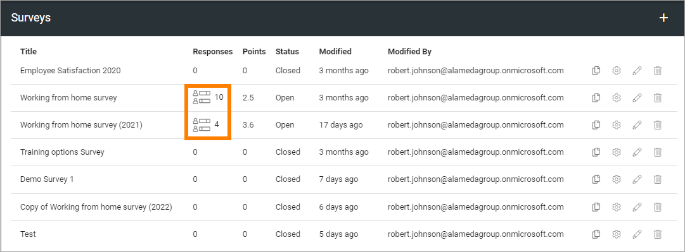
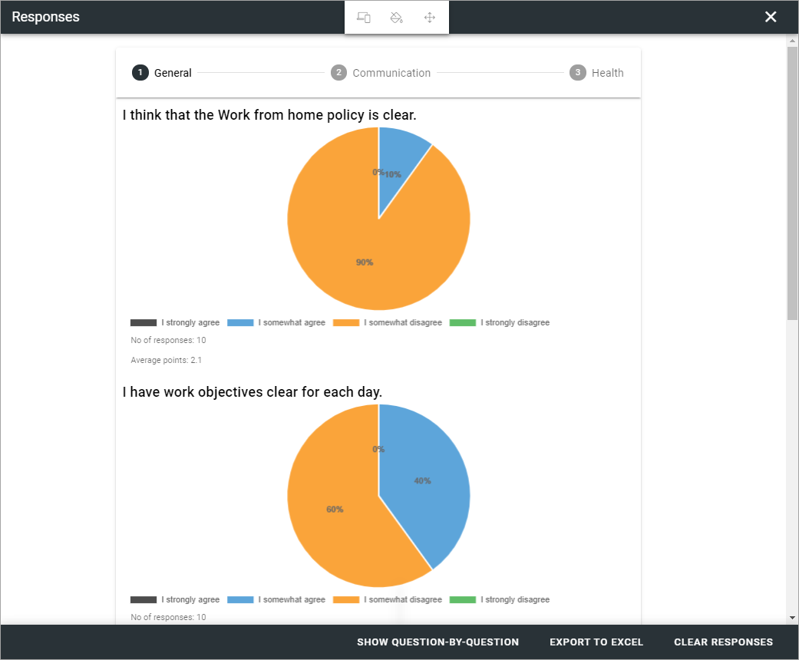
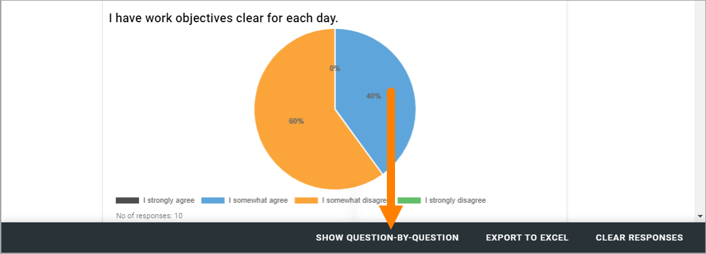
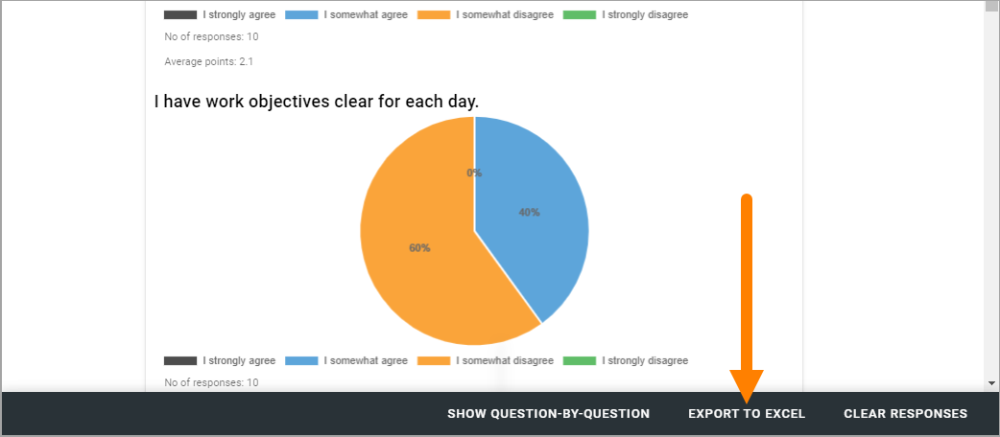
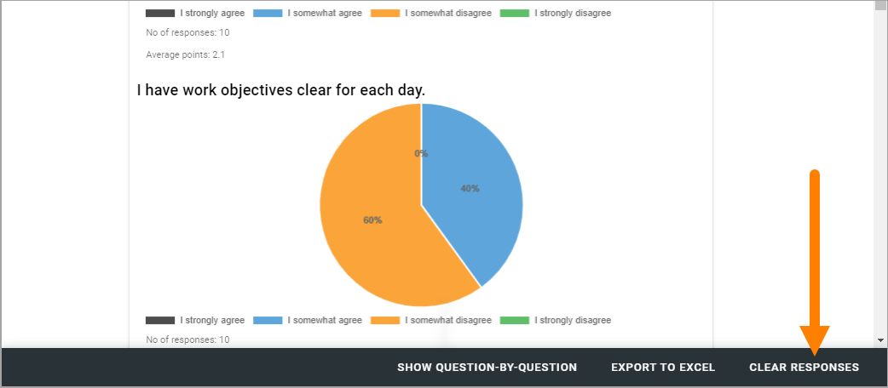
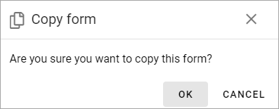
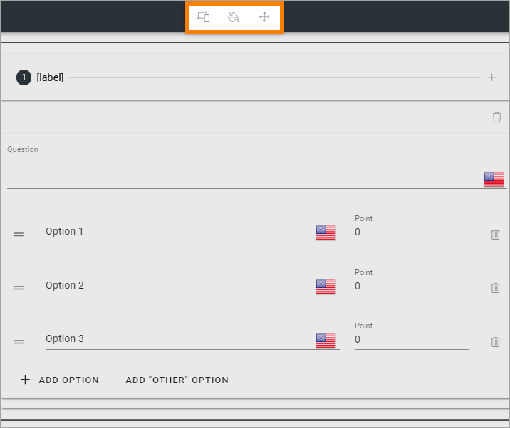
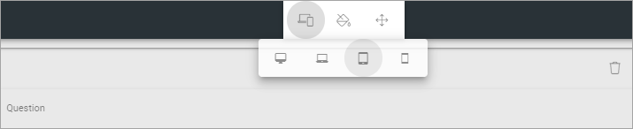
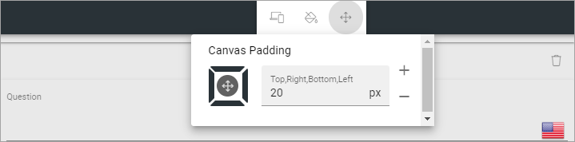
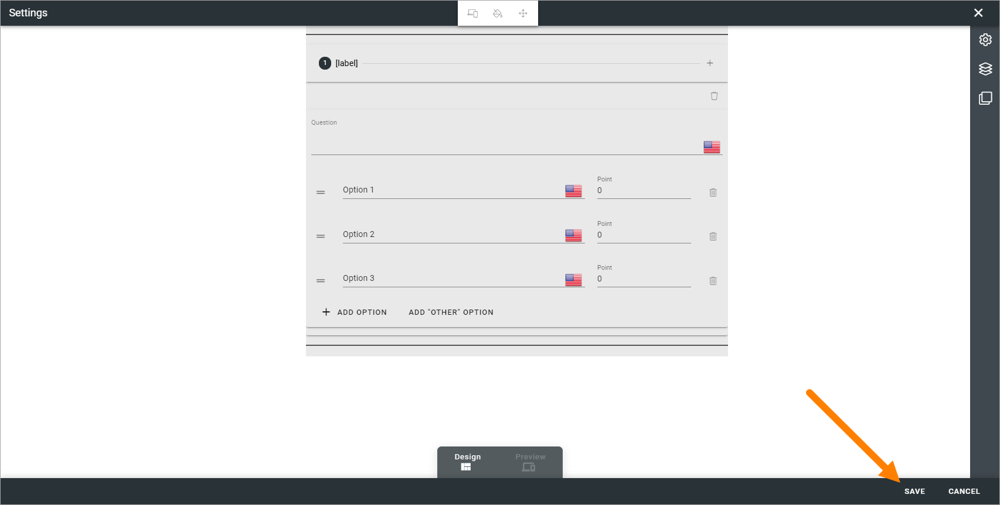

Forms
===========

Here you can work with three types of forms, that can be made available on any pages. 

.. image:: forms-all-new.png

Surveys has the most options. Polls are similar to surveys but suitable for shorter, simpler forms. Checkups are suitable for micro-courses with knowledge checks.

For settings options, see this page: :doc:`Settings (Forms) </admin-settings/business-group-settings/forms/forms-settings/index>`

To make the forms available for users, there's a Forms block and, in Omnia 7.6 and later, a Forms rollup block available. For more information, see:

+ :doc:`The Forms block </blocks/blocks-forms/form/index>`
+ :doc:`The Forms rollup block </blocks/form-rollup-block/index>`

In Omnia 7.6 and later, Forms can also be created using an action button. Such forms are only available in the app where they are created. They are not available here for editing. For more information, see: :doc:`Creating a form using an action button </general-assets/creating-form-button/index>`

Surveys, polls and checkups
********************************
For each type of form, all existing are listed, Surveys as an example:

.. image:: forms-surveys.png

In the list, you can use the icons (from left to right), to copy the form to a new one, change settings, work with the graphical presentation, or delete a form, if needed.

.. image:: forms-icons.png

**Note!** Only the forms beloning to the business profile is listed here, meaning created and edited here. Forms created in an app is not listed here, they exist within that app only.

Checking responses
*********************
If responses are available (can be for surveys and polls), you can click this icon to check them:

Here's an example:

This is the "Layout view" for the responses. To see one question at a time, click here:

Just one question at a time is now shown. You can go from question to question by clicking BACK and NEXT.

.. image:: forms-response-example-question-back-next.png

You can export the responses to Excel for further processing:

You can also remove all responses so far, by clicking here:

When moving back to the Forms list where you started, don't use the back button in your browser, click the x.

.. image:: forms-response-example-close.png

Create a copy of a form
*************************
This can be handy if you are going to create a new form that is simliar to one you already have.

Just click the copy icon for a form, and the following is shown:

Just click OK and a copy will be created. You can edit settings and work with the graphical presentation, the same way as with any other form, see below.

Create new form
****************
The basic steps for creating a form are the same for all form types, but available settings and options can differ.

Do the following to create a new form:

1. Click the plus, set the settings, and save.
2. Click the pen to edit the graphical presentation, and save.
3. To make a form available for users, add the Form block to a suitable page.

You can find more information about the Form block here: :doc:`Form block </blocks/blocks-forms/form/index>`

When you create a new form, the graphical presentation is opened when you click Save for the settings. (When you edit settings for an existing form, it's not).

Settings
***********
The settings are the same for all form types. All settings you use when creating a form are available when editing (but not all can be changed for all types of forms).

.. image:: forms-settings.png

+ **Title**: Add a Title for the form here, in any or all of the available languages.
+ **Use points**: Selected per default for Surveys, but can be changed.
+ **Use correct answer**: If it should be possible to show correct answers, after the user has submitted answers, select this option. Selected per default for checkups.
+ **Enable "Check your answers"**: Available when "Use correct answer" is selected. When this option is selected, users can click "Check your answers" to see the answers.
+ **Enable Save for for later**: If the user should be able to save the progress so far and continue later, select this option. If not selected, users have to finish the Survey/Poll/Checkup in one go.
+ **Enable submission**: If it should be possible for users to submit an answer, and just not read the information, select this option. It's always selected and can't be unchecked for surrveys and polls. For checkups it's unchecked per default.
+ **One respons per person**: When "Enable submission" is selected, you can schoose if a user should be able to submit answers just once, or several times. Selected per default for surveys.
+ **Make responses anonymus**: When "Enable submission" is selected, you can schoose to make answers anonymus. If you do, it's not possible for administrators on any level to trace user submissions. Selected per default for polls.
+ **Custom submit label**: When "Enable submission" is selected, you can add a label here if needed.
+ **On submission**: When "Enable submission" is selected, you select what will happen on submission: "Show message" meaning the message you can add above, "Show user respone" and/or "Show all responses" - meaning all user responses for this surevy or poll, so far.
+ **Open**: Select this option for dates when the form should be available, and then add a start date and an snd date.

Don't forget to save the settings.

Working with the graphical presentation
****************************************
It can look like this (survey as an example):

.. image:: surveys-1.png

As you can see, there are some similarities to working with pages. For example, the layout explorer is available here. 

.. image:: surveys-layout-explorer.png

See this for more information: :doc:`Layout explorer </general-assets/layout-explorer/index>`

Also similar to working with pages, there is a Design mode and a Preview mode (but no Write mode, because it's not needed here).

.. image:: surveys-mode.png

General settings
------------------
The general settings for the graphical presentation are found here:

Use the left-most icon to select a canvas size (workspace area):

Use the icon in the middle to set colors:

.. image:: forms-settings-graphical-colors.png

Use the right-most icon to set padding:

Working with sections and blocks
-----------------------------------
You can use all general sections and blocks when working with the graphical presentation, and you use the settings the normal way. Click a blue plus to add a section, a black plus to add a block.

**A tip!** The Stepper section can be very useful for forms.

You can find more information about how to work with sections here: :doc:`Working with sections and blocks </pages/page-types/working-with-sections-and-blocks/index>`

Information about sections settings is found here: :doc:`Settings for sections </pages/page-types/section-settings/index>`

More information about how to work with blocks is found here: :doc:`Working with blocks </blocks/working-with-blocks/index>`

When working with the a form's graphical presentation, a specific block is available - Form question. You can find more information about that block here: :doc:`The Form question block </blocks/blocks-forms/form-question/index>`.

As always, don't forget to save when you're finished:

