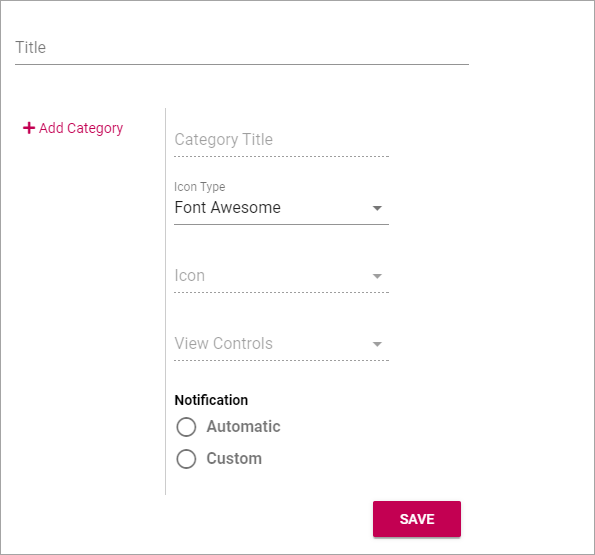
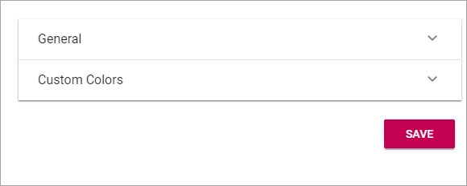
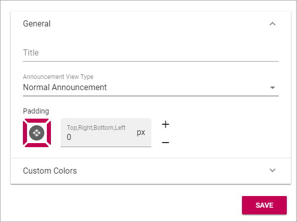
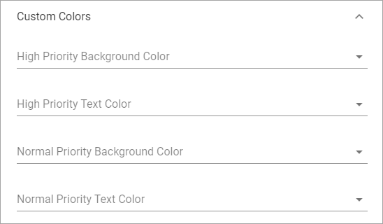
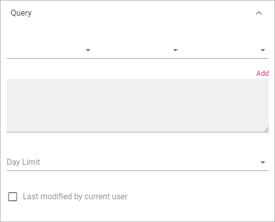

Notfication Panel
===========================================

**Note! This documentation is just started. More information will be added soon.**

The notification panel is a concept in Omnia. The purpose is to help end users find out what information has been updated within different areas of the intranet.

A Notification Panel can be placed on any page, to show different notifications. You can create several Notification Panels for different purposes.

.. image:: notification-panel.png

Create a new Notification Panel
*********************************
To create a new Notification Panel, do the following:

1. Click the plus.

.. image:: notification-panel-click-plus.png

2. Use the following settings:

+ **Add Category**: Click here to add a new Category.
+ **Category Title**: Add a Title for the new Category.
+ **Icon Type**: Select an Icon Type.
+ **Icon**: Choose the Icon in the Icon Type you have selected.
+ **View Control**: Here you select what you will display in the Category: "Announcements", "Document Rollup", "My Tasks", "Page Rollup" or "Team News Rollup".
+ **Notification**: Select Automatic or Custom for the Category. For Custom, Notification Providers must have been setup.

3. Click "ADD" to create the Category.
4. Click the cog wheel to access more settings.

.. image:: notification-category-more-settings-cogwheel.png

The following settings are available:

Available settings differ depending on View Controll selected.

Announcements
---------------
For Announcements you can set "General" settings:

+ **Title**: Add a Title for the Category (Not mandatory).
+ **Announcement View Type**: Select "Normal Announcements" or "High Priority Announcements"
+ **Padding**: If some padding around the Category is needed, use this option.

For "Custom Colors" you can set:

Document Rollup
-----------------
For Document Rollup, the following settings are available:

.. image:: notification-settings-document-rollup.png

For "General" you can set:

+ **Title**: Add a Title for the Category (Not mandatory).
+ **Open in Client App**: Select this option of you want the documents to be opened in the Client App (the installed version) instead the online application.

For "Display" you can set:

+ **View**: Select how the Document List should be displayed: "List View", "Card View" or "Group By Site".

Selecting "Query" you can set the following:

(A description will be added soon.)

Using "Filter" you add Filter Options to the Document list.

.. image:: notification-settings-document-rollup-filter.png

(A desciption will be added soon.)

Use "Refiner" to add Refiners for the Document list.

(A description will be added soon.)

