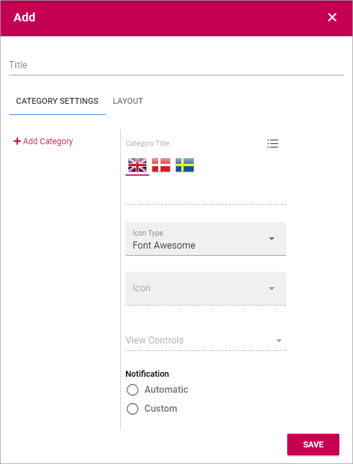
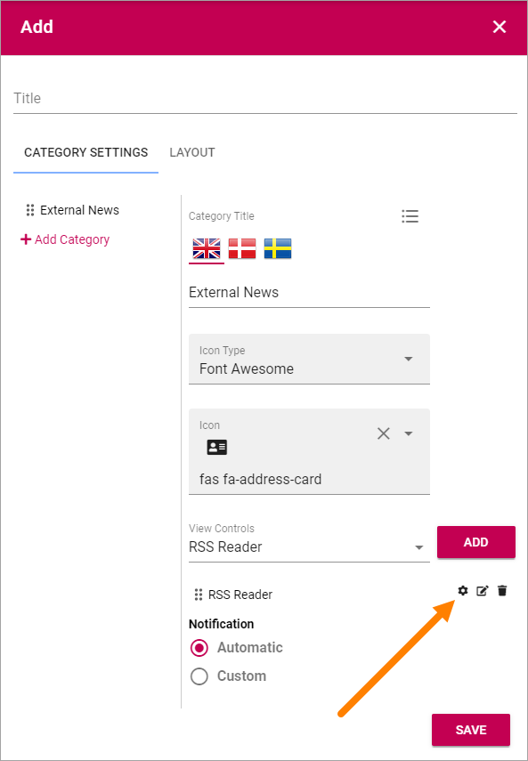

Notification Panel
===========================================

The Notification Panel is a concept in Omnia. The purpose is to help end users find out what information has been updated within different areas of the intranet.

A Notification Panel can be placed on any page, or in the Action Manu, to show different notifications. You can create several Notification Panels for different purposes.

.. image:: notification-panel.png

Create a new Notification Panel
*********************************
To create a new Notification Panel, do the following:

1. Click the plus.

.. image:: notification-panel-click-plus.png

2. Use the following settings:

+ **Add Category**: Click here to add a new Category. 
+ **Category Title**: Add a Title for the new Category. You can add titles for all active languages.
+ **Icon Type**: Select an Icon Type.
+ **Icon**: Choose the Icon in the Icon Type you have selected.
+ **View Control**: Here you select what you will display in the Category. See below, under *Category settings* for more information.
+ **Notification**: Select Automatic or Custom for the Category. For Custom, Notification Providers must have been setup.

3. Click "ADD" to create the Category.
4. Click the cog wheel to access the settings for the Category, for example.

Category settings
*******************
The settings for a Category is the same as the settings for the corresponding Block, see:

Announcements: :doc:`The Announcements block </blocks/announcements/index>`

Document Rollup: :doc:`The Document Rollup block </blocks/document-rollup/index>`

HTML Scripts: :doc:`The HTML Scripts block </blocks/html-script/index>`

My Tasks: :doc:`The Tasks Rollup block </blocks/task-rollup/index>`

Page Rollup: :doc:`The Pages Rollup block </blocks/page-rollup/index>`

People Rollup: :doc:`The People Rollup block </blocks/people-rollup/index>`

RSS Reader: :doc:`The RSS Reader block </blocks/rss-reader/index>`

Team News Rollup: :doc:`The Team News Rollup block </blocks/team-news-rollup/index>`

Trello Card: :doc:`The Trello Card block </blocks/trello-cards/index>`

