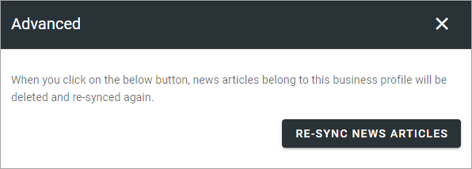
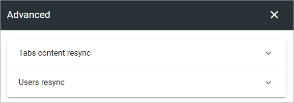
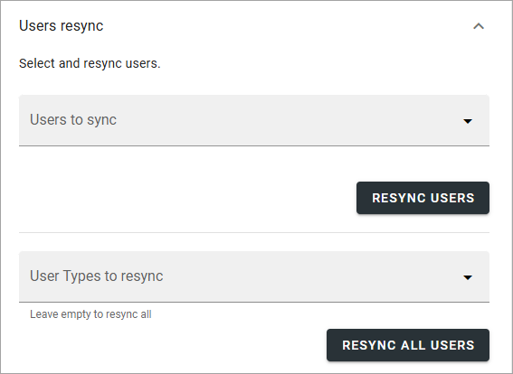

Advanced - Omnia Feed
=============================================

Here you can resync articles if someting has gone wrong. Read the text for details.

In Omnia 7.7 and later, you can also sync users:

The options for "Tab content resync" are the same as seen above. The options for resyncing users are these:

If you resync users the initial login to the app is quicker but it's an option, it's not mandatory. Just remember to only resync actual users, not other types of accounts.

