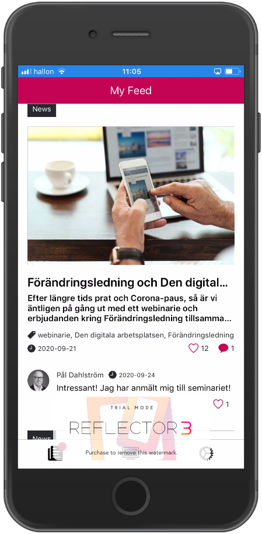
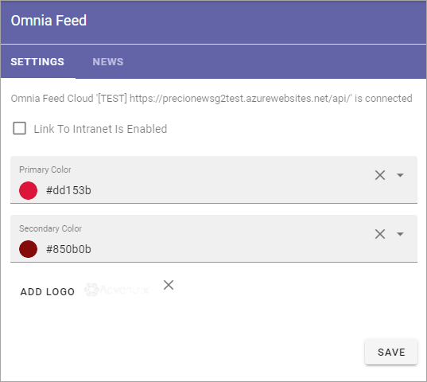

Omnia Feed - Business Profile Settings
========================================

(This documentation is just started, more will be added soon).

Using Omnia Feed, users can read News from your intranet in their mobile device. Apps can be downloaded from the usual channels, for example App Store for iPhone.

From the user's point of view, here's and example of a News feed on an iPhone (just a test image):

Settings
**********
The following settings are available for Omnia Feed, for the Business Profile:

