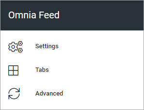

Omnia Feed - Business Profile Settings
=================================================

**Important Note!** Omnia Feed is "Forward Only" meaning that a page that has been sent to a user can't be recalled. This is important to remember for example when creating or editing a query. 

**Note!** Omnia Feed is not available for Omnia on-prem due to push notifications.

The following settings are available for Omnia Feed, for the Business Profile:

Select section below for more information:

.. toctree::
   :titlesonly:

   settings-omnia-feed/index
   tabs-omnia-feed/index
   advanced-omnia-feed/index

Omnia Feed and permissions
******************************
To be able to access a page - news or any other Omnia page - users will need read permission for that page, meaning permissions in Omnia apply. This is normally set on Page Collection level. Omnia Feed has no separate permissions settings. Therefore, users can only see feed notifications for and read the pages they are allowed to read as set in Omnia.

Resetting the app
******************
If it, for any reason, should be needed to reset the app - for example if an important query is edited, it is simply done by the user logging out and logging in again.

Intune users
**************
Important information when setting up the tenant: If the customer is using Intune/conditional access that requires device authentication, the AM editor must be informed so the necessary settings for this will be done. Also note that when this is the case, Omnia Feed for Android will require access to the Contacts list on the device.

For more advice on setting up Intune for Omnia Feed, see this page: :doc:`Setup Intune for Omnia Feed </admin-settings/business-group-settings/omnia-feed/setup-intunes-for-omnia-feed/index>`

