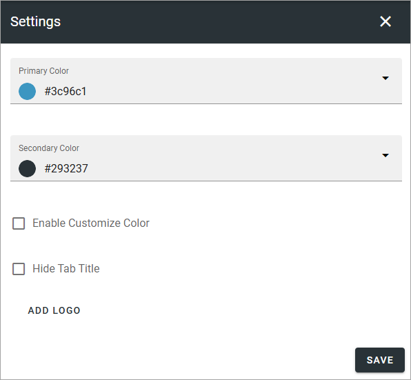
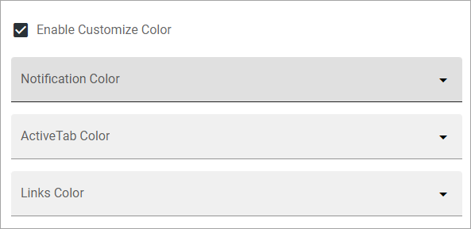

Settings - Omnia Feed
=============================================

Here you can edit colors and add a logo. 

+ **Enable Customize Color**: Use these settings to set custom colors, see below.
+ **Hide Tab Title**: If tab titles should not be shown, select this option.
+ **ADD LOGO**: When you click ADD LOGO the media picker starts. For more information about how to use it see: :doc:`Media picker </general-assets/media-picker/index>`

When you select "Enable Customize color" you can set custom colors for the following:

