Setup Intune for Omnia Feed
=============================================

**This page is just started. Please come back in i few days.**

This document is a guideline for setting up Intune for the Omnia Feed App.

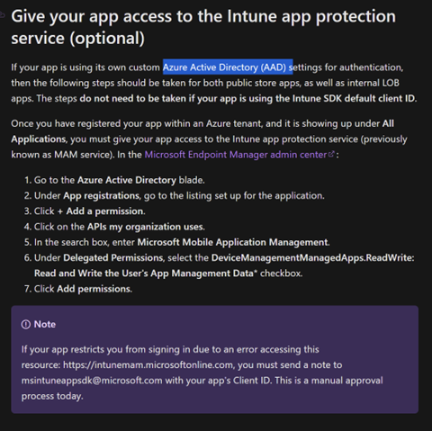

The "Omnia Feed 2" App (ab4ee7fd-4aa2-494b-82a2-fe16b8f2c3ff) must have the permission "Microsoft Mobile Application Management".

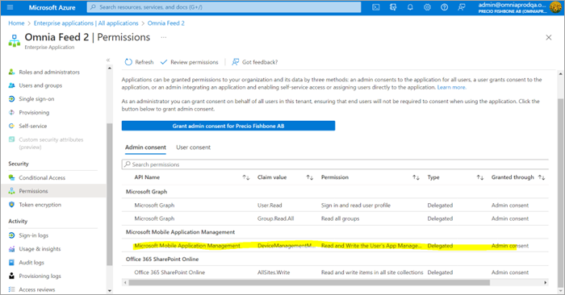

+ Setup Intune for the Tenant.
+ Set up Microsoft Intune | Microsoft Learn.
+ Before continuing, ensure the folllowing configuration is done in Intune: Config Apple enrollment, Android enrollment.

Create App Protection Policies
*************************************
In this step, setup an app protection policy for the Omnia Feed App. It should be done for both Android and iOS.

1. Follow the instructions in this Microsoft document: https://docs.microsoft.com/en-us/mem/intune/apps/app-protection-policies#app-protection-policies-for-iosipados-and-android-apps
2. Go to Microsoft Endpoint Manager : https://endpoint.microsoft.com/
3. In the menu, select “Apps” => “App protection policies”.

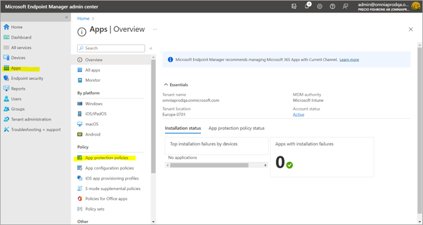

4. Create policy for Android or iOS => Add a title for the policy => Go to the second screen, config “Apps” => “Select custom apps”.

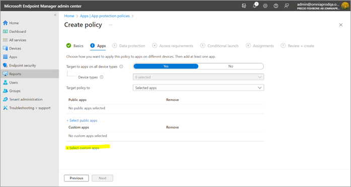

5. In the popup shown => Add the “Package Id” => Then click on the "Add" button.
6. Add: Android: se.precio.news and iOS: se.preciofishbone.omniafeed

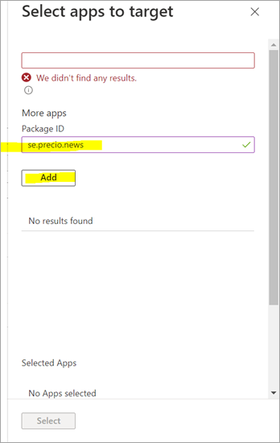
 
7. Select the custom added app.

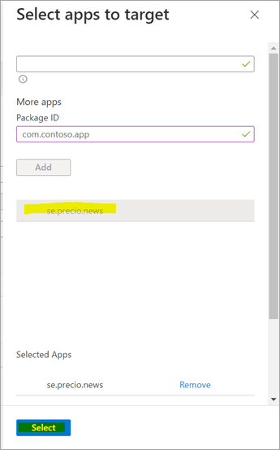
 
Then you will see the custom app in the list of apps.

8. Then go through the next setup steps.

Notice in step 6 “Assignments” you will need to configure a deploy group for it to work.

9. Then create the policy.

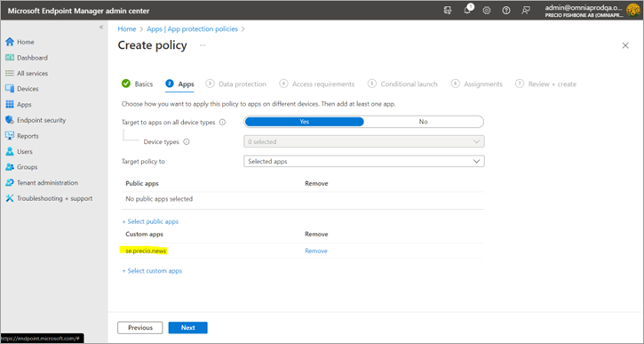

10. Verify that policy is deployed.

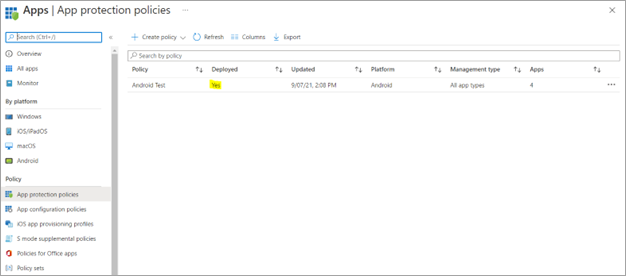
 
**Note!** It can take some time before you see the effect of the new policy.

If the app have Intune SDK and the setup has been done correctly, the first time the app is open, something like the following is shown.

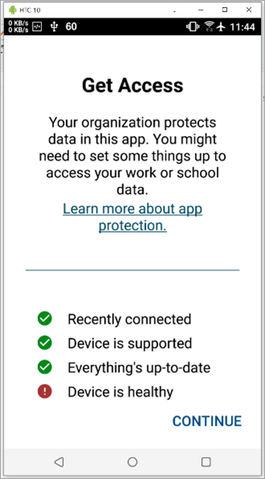

Setup Conditional Access
*****************************
Here's how to set up conditional access:

1. Follow the instructions in this Microsoft document: https://docs.microsoft.com/en-us/azure/active-directory/conditional-access/concept-conditional-access-policies
2. Go to https://portal.azure.com and search for “Conditional Access”. 

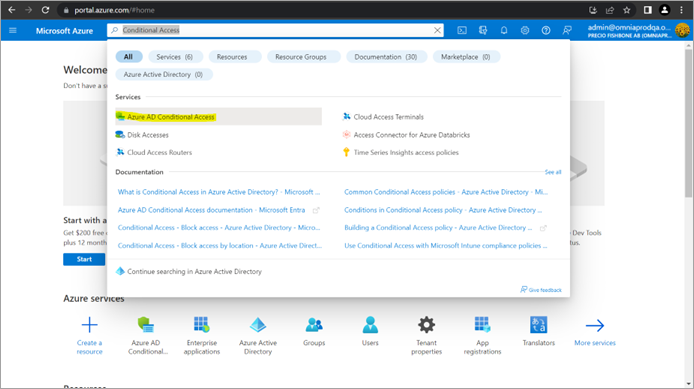

3. Go to "Conditional Access service".

Now you can see a list of policies already setup You can verify it or create a new policy for Omnia Feed. 

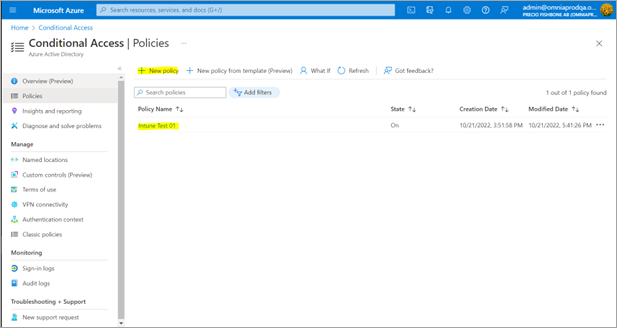
 
4. Create new Conditional Access policy.

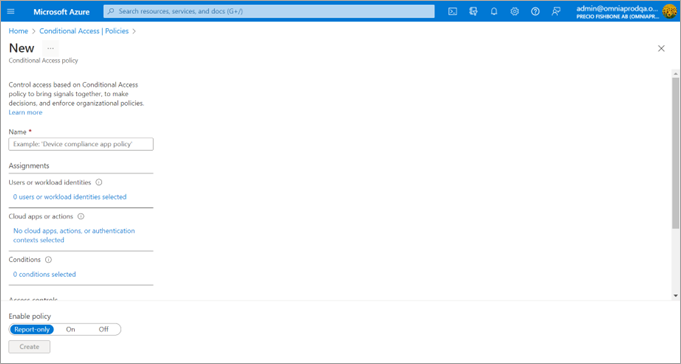
 
5. Set Assignments to users or group to apply.
 
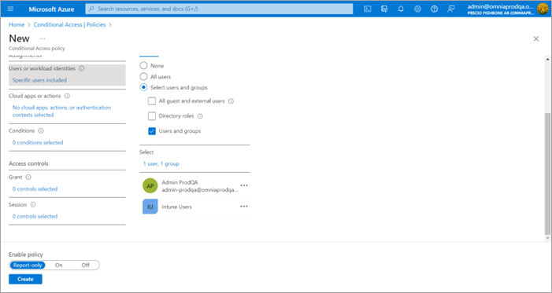

6. Set Cloud Apps => Omnia Feed 2.

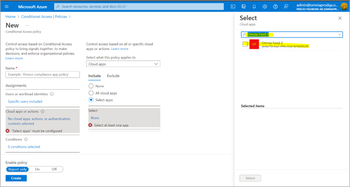
 
You may also want to select App “Office 365”. It may block user from some Microsoft Apps (optional).

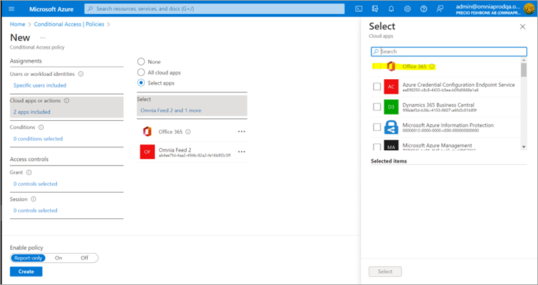
 
7. Configure Conditional to focus on platforms Android and iOS since Omnia Feed App only supports these platforms.

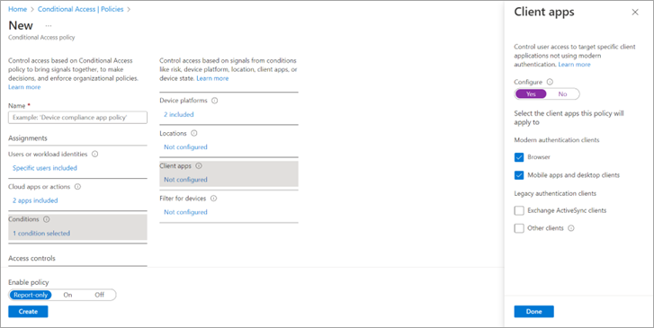

8. In Client App section select “Browser”, “Mobile apps and desktops clients”.
9. For Access controls, select “Grant”. 

In here there are 3 main options that Omnia Feed can support:

+	Require multifactor authentication => will prompt MFA or some other of second layer protection when user login.
+	Require device to be marked as compliant => only allow devices already enroll Intune using Omnia Feed.
+	Require app protection policy => need to config App protection policy for Omnia Feed before enable this option. 

There is 2 ways to config Mutil controls:

+	Require all the selected controls (AND condition).
+	Require one of the selected controls (OR condition).

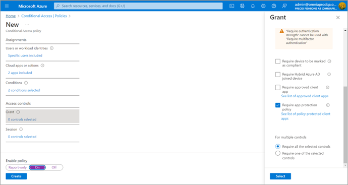

After config the Grant section with option you want make sure in Enable policy select “On”
Then create policy. It should take about 1 hour to take effect.
Tips: let try test on some small group users first to make sure the setup is correct and not block users out.

For now there are some limit in Access control for Omnia Feed app:
Both “Require app protection policy” and “Require multi-factor authentication” can not turn on at the same time.
We can config these 2 conditions with multiple controls: ”Require one of the selected controls”
 

