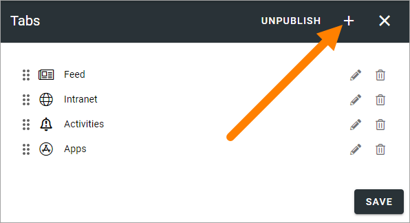
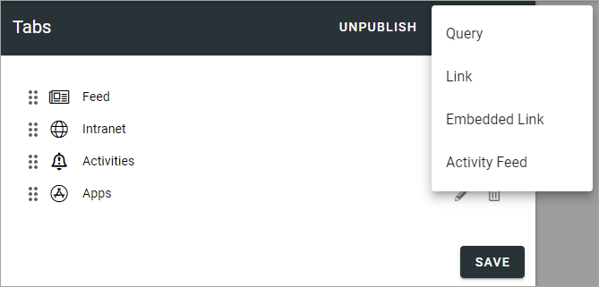
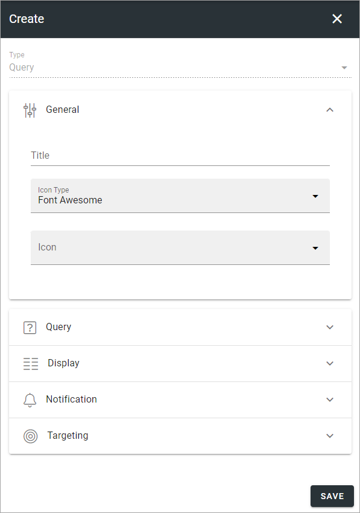
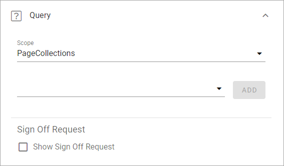
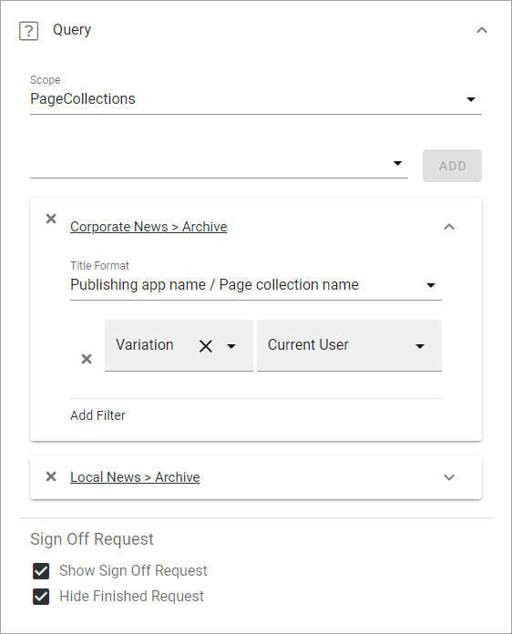
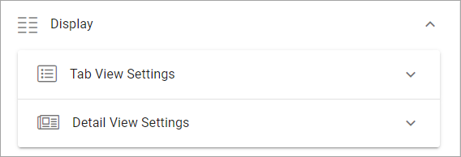
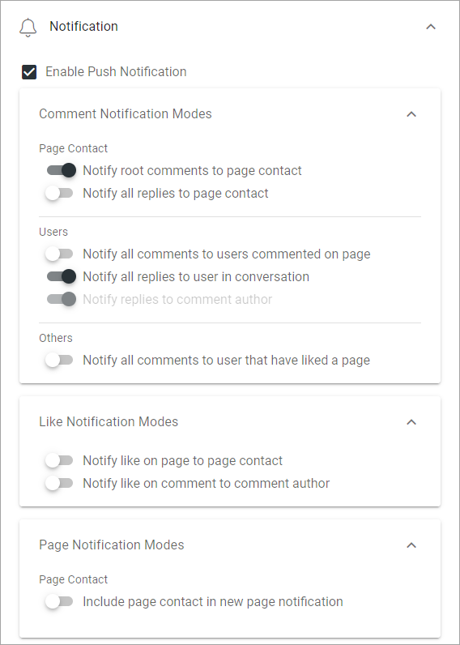
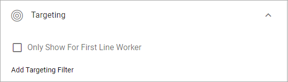

Tabs - Omnia Feed
=============================================

Use the settings here to edit tabs for this Business Profile in Omnia Feed.

Here's an example with a number of tabs set up:

.. image:: omnia-feed-tabs.png

+ **UNPUBLISH**: If this Business Profile should no longer be published to Omnia Feed, select this option.

To edit settings for one of the existing tabs, click the pen, to delete it, click the dust bin.

All settings used when adding a new tab can be edited, except the tab type, see below.

When any settings for tabs are done, users that already are using the app will be prompted to restart the app. After restart, users will see the changes.

Adding a new tab
******************
To add a new tab, click the plus.

Then select the type of tab you want to add.

Query tab
***********
This type of tab can display a Page Rollup from Omnia. The following settings are available:

General settings
-----------------
You can set the following here:

.. image:: omnia-feed-tabs-general.png

+ **Title**: Add a title for the tab.
+ **Icon Type**: If you want an icon for the tab, select icon type here.
+ **Icon**: Choose icon from the selected type here. If you leave this field empty, no icon is shown.

Query settings
----------------
Here you set up the query for the tab.

+ **Scope**: Select "Page Collections" or "Channel" as scope and then set the details similar to what you do in any Page Rollup. You can add one or more page collections or one or more channels.
+ **Sign Off Requests**: You can choose to show sign off requests for scope and if you do that, you can choose to hide finished requests.

Here's an example of a query setting for two page collections with the detailed settings for one of them:

Display settings
-----------------
The following settings are available here:

Use "Tab View Settings" for settings for the tab itself. Use "Detail View Settings" for objects opened in the tab. What you do in both cases is to select properties in Omnia that contain the information needed. Note that properties must have been set up in Omnia Admin to be available to select here, see: :doc:`Properties </admin-settings/tenant-settings/properties/index>`

For example, this is what can be selected for "Tab View Settings":

.. image:: omnia-feed-tabs-query-display-tab-view.png

At the bottom you can also set "descending" or Ascending. 

Notifocation settings
----------------------
The following is available here:

+ **Enable Push Notification**: Select this option if users should recieve a Push Notification when new information, for example a new page, has been added.

For the detailed options, read the options carefully. They should be self explanatory.

Targeting settings
-------------------
This is available:

+ **Only Show For First Line Worker**: If this tab should be shown for Kaizala users only, select this option.
+ **Add Targeting Filter**: This works the same way as in many other parts of Omnia, described here: :doc:`Using targeting </general-assets/targeting-in-omnia/index>`

Link tab
**********
(A description will be added soon).

Embedded Link tab
**********************
(A description will be added soon).

Activity Feed tab
**********************
(A description will be added soon).

