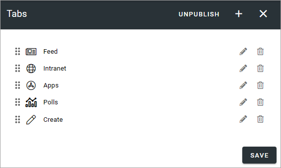
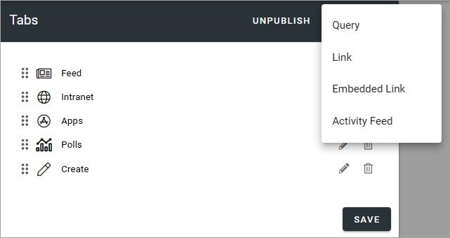
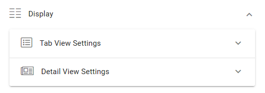
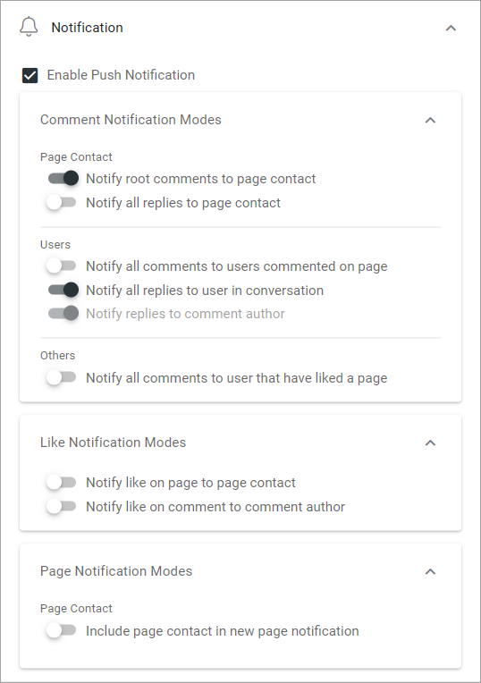

Tabs - Omnia Feed
=============================================

Use the settings here to edit tabs for this Business Profile in Omnia Feed.

Here's an example with a number of tabs set up:

+ **PUBLISH/UNPUBLISH**: Use this to enable/disable this configuration in Omnia Feed. 

To edit settings for one of the existing tabs, click the pen, to delete it, click the dust bin.

All settings used when adding a new tab can be edited, except the tab type, see below.

When any settings for tabs are done, users that already are using the app will be prompted to restart the app. After restart, users will see the changes.

Adding a new tab
******************
To add a new tab, click the plus. Then select the type of tab you want to add.

General tab settings
***********************
For all tabs, the following settings are available:

General settings
-----------------
You can set the following here:

.. image:: omnia-feed-tabs-general-v7.png

+ **Title**: Add a title for the tab.
+ **Icon Type**: If you want an icon for the tab, select icon type here.
+ **Icon**: Choose icon from the selected type here. If you leave this field empty, no icon is shown.

Targeting settings
-------------------
Here you can target the tab to specific users:

.. image:: omnia-feed-tabs-targeting-v7.png

This works the same way as in many other parts of Omnia, described here: :doc:`Using targeting </general-assets/targeting-in-omnia/index>`

Query tab
***********
This type of tab can display a Page Rollup from Omnia. The following settings are available:

.. image:: omnia-feed-tabs-query-v7.png

For "General" and "Targeting", general tab settings are available, see above.

Query settings
----------------
Here you set up the query for the tab.

.. image:: omnia-feed-tabs-query-query-v7.png

+ **Scope**: Select scope and then set the details similar to what you do in any Page Rollup. Can be "Tenant", "Business Profiles", "Publishing Apps" or "Page Collections". Regarding business profiles, publising apps and page collections, you can add one or more. For tenant settings, see below.
+ **Sign Off Requests**: This option can be available depending on setup. You can choose to show sign off requests for the scope and if you do that, you can choose to hide finished requests.

When you select Tenant as the scope, you select "Title Format" and can then add a filter using one or more properties.

**Note!** here you can, for example, add channels to the rollup.

Display settings
-----------------
The following settings are available here:

Use "Tab View Settings" for settings for the tab itself. Use "Detail View Settings" for objects opened in the tab. What you do in both cases is to select properties in Omnia that contain the information needed. Note that properties must have been set up in Omnia Admin to be available to select here, see: :doc:`Properties </admin-settings/tenant-settings/properties/index>`

For example, this is what can be selected for "Tab View Settings":

.. image:: omnia-feed-tabs-query-display-tab-view-v7.png

At the bottom you can also set the sorting "descending" or "Ascending" (not available for Detail View Settings). 

Notification settings
----------------------
The following is available here:

+ **Enable Push Notification**: Select this option if users should recieve a Push Notification when new information, for example a new page, has been added.

For the detailed options, read the options carefully. They should be self explanatory.

Link tab
**********
For Link tabs, the following settings are available:

.. image:: omnia-feed-link-tab-v7.png

For "General" and "Targeting", general tab settings are available, see above.

Content
-----------
For content, the following is available:

.. image:: omnia-feed-link-tab-content-v7.png

You can choose to use a "Web Url link" or a "Deep link". Then add the link below. Note the information about Omnia Url links.

Embedded Link tab
**********************
For an Embedded Link tab, the following settings are available:

.. image:: omnia-feed-embedded-v7.png

General tab settings are available for "General" and "Targeting", see above.

Content
-----------
Add the Url for the embedded link here and select what should be shown as the tab title, the Business Profle title or the the web page title:

.. image:: omnia-feed-embedded-link-v7.png

Note the information about Omnia Url:s.

Activity Feed tab
**********************
For an Activity Feed tab, the following settings are available:

.. image:: omnia-feed-activity-feed-v7.png

For "General" and "Targeting", general tab settings are available, see above.

Content
---------
The Activity Scope can be from the user's "My Subscriptions" or from a "Page Collection". 

.. image:: omnia-feed-activity-feed-content-v7.png

When you choose "My Subscription" no further settings are needed. When selecting "Page Collection", you must select one or more page collections to get the activity feed from.

Display
---------
For Display, a number of detailed view settings are avalable.

.. image:: omnia-feed-activity-feed-display-v7.png

What you do here is to select properties in Omnia that contain the information needed. Note that properties must have been set up in Omnia Admin to be available to select here, see: :doc:`Properties </admin-settings/tenant-settings/properties/index>`

