Tabs - Omnia Feed
=============================================

Use the settings here to edit tabs for this business profile in Omnia Feed.

Here's an example with a number of tabs set up:

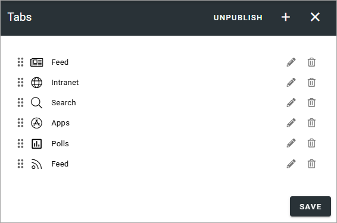

+ **PUBLISH/UNPUBLISH**: Use this to enable/disable this configuration in Omnia Feed. 

To edit settings for one of the existing tabs, click the pen, to delete it, click the dust bin.

All settings used when adding a new tab can be edited, except the tab type, see below.

When any settings for tabs are done, users that already are using the app will be prompted to restart the app. After restart, users will see the changes.

Adding a new tab
******************
To add a new tab, click the plus. Then select the type of tab you want to add.

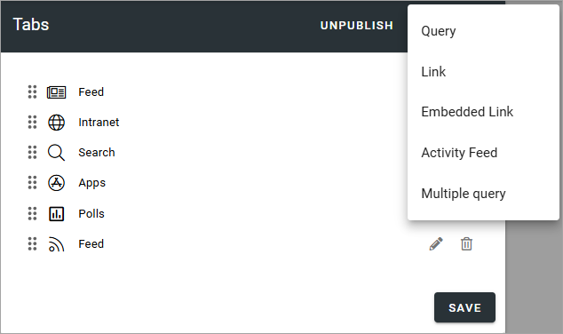

General tab settings
***********************
For all tabs, the following settings are available:

General settings
-----------------
You can set the following here:

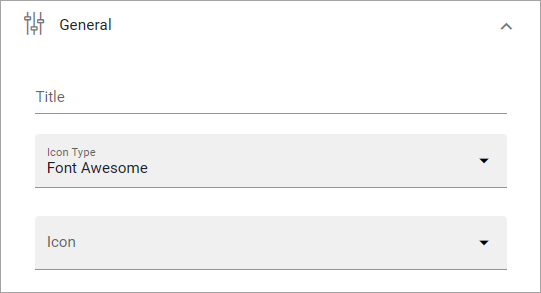

+ **Title**: Add a title for the tab.
+ **Icon type**: If you want an icon for the tab, select icon type here.
+ **Icon**: Choose icon from the selected type here. If you leave this field empty, no icon is shown.

Targeting settings
-------------------
Here you can target the tab to specific users:

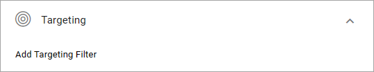

This works the same way as in many other parts of Omnia, described here: :doc:`Using targeting </general-assets/targeting-in-omnia/index>`

Query tab
***********
This type of tab can display a page rollup from Omnia. The following settings are available:

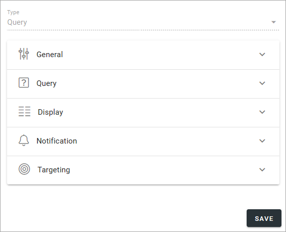

For "General" and "Targeting", general tab settings are available, see above.

Query settings
----------------
Here you set up the query for the tab.

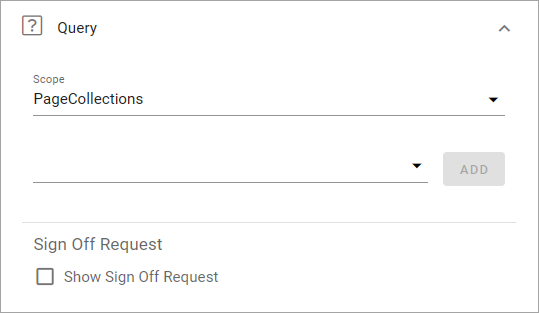

+ **Scope**: Select scope and then set the details similar to what you do in any page rollup. Can be "Tenant", "Business profiles", "Publishing apps" or "Page collections". Regarding business profiles, publishing apps and page collections, you can add one or more. Using Tenant as the scope, there's almost endless possibilities to rollup pages with certain properties from the tenant.
+ **Title format**: Available when scope has been selected. Choose what should be shown as the metadata for source. (Note that you may have to expand the scope to find this setting).
+ **ADD FILTER**: Available when scope has been selected. Here you select one or more filters for pages to rollup. One example is channels for the scope Tenant.
+ **Sign Off Requests**: This option can be available depending on setup. You can choose to show sign-off requests for the scope and if you do that, you can choose to hide finished requests.

Display settings
-----------------
The following settings are available here:

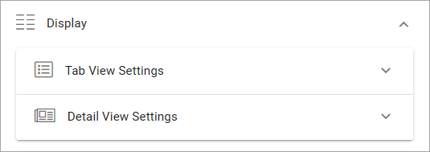

Use "Tab View Settings" for settings for the tab itself. Use "Detail View Settings" for objects opened in the tab. What you do in both cases is to select properties in Omnia that contain the information needed. Note that properties must have been set up in Omnia admin to be available to select here, see: :doc:`Properties </admin-settings/tenant-settings/properties/index>`

For example, this is what can be selected for "Tab View Settings":

.. image:: omnia-feed-tabs-query-display-tab-view-v7.png

At the bottom you can also set the sorting "Descending" or "Ascending" (not available for Detail View Settings). 

For "Detail View Settings" you can also select the order shown for comments, "Older To Newer" or "Newer To Older".

Notification settings
----------------------
The following is available here:

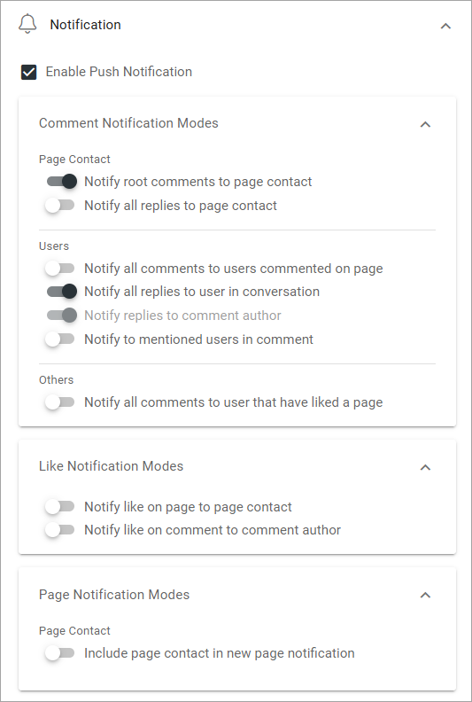

+ **Enable push notification**: Select this option if users should recieve a push notification when new information, for example a new page, has been added.

For the detailed options, read the options carefully. They should be self explanatory.

Link tab
**********
For Link tabs, the following settings are available:

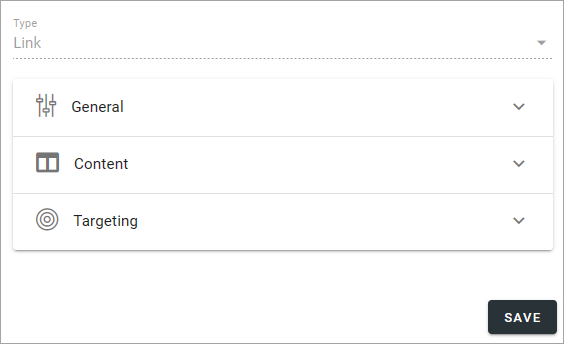

For "General" and "Targeting", general tab settings are available, see above.

Content
-----------
For content, the following is available:

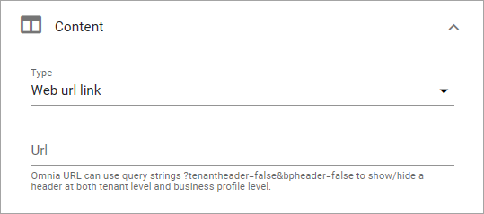

You can choose to use a "Web URL link" or a "Deep link". Then add the link below. A deep link can be used to link to another app, or content in another app, on the users device.

Note the information about Omnia URL links.

Embedded link tab
**********************
For an Embedded link tab, the following settings are available:

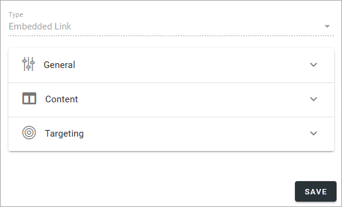

General tab settings are available for "General" and "Targeting", see above.

Content
-----------
Add the URL for the embedded link here and select what should be shown as the tab title, the business profle title or the the web page title. You can also hide the header all together.

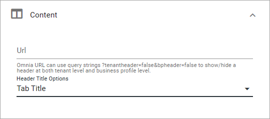

Note the information about Omnia URL:s.

Activity feed tab
**********************
For an Activity feed tab, the following settings are available:

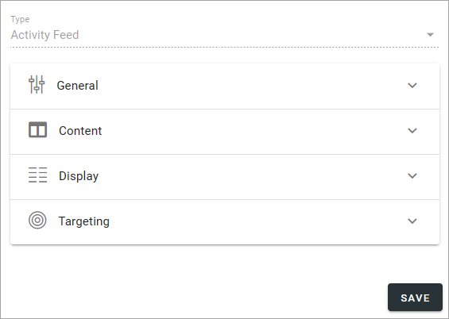

For "General" and "Targeting", general tab settings are available, see above.

Content
---------
The Activity scope can be from the user's "My subscriptions" or from a "Page collection". 

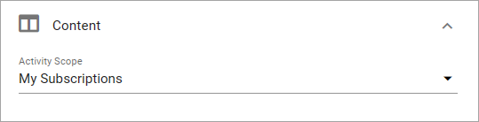

When you choose "My subscription" no further settings are needed. When selecting "Page collection", you must select one or more page collections to get the activity feed from.

Display
---------
For Display, a number of detailed view settings are avalable.

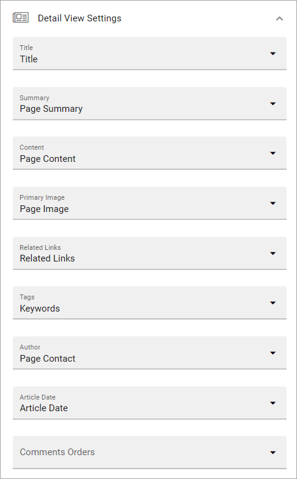

What you do here is to select properties in Omnia that contain the information needed. Note that properties must have been set up in Omnia admin to be available to select here, see: :doc:`Properties </admin-settings/tenant-settings/properties/index>`

Multiple query tab
*******************
As the title implies, this tab can be used for multiple queries:

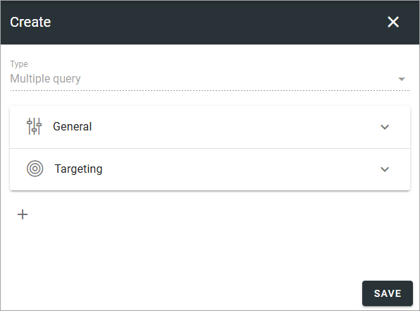

General and Targeting contains general settings, see above.

To use one or more queries on this tab, click the plus, and select query type:

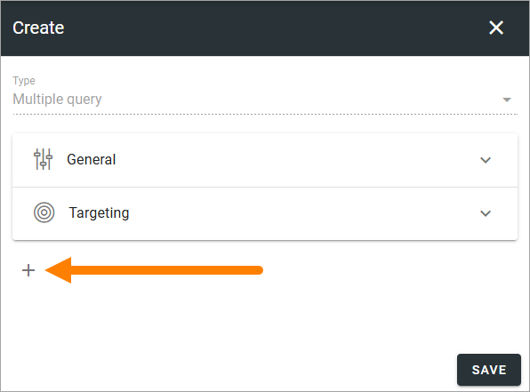
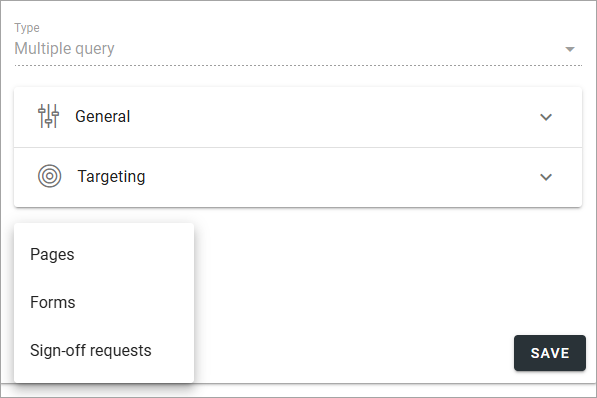

Pages
-------
For a Pages rollup you can choose one or more page collections, business profiles, publishing apps or the whole tenant. And then, in the second list, one or more within the scope.

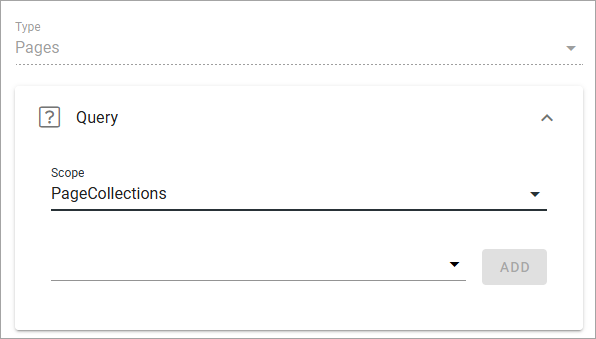

Display and Notification has the same type of options as for the Query tab.

Forms
----------
For a Forms rollup you can choose Tenant, one or more business profiles or one or more app instances. You can then add filters the same way as for other rollups.

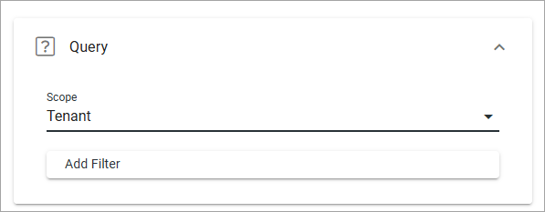

For Display, you can use the same settings as the Tab View settings for the Query tab, see above.

For Notification, you can decide to enable push notification for this rollup, or not.

Sign-off requests
------------------
You can add filters for the sign-off request you want to list on the tab. Here's an example listing all sign-off requests that is active:

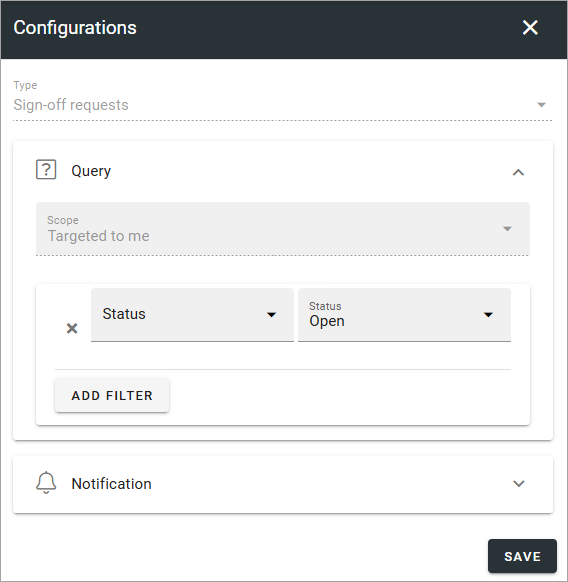

