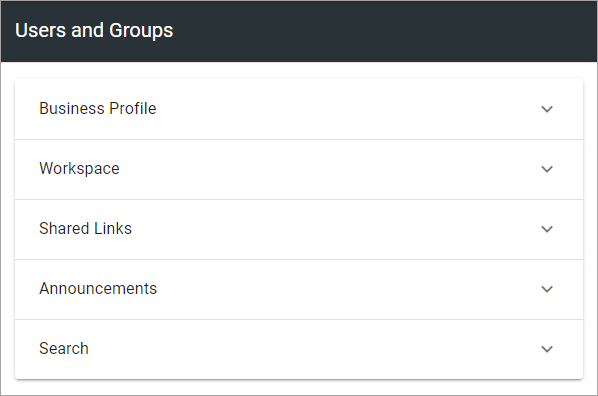
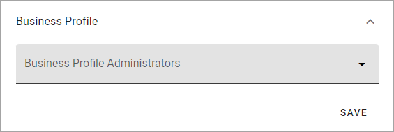
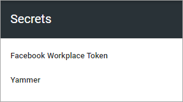

Permissions for a Business Profile
===========================================
Here you can set the following:

.. image:: security-business-profile-672.png

Users and groups
******************
Here you can add or remove Business Profile Administrators, and set separate administrators for various parts of the Business Profile, if needed. You must be Business Profile Administrator or Tenant Administrator to edit the permissions. 

A Business Profile Administrator automatically has permissions for Workspace, Shared Links, Announcements and Search, and therefore does not need to be added there. 

Note that every Business Profile has it's own Permissions list. Besides that, a Tenant Administrator can always edit settings for all Business Profiles.

To add an administrator in any of the permissions lists, add the name the same way as in other name fields. To delete an administrator here, just click the x. 

Single users, Security groups and Microsoft 365 groups can be added here (In Omnia on-prem, Microsoft 365 groups can't be used). 

Note that external users that has been invited in the Azure AD can be added here as well. Users invited this way can log in with their own Microsoft 365 account.

**Note!** A user or a group must be permissions enabled do show up in the list.

Administrators are added or removed the same way for Business Profile, Shared Links, Announcements and Search (just one field available). Here's the settings for Business profile as an example:

Options for Workspace
-----------------------------
The permission settings for Workspace are a bit different, but users and groups must be permissions enabled to show up in the list here as well.

.. image:: permissions-workspace-new612.png

+ **Allow mobile login**: This setting is intended to offer login to certain parts of Omnia for first line workers, partners and similar. The user needs the Kaizala app and a viable account. If you come across a label that says "Kaizala login" - it's the same thing. **Note!** Mobile login/Kaizala login can't be used in Omnia on-prem. 
+ **Workspace Designer**: Add and remove Workspace Designers (administrators) here as needed.
+ **Workspace Contributor**: Users/groups that should be able to comment on Business Profile Announcements and be able to send Organization Wide Posts, must be added here. (This setting does not apply to Tenant Announcements).
+ **Workspace Reader**: Here you can set permissions for the Workspace navigation. 

Not that all other permissions concerning the Workspace is handled by the general Business Profile permissions settings.

Secrets
********
When an extension has been installed for the Business Profile, get the security key/token and enter it here. In this example tokens for Facebook Workplace and Yammer can be added:

