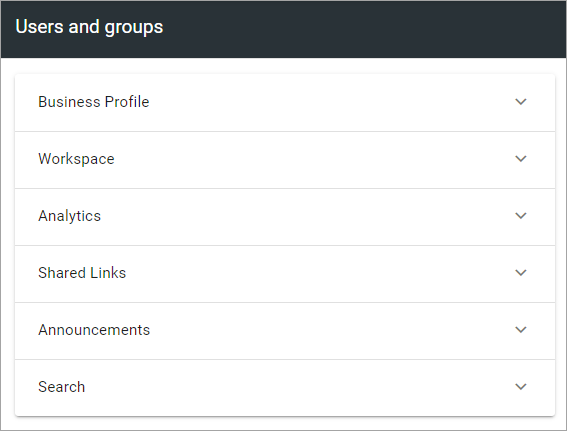
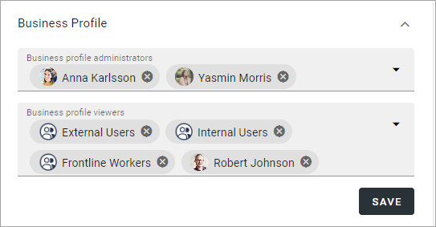
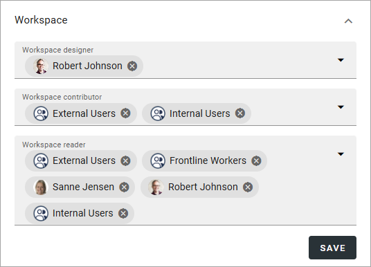
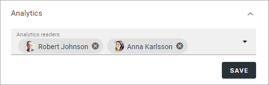
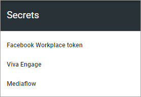

Permissions for a business Profile
===========================================
Here you can set the following:

.. image:: security-business-profile-672.png

Users and groups
******************
The following permissions can be set here:

Here you can add or remove business profile administrators, and set separate administrators for various parts of the business profile, if needed. You must be business profile administrator or tenant administrator to edit the permissions. 

A business profile administrator automatically has permissions for Workspace, Shared links, Announcements and Search, and therefore does not need to be added there. 

Note that every business profile has it's own permissions list. Besides that, a tenant administrator can always edit settings for all business profiles.

To add an administrator in any of the permissions lists, add the name the same way as in other name fields. To delete an administrator here, just click the x. 

For more information on the people picker, see: :doc:`Using the people picker </general-assets/using-people-picker/index>`

Business profile
---------------------
Here, business profile administrators and business profiles readers can be handled:

To be able to access a business profile and use the various user options, a user must be added in the Business profile viewers list, either as a person or as a member of a group. Note that if a workspace is set up, users also need to be added to the Workspace reader list, to be able to access the workspace start page and the navigation.

Options for Workspace
-----------------------------
The permission settings for Workspace are a bit different, but users and groups must be permissions enabled to show up in the list here as well.

+ **Workspace designer**: Add and remove workspace designers (administrators) here as needed.
+ **Workspace contributor**: Users/groups that should be able to comment on business profile announcements and be able to send organization wide posts, must be added here. (This setting does not apply to tenant announcements).
+ **Workspace reader**: Here you can set permissions for the workspace navigation. 

Not that all other permissions concerning the workspace is handled by the general business profile permissions settings.

Option for Analytics
----------------------
All users that should have permission to see analytics data for the business profile must be added as "Analytics readers". **Note!** That's true for tenant administrators and business profile administrators as well. No administrator has automatic access to analytics. An analytics reader will also be added as a user within Matomo.

Note that groups can't be added here, only users.

Secrets
********
When an extension has been installed for the business profile, get the security key/token and enter it here. In this example tokens for Facebook workplace, Viva Engage (former Yammer) and Mediaflow can be added:

