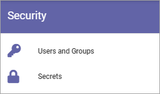
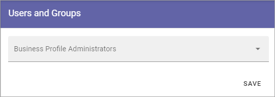

Permissions
===========================================
Here you can set the following:

(This option was formerly called Security).

Users and groups
******************
Users added to this list can edit all settings for the Business Profile. 

Note that every Business Profile has it's own Permissions list. A Tenant Administrator can always edit settings for all Business Profiles.

To add an administrator, add the name the same way as in other name fields. To delete an administrator here, just click the x. 

Note that external users that has been invited in the Azure AD can be added here as well. Users invited this way can log in with their own Microsoft 365 account.

Secrets
********
When an extension has been installed for the Business Profile, get the security key/token and enter it here. In this example tokens for Facebook Workplace and Yammer can be added:

.. image:: secrets-business-profile-new.png

