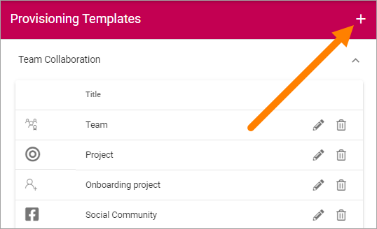
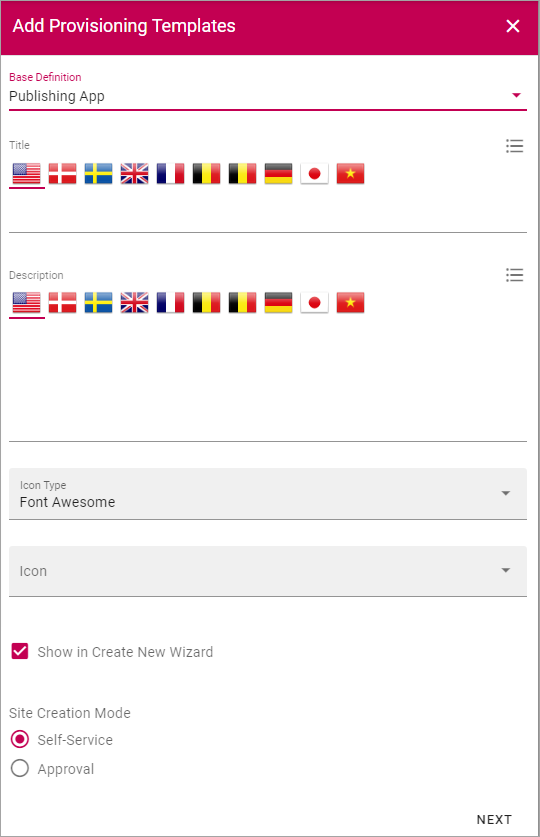
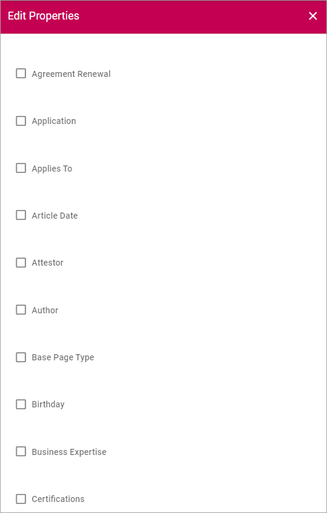
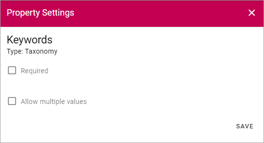
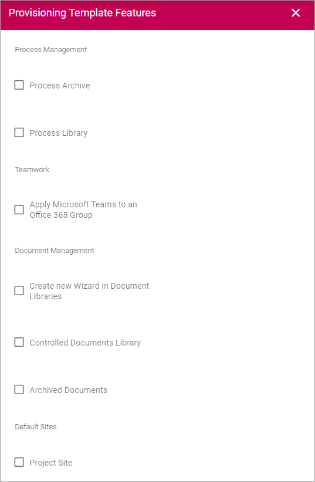

Provisioning Templates
===========================================

Use these options to create Provisioning Templates for Team Sites of different types, or Publishing Apps.

All existing templates are displayed in the list, for example:

.. image:: provisioning-templates-new3.png

Use the icons to edit or delete a template. 

.. image:: provisioning-templates-edit-delete-new3.png

When editing a template, the same options as when creating a template is available, see below.

Create a Provisioning Template
*********************************
To create a Template, do the following:

1. Click the plus.

Available settings differ depending on which type of template you're creating, see below.

The first step is the same for all template types. Do the following:

2. For Base Definition select "Publishing", "Community App" or "Teamwork" and use the following settings:

+ **Title**: Add a Title for the Template. You can add titles in a number of the languages available in the tenant. Default language is mandatory.
+ **Description**: Add a Description if needed. You can add titles in a number of the languages available in the tenant. Default language is mandatory.
+ **Icon Type**: An icon is always shown for a Template. If you would like another icon for this Template, select the set of Icons here: "Font Awesome", "Fabric" or "Custom". When selecting "Custom" you can choose any image as the Icon.
+ **Icon**: When you have select Icon Type, use this list to select the icon. If you select "Custom", this list is not shown. Instead a "Url" field is shown, where you enter the Url for the image.
+ **Show in Create New Wizard**: Select this option if the Template should be available in the user Wizard for creating new sites.
+ **Site Creation Mode**: Here you select if Approval is required when users create sites from this Template. 

**Very important!** At the moment creating a community requires some hands on by an administrator. We therefore recommend that administrators create all communities for now. See to that "Show in Create New Wizard" is NOT selected. In this case, setting "Site Creation Mode" to "Self Service" for Community templates can be a good idea as it will make creation of communities straight forward.

3. Click "Next".

The next step is for **Teamwork** only. These settings are not applicable for Publising or for Community. For Teamwork, you can set the following:

.. image:: provisioning-templates-create-team-3-new.png

+ **Type**: Select template to base the new template on; "Office 365 Group, Sharepoint Team Site", "Sharepoint Communication Site", "Yammer Group" or "Facebook Workplace Group". This can be changed when an existing Provisioning Template is edited.

For **Office 365 Group**, the following settings are available:

+ **Site Design**: Here templates can be available, templates made according to Microsoft's standard for Site Design. Such templates can be used in Omnia.  Not mandatory. If no such templates are available, the list is empty. For more information about Site Design, see this Microsoft page: https://docs.microsoft.com/en-us/sharepoint/dev/declarative-customization/site-design-overview
+ **Languages**: Select Language to be used for system texts in the site.
+ **User can select language**: Select this option to enable Language selection by the user creating the site.
+ **Time Zones**: Select the correct Time Zone here.
+ **Privacy: For 365 Groups you can select either “Private” or “Public”. The text in the selections explains the difference.

The following settings are available for a **Sharepoint Team Site** and for a **Sharepoint Communication Site** (note that a "Sharepoint Communication Site" is not the same as a Community site):

+ **Site Design**: (See above for a description).
+ **Languages**: Select Language to be used for system texts in the site.
+ **User can select language**: Select this option to enable Language selection by the user creating the site.
+ **Time Zones**: Select the correct Time Zone here.
+ **Primary Site Collection Administrator**: If empty, the user creating or requesting the site will automatically become the Default Administrator (Owner) of the site. If a specific group or user should be administrator for all sites created from this template, add that group or user. Only on group or user can be added in this field.
+ **Default Site Collection Administrators**: You can add (several) additional administrators here, if needed.
+ **Default Visitors**: You can use this to set a default visitor group (read permissions) to all sites created from this template. Let's say it's a template for community pages - then probably all users of the intranet should have read permission to all pages in the site. 

The following setting is available for a **Yammer Group** Template:

+ **Client id**: Type Client id for the Yammer Network here.

This setting is available for a **Facebook Workplace Group** Template:

+ **Workplace Domain**: Add the Facebook Workplace name here.

4. When you are done here, Click "Next".

The next step is to select properties, which you can do for all types of templates. All available properties are shown, for example:

Available properties must have been set up using the Tenant setting Properties, see: :doc:`Tenant Settings - Properties </admin-settings/tenant-settings/properties/index>`

Normally a lot more properties are available than shown in the image above.

What you can do here is to select if a property should be required (meaning that it should be mandatory to add information for the property when creating a site). For some properties you can also set that multiple values are allowed.

Here's an example with Keywords, where you can set both:

5. Select the property and then click the dot menu.

6. Select if the property is required and/or if multiple values should be allowed:

7. Click "Save"
8. When all property settings are done, click "Next", at the bottom of the properties list.

.. image:: provisioning-templates-pubapp4.png

As the next step you can set this:

(All features are not shown in the image above.)

+ **Process Archive**: Set if a process archive should be created when this template is used. Applicable for a Sharepoint Teamsites and Office 365 sites only.
+ **Process Library**: Set if a process Library should be created when this template is used. Applicable for a Sharepoint Teamsites and Office 365 sites only.
+ **Apply Microsoft Teams to an Office 365 Group**: Here you can select that a Microsoft Teams Group should be created for the Office 365 Group.
+ **Create a new Wizard in Document Libraries**: For Document Management; if the New Document Wizard should be added to all document libraries in the site created from this template, check the box. Applicable for a Sharepoint Teamsites and Office 365 sites only
+ **Controlled Documents Library**: For Document Management; if a Controlled Documents library should be added to all document libraries in the site created from this template, check the box. Applicable for a Sharepoint Teamsites and Office 365 sites only
+ **Archived Documents**: Select this option if the feature "Archived Documents" should be activated automatically when a site is created from this template. Applicable for a Sharepoint Teamsites and Office 365 sites only
+ **Project Site**: Select this option if the feature "Project Site" should be activated automatically when a site is created from this template. Applicable for specialized set ups only.
+ **Default Page Collections and Page Types**: For Publishing templates; Select this option if the corresponding feature should be activated automatically when a site is created from this template. The default Page Collections and Page Types can be edited to suit your needs.
+ **Show Business Profile Header**: For Publishing templates; if the header set up in the Business Profile should be used, select this option. Applicable for Publishing App templates only.

**Very important**: Make sure you select only the features that are applicable for the type of template you create, if any. Selecting the wrong feature here can cause problems when a site is created from the template. No feature shown here are applicable for Community site templates.

9. Set the options here as needed and click "Next".

Finally, you can select to add Custom Steps. If additional Custom Steps are developed, they are shown here.

If you do, something like the following is shown:

.. image:: custom-steps.png

You can choose to add some standard "Custom steps" as shown in the image above. If additional Custom Steps are developed, they are shown here.

10. When all settings are done here, or if you selected not to add custom steps, click "ADD" to create the Template.

.. image:: provisioning-templates-4-new.png