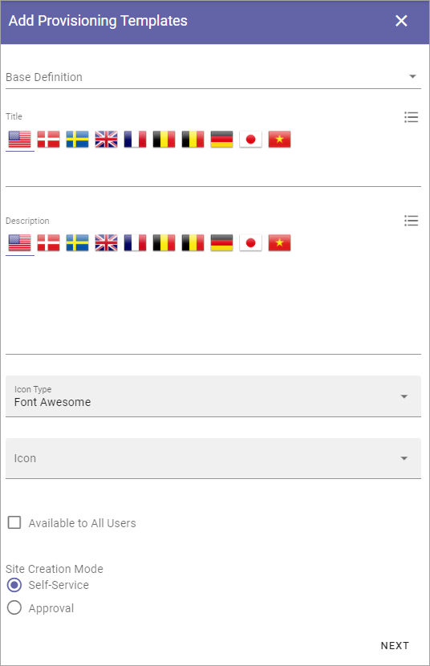
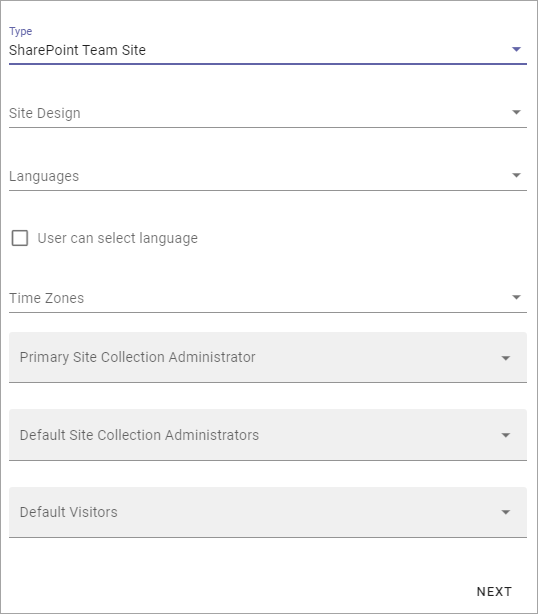
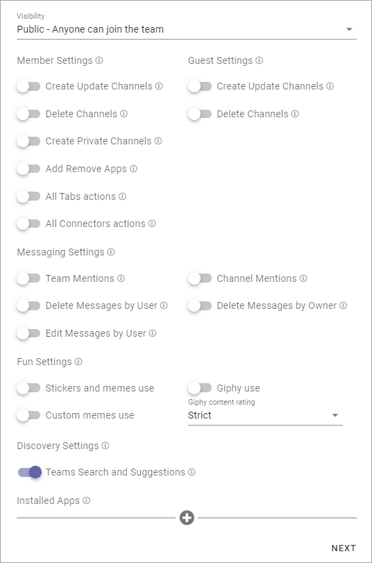
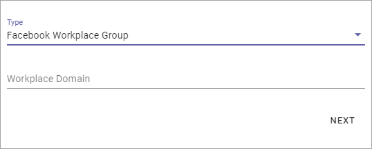
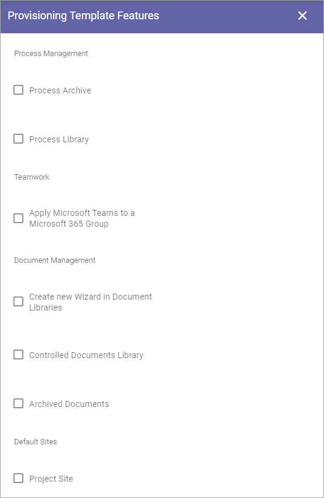
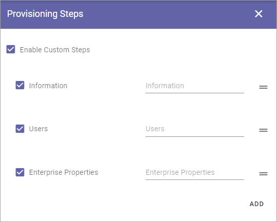

Provisioning Templates
===========================================

Use these options to create Provisioning Templates for Team Sites of different types, or Publishing Apps.

All existing templates are displayed in the list, for example:

.. image:: provisioning-templates-new4.png

Use the icons to edit or delete a template. 

When editing a template, the same options as when creating a template is available, see below.

Create a Provisioning Template
*********************************
To create a Template, click the plus:

.. image:: provisioning-templates-create-1new2.png

Settings for all templates
----------------------------
The first step is the same for all template types.

+ **Base Defintion**: Select main type of template here; Publishing, Community or Teamwork. The settings in the steps to come will differ depending on what you choose.
+ **Title**: Add a Title for the Template. You can add titles in a number of the languages available in the tenant. Default language is mandatory.
+ **Description**: Add a Description if needed. You can add titles in a number of the languages available in the tenant. Default language is mandatory.
+ **Icon Type**: An icon is always shown for a template. If you would like another icon for this template, select the set of icons here: Font Awesome,, Microsoft, Flags or Custom. When selecting Custom you can choose any image as the icon.
+ **Icon**: When you have select Icon Type, use this list to select the icon. If you select Custom, a Url field is shown, where you enter the Url for the image.
+ **Available to All Users**: Select this option if the template should be available for other's than administrators, for example in the user Wizard for creating new teamworks. If this option is selected, the template will be available only for administrators to use in Omnia Admin.
+ **Site Creation Mode**: Here you select if approval is required when users create sites from this template. 

If you select Approval, you must add one or more approvers right away:

.. image:: provisioning-templates-approval.png

**Very important!** At the moment creating a community requires some hands on by an administrator. We therefore recommend that administrators create all communities for now - using the "Community" option in Omnia Admin. See to that "Available for all users" is NOT selected. In this case, setting Site Creation Mode to Self Service for community templates can be a good idea as it will make creation of communities straight forward.

Teamwork Type
----------------
The second step for Teamwork is to select type and set some settings (for Publishing and Communities, this step is not used):

.. image:: provisioning-templates-create-team-3-new2.png

+ **Type**: Select template to base the new template on; Microsoft 365 Group, Sharepoint Team Site, Sharepoint Communication Site, Microsoft Team, Yammer Community or Facebook Workplace Group. This can be changed when an existing Provisioning Template is edited.

Microsoft 365 Group
---------------------
For Microsoft 365 Group, the following settings are available:

.. image:: ms-365-group.png

+ **Site Design**: Here templates can be available, templates made according to Microsoft's standard for Site Design. Such templates can be used in Omnia.  Not mandatory. If no such templates are available, the list is empty. For more information about Site Design, see this Microsoft page: https://docs.microsoft.com/en-us/sharepoint/dev/declarative-customization/site-design-overview
+ **Languages**: Select language to be used for system texts in the site.
+ **User can select language**: Select this option to enable language selection by the user creating the site.
+ **Time Zones**: Select the correct time zone here.
+ **Privacy**: For 365 Groups you can select either Private or Public. The text in the selections explains the difference.

Sharepoint Team Site or Sharepoint Communication Site
-------------------------------------------------------
The following settings are available for a Sharepoint Team Site and for a Sharepoint Communication Site (note that a Sharepoint Communication Site is not the same as a Community site):

+ **Site Design**: Here templates can be available, templates made according to Microsoft's standard for Site Design. Such templates can be used in Omnia.  Not mandatory. If no such templates are available, the list is empty. For more information about Site Design, see this Microsoft page: https://docs.microsoft.com/en-us/sharepoint/dev/declarative-customization/site-design-overview
+ **Languages**: Select language to be used for system texts in the site.
+ **User can select language**: Select this option to enable language selection by the user creating the site.
+ **Time Zones**: Select the correct time zone here.
+ **Primary Site Collection Administrator**: If empty, the user creating or requesting the site will automatically become the default administrator (Owner) of the site. If a specific group or user should be administrator for all sites created from this template, add that group or user. Only on group or user can be added in this field.
+ **Default Site Collection Administrators**: You can add (several) additional administrators here, if needed.
+ **Default Visitors**: You can use this to set a default visitor group (read permissions) to all sites created from this template. 

Microsoft Team
---------------
Use these settings to configure a Microsoft Teams template with predefined channels, apps, tabs and settings. 

For CHANNELS the following settings are available:

.. image:: microsoft-team-channels.png

+ **Name**: Type the name for the tab here.
+ **App Types**: Select type of app for the tab; Built-in meaning Microsoft Apps, or Organization for other Apps, which can, for example, be Omnia Apps.
+ **Installed Apps**: Open the list and select app.
+ **Content Url**: (A description will be added soon).
+ **Website Url**: (A description will be added soon).

To add addtional tabs click the plus:

.. image:: microsoft-team-channels-another.png

Use the settings as explained above. 

For SETTINGS, this is available:

(A description of these settings will be added soon.)

Yammer Community
-----------------
The following setting is available for a Yammer Community Template:

.. image:: yammer-community.png

+ **Client id**: Type the Client id for the Yammer Network here.

Facebook Workplace Group
-------------------------
This setting is available for a Facebook Workplace Group Template:

+ **Workplace Domain**: Add the Facebook Workplace name here.

Edit Properties
----------------
For Publishing and Communities, this will be step number 2, for Teamwork it will be step 3. All available properties are shown, for example:

.. image:: provisioning-templates-properties-new2.png

Available properties must have been set up using the Tenant setting Properties, see: :doc:`Tenant Settings - Properties </admin-settings/tenant-settings/properties/index>`

Normally a lot more properties are available than shown in the image above.

What you can do here is to select the properties that should be available for this template, and set if a property should be required (meaning that it should be mandatory to add information for the property). For some properties you can also set that multiple values are allowed.

Here's an example with Keywords, where you can set both. Click the dots to edit settings (if available).

.. image:: template-properties-dot-menu-new2.png

The available settings for the property are shown, for example:

.. image:: template-property-required-new2.png

Don't forget to save the settings for a property, and when you're done, you click NEXT at the bottom of the property page (you have to scroll all the way down).

Provisioning Template Features
---------------------------------
There can be a number of features available. Here's an example:

(All features are not shown in the image above.)

+ **Process Archive**: Set if a process archive should be created when this template is used. Applicable for a Sharepoint Teamsites and Microsoft 365 sites only.
+ **Process Library**: Set if a process Library should be created when this template is used. Applicable for a Sharepoint Teamsites and Microsoft 365 sites only.
+ **Apply Microsoft Teams to an Office 365 Group**: Here you can select that a Microsoft Teams Group should be created for the Microsoft 365 Group.
+ **Create a new Wizard in Document Libraries**: For Document Management; if the New Document Wizard should be added to all document libraries in the site created from this template, check the box. Applicable for a Sharepoint Teamsites and Microsoft 365 sites only.
+ **Controlled Documents Library**: For Document Management; if a Controlled Documents library should be added to all document libraries in the site created from this template, check the box. Applicable for a Sharepoint Teamsites and Microsoft 365 sites only.
+ **Archived Documents**: Select this option if the feature "Archived Documents" should be activated automatically when a site is created from this template. Applicable for a Sharepoint Teamsites and Microsoft 365 sites only.
+ **Project Site**: Select this option if the feature "Project Site" should be activated automatically when a site is created from this template. Applicable for specialized set ups only.
+ **Default Page Collections and Page Types**: For Publishing templates; Select this option if the corresponding feature should be activated automatically when a site is created from this template. The default Page Collections and Page Types can be edited to suit your needs.
+ **Default Page Types for Event Management**: (A description will be added soon).
+ **Show Business Profile Header**: If the header set up in the Business Profile should be used, select this option. Applicable for Publishing templates only. When the Business Profile Header is shown on a team site, the height is pre-allocated until the whole page is loaded.

**Very important**: Make sure you select only the features that are applicable for the type of template you create, if any. Selecting the wrong feature here can cause problems when a site is created from the template. No feature shown here are applicable for Community site templates!

Custom steps
--------------
Finally, you can select to add custom steps. If additional custom steps are developed, they are shown here.

If you add custom steps, something like the following can be shown:

Create the Provisioning Template
***********************************
When all settings are done here, click "ADD" to create the Template.

.. image:: provisioning-templates-4-new2.png
