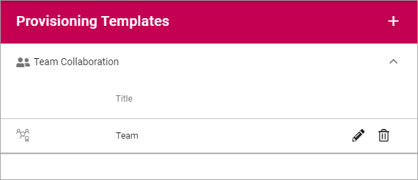
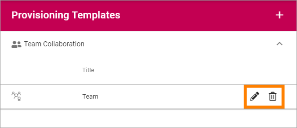
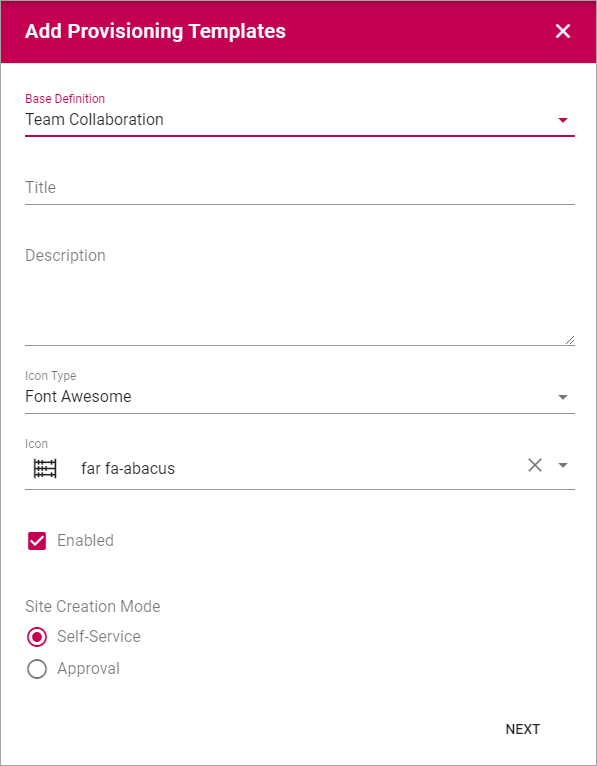

Provisioning Templates
===========================================

Use these options to create Provisioning Templates for creating Team Sites or Publishing Apps.

All existing Templates are displayed in the list.

Use the icons to edit or delete a Template. 

When editing a template, the same options as when creating a Template is available, see below.

Creating a Provisoning Template
*********************************
To create a Template, do the following:

1. Click the plus.

.. image:: provisioning-templates-create-1.png

Available settings differ depending on if you create a Template for a Publishing App or for a Team Site, see below.

Creating a Template for a Publishing App
-----------------------------------------
Do the following:

2. For "Base Definition", select "Publishing App" and use the following settings:

.. image:: provisioning-templates-create-publishing-2.png

+ **Title**: Add a Title for the Template.
+ **Description**: Add a Description if needed.
+ **Icon Type**: An icon is always shown for a Template. If you would like another icon for this Template, select the set of Icons here: "Font Awesome", "Fabric" or "Custom". When selecting "Custom" you can choose any image as the Icon.
+ **Icon**: When you have select Icon Type, use this list to select the icon. If you select "Custom", this list is not shown. Instead a "Url" field is shown, where you enter the Url for the image.
+ **Enabled**: Select this option if the Template should be available for use (meaning, you can work on a Template a while and make it available when you're reday).
+ **Site Creation Mode**: Here you select if users will be available to create sites from this Template or if Approval is required.

3. Click "Next".
4. Click "ADD" to create the Template.

.. image:: provisioning-templates-publishing-3.png

Creating a Template for a Team Site
-----------------------------------------
Do the following:

2. For "Base Definition", select "Team Collaboration" and use the following settings:

The first set of options is the same as for Publishing Templatse, see above.

3. Click "Next".

Use the following optinons here:

.. image:: provisioning-templates-create-team-3.png

+ **Type**: Select template to base the new template on. If in doubt, select "Team", it's the most commonly used. 
+ **Language**: Select Language to be used for system texts in the site.
+ **User can select language**: Select this option to enable Language selection by the user creating the site.
+ **Time Zone**: Select the correct Time Zone here.
+ **Location**: Select location for the sites created from this template. For a site collection site, you can select to create sites from this template in any of the managed paths, normally either /sites or /teams. Not available for Office 365 Groups.
+ **Default Administrator**: If empty, the user creating or requesting the site will automatically become the administrator (Owner) of the site. If a specific group or user should be administrator for all sites created from this template, add that group or user. Not available for Office 365 Groups.
+ **Default Secondary Administrator**: You can add a second Administror, there should always be at least two.
+ **Default Visitors**: You can use this to set a default visitor group (read permissions) to all sites created from this template. Let's say it's a template for community pages - then probably all users of the intranet should have read permission to all pages in the site. Not available for Office 365 Groups.
+ **Privacy**: For 365 Groups (Not for Teams), you can select either "Private" or "Public". The text in the selections explans the difference.

5. Click "Next".
6. Click "ADD" to create the Template.

.. image:: provisioning-templates-4.png