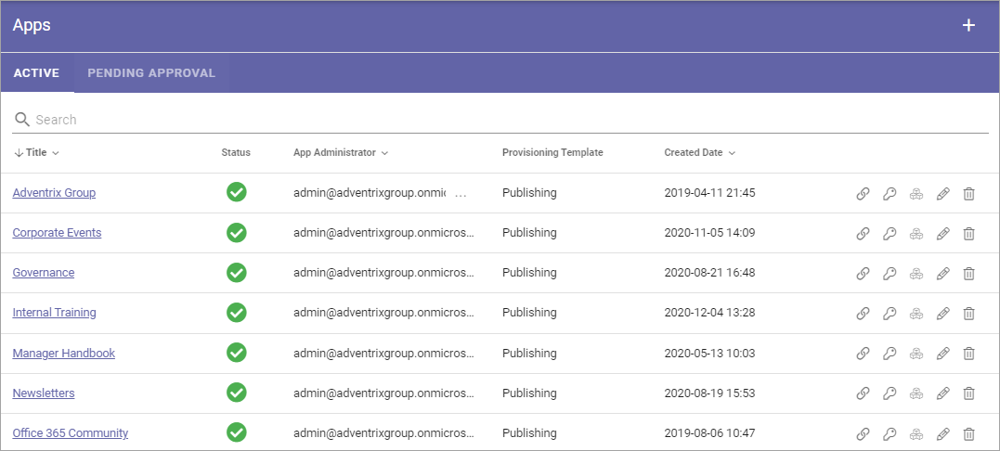
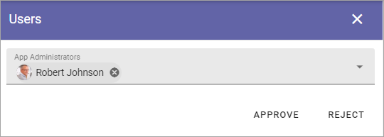
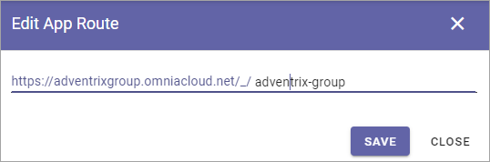

Apps
========

This is an ongoing, preliminary documentation for functionality to come in Omnia 6.5.

Within a Business Profile several Publishing Apps can be active for different settings. To be able to create a Publishing App, at least one template for Publishing Apps must be available. If none are, create a template first.

Here you will see a list of Publishing Apps in the Business Profile, for example:

Use the icons this way:

+ The left most icon to edit the app route.
+ The key to edit permissions for the Publishing Apps.
+ The boxes to activate, deactivate or upgrade features.
+ The pen to edit the settings (same as when creating a new, see below).
+ The dust bin to delete a Publishing App that has been created by mistake.

For description of settings you can edit, see below.

Create a new Publishing App
*****************************
Do the following:

1. Click the plus.

.. image:: publishing-apps-click-plus-new3.png

2. Select a Provisioning Template.

.. image:: publishing-app-template-new.png

3. Use the following settings:

.. image:: publishing-app-template-new2.png

Available settings depends on how the template is set up. Here are some common examples:

+ **Title**: Add a Title for the Publishing App.
+ **Description**: Add a Description if needed.
+ **Sharepoint Alias**: The last part of the Url to the Publishing App is shown here. It can be edited if needed.
+ **Document Library Url**: To make the Publishing App's Document library available in for example the Add Link asset and in the Document Picker, the full Sharepoint Url to the Document library must be added here.
+ **Allow User Upload Document**: The Administrator of the Publishing App will always be able to upload documents to the Document Library. If end users should be able to do that as well, select this option.

4. Click "Next" and use the following settings:

.. image:: publishing-apps-settings-3.png

+ **App Administrators**: The active Administrator (you) is automatically added as App Administrator. Add or delete administrators as needed. 

3. Click "CREATE" to create the Publishing App.

Publishing App settings
*************************
Settings for a Publishing App is done in the Settings menu when working with pages, see: :doc:`Publishing App Settings </pages/page-settings/index>`

Pending Approval
*****************
If Approval for creation is activated for the Provisioning Template, this is one of the places where an administrator can work with approval or rejection.

The list can look like this:

.. image:: publishing-pending-approval.png

To approve or reject, click the link and browse the settings. And here you decide:

If you click Approve, the publishing app is created and the colleague requesting the approval is notified. If you click Reject you add a comment of what needs to be done before it can be approved:

.. image:: publishing-pending-approval-comment.png

Edit App Route
*****************
If it should be needed to add the Aoo Route, click the icon and the following is shown:

