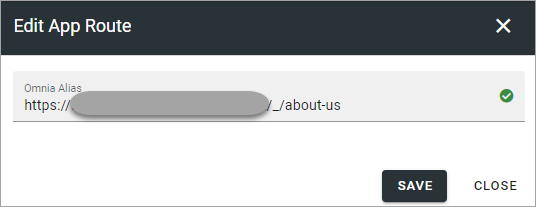
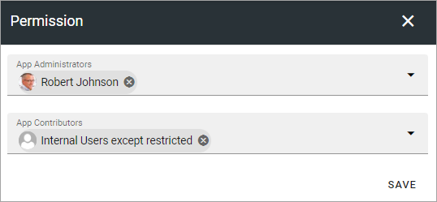
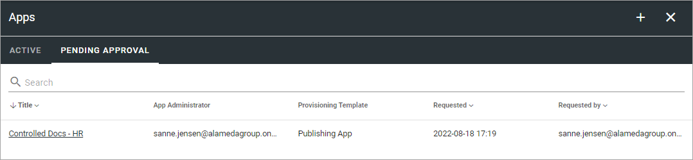
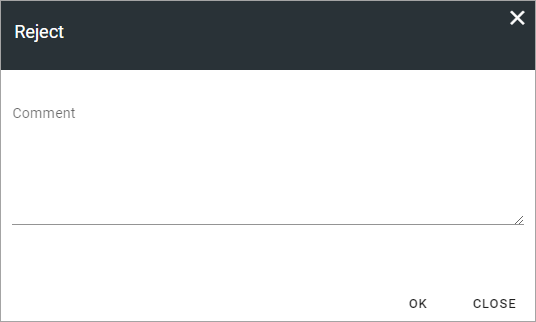
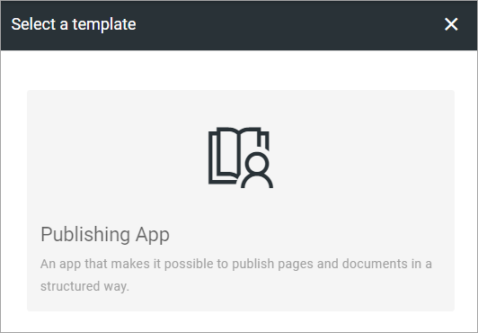

Publishing Apps
=================

Within a Business Profile several Publishing Apps can be active for different settings. To be able to create a Publishing App, at least one template for Publishing Apps must be available. If none are, create a template first.

Here you will see a list of Publishing Apps in the Business Profile, for example:

.. image:: publishing-apps-apps-612.png

You can click the link to go to an app.

Use the icons this way:

+ The left-most icon to edit the app route, if needed.
+ The key to add or remove App Administrators.
+ The boxes to activate, deactivate or upgrade features.
+ The pen to edit the settings (same as when creating a new, see below).
+ The dust bin to delete a Publishing App.

**Note!** To be able to delete a Publishing App, you must be App Administrator for that Publishing App. 

Edit App Route
*****************
If it should be needed to edit the App Route, click the icon and the following is shown:

Edit Permissions
*****************
If you need to add or remove Administrator(s) for a Publishing App, you do it here:

Contributor permissions is needed if colleagues should be able to add comments to publishing pages.

Don't forget to save when you're done.

Edit Features
**************
If it's needed to upgrade a feature for the Publishing App, you need to go here. You also go here to activate or remove a feature.

.. image:: publishing-apps-app-features-65.png

Pending Approval
*****************
If Approval for creation is activated for the template, an administrator uses this list to work with approval or rejection.

The list can look like this:

To approve or reject, click the link and browse the settings. And here you decide:

.. image:: publishing-pending-approval-approve-612.png

If you click Approve, the publishing app is created and the colleague requesting the approval is notified. If you click Reject you add a comment of what needs to be done before it can be approved:

**Note!** Requesting an app must always be done from start each time. If rejected, nothing from the request is saved.

Create a new Publishing App
*****************************
Do the following:

1. Click the plus.

.. image:: publishing-apps-click-plus-65.png

2. Select a template.

3. Use the following settings:

.. image:: publishing-app-template-settings-65.png

Available settings depends on how the template is set up. Here are some common examples:

+ **Title**: Add a Title for the Publishing App.
+ **Description**: Add a Description if needed.
+ **Add Image**: The editor setting up a Publishing Rollup can choose to show images for the apps, both for List and for Card display. Here you can select an image to be shown there, using the Media Picker. When an image has been selected it can be deleted or edited using the X and the pen that is shown then.
+ **Show in Public Listings**: If a link to the app should be available in public listings (meaning listings in Omnia) select this option. If this option is deselected, the app can only be reached by specific links, for example in a Workspace navigation.
+ **Sharepoint Alias**: The last part of the Url to the Publishing App is shown here. It can be edited if needed.
+ **Omnia Alias**: The last part of the address to the site is created automatically but can be edited if necessary. If the name (address) already exists an alternative address is suggested.
+ **Document Library Url**: To make the Publishing App's Document library available in for example the Add Link asset and in the Document Picker, the full Sharepoint Url to the Document library must be added here.
+ **Allow User Upload Document**: The Administrator of the Publishing App will always be able to upload documents to the Document Library. If end users should be able to do that as well, select this option.

4. Click "Next" and use the following settings:

.. image:: publishing-apps-settings-65.png

+ **App Administrators**: The active Administrator (you) is automatically added as App Administrator. Add or delete administrators as needed. 

3. Click "CREATE" to create the Publishing App.

If the template was set up for approval, the last option would be SEND FOR APPROVAL instead.

Publishing App settings
*************************
Settings for a Publishing App is done in the Settings menu when working with pages, see: :doc:`Publishing App Settings </pages/page-settings/index>`

