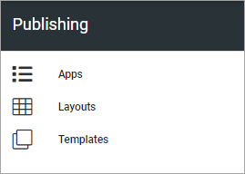

Publishing
========================================

This page and the pages available here, describes how these options work in Omnia 6.13. For Omnia 7.0 and later, see this page: :doc:`Publishing settings in Omnia v7 </admin-settings/business-group-settings/publishing-apps/publishing-v7/index>`

The following settings are available in Omnia 6.13:

Select section for more information:

.. toctree::
   :titlesonly:

   apps/index
   layout/index
   templates/index

A Publishing Apps Rollup block is also available: :doc:`Publishing app rollup block </blocks/publishing-app-rollup/index>`

