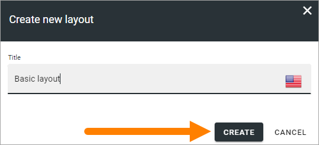
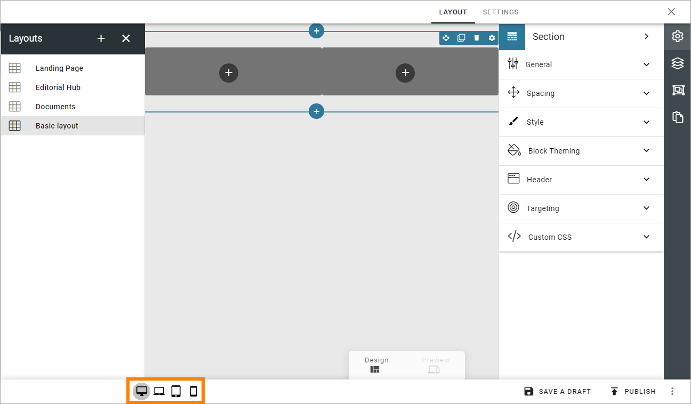

Publishing Layouts
=============================

Here you can create aned edit ready made layouts for publishing pages. If you're planning to add the possibility to work with Controlled Documents in a Publishing App, you use this option to create a layout for that functionality. For more information on how to create a layout for Controlled Documents, see the end of the page.

If there are som publishing layouts created, they will be listed here, for example:

.. image:: publishing-layouts.png

To edit a layout, just click the name. All settings available when creating a new layout can be edited, see below.

Create a new publishing layout
********************************
To create a new layout, do the following:

1. Click the plus.

.. image:: publishing-click-plus-new.png

2. Add a name for the layout in any or all the available tenant languages (click the flag to change language).
3. Click "Create".

To start working on the layout, continue this way:

4. Click on the name.

.. image:: publishing-click-name-new.png

5. Use this work area to create the layout. 

.. image:: publishing-click-work-area-new.png

You work with the layout in a similar way to Page Types. You can use all sections and blocks available.

Start by adding a section layout, just like you would do when working with a Page Type.

.. image:: publishing-click-work-area-section-new.png

Then continue building up the layout using sections and blocks.

For more information, see these pages:

+ :doc:`Working with sections and blocks </pages/page-types/working-with-sections-and-blocks/index>`
+ :doc:`Settings for sections </pages/page-types/section-settings/index>`
+ :doc:`Working with blocks </blocks/working-with-blocks/index>`

Also note the previews for the different screen sizes:

Saving a draft and publishing
---------------------------------
Saving a draft, discarding changes and finally publishing the layout, works very similar to working with pages.

.. image:: publishing-saving.png

For more information, see these pages:

+ :doc:`Edit a page </pages/edit-page/index>`
+ :doc:`Publish page changes </pages/publish-page-changes/index>`

But note that it's very similar, not exactly the same. Some options for pages are not available here (like scheduled publishing).

One thing that is perhaps not that obvious is how to delete a layout, if needed. You will find that option in the menu:

.. image:: publishing-layout-delete.png

Create a layout for Controlled Documents editing
*****************************************************************
If the purpose of the layout is to make it possible to work with Controlled Documents in a Publishing App, add this block under Miscellaneous:

.. image:: documents-process-block.png

Also note that settings for this block then is available the usual way:

.. image:: documents-process-block-settings.png
