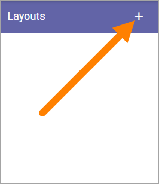
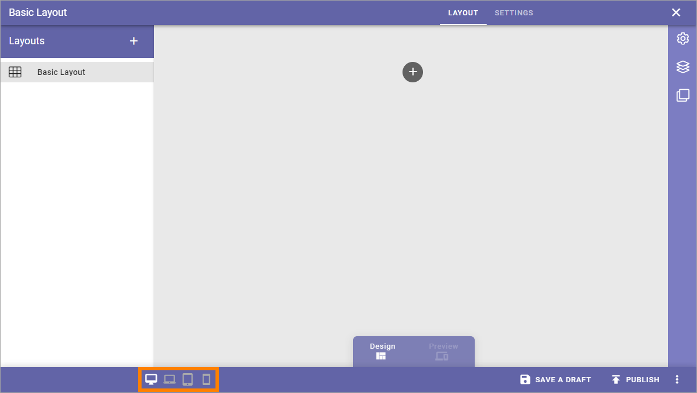

Layout
=======

This is an ongoing, preliminary documentation for functionality to come in Omnia 6.5.

Here you can work with ready made layouts for publishing start pages.

.. image:: publishing-layout.png

To create a new layout, do the following:

1. Click the plus.

2. Add a name for the layout in any or all the available tenant languages (click the flag to change language).
3. Click Create.

.. image:: publishing-click-create.png

To start working on the layout, continue this way:

4. Click on the name.

.. image:: publishing-click-name.png

5. Use this work area to create the layout. 

.. image:: publishing-click-work-area.png

You work with the layout in a similar way to Page Types. You can use all sections and blocks available.

Also note the previews for the different screen sizes:

