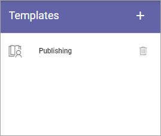
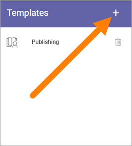
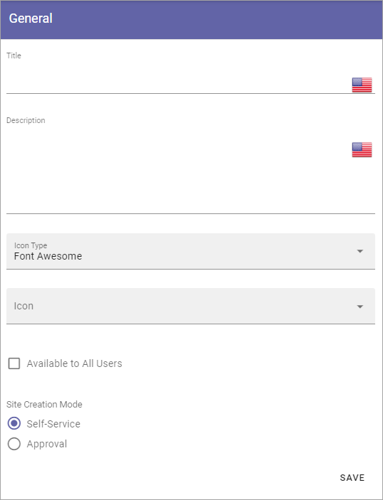
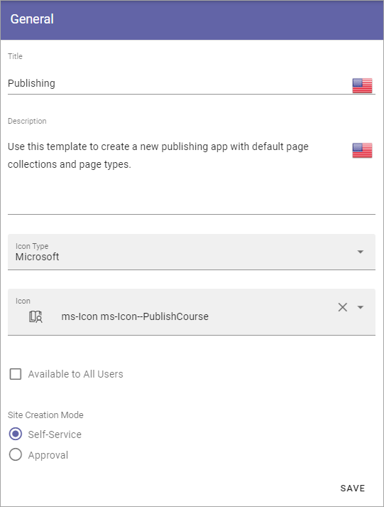
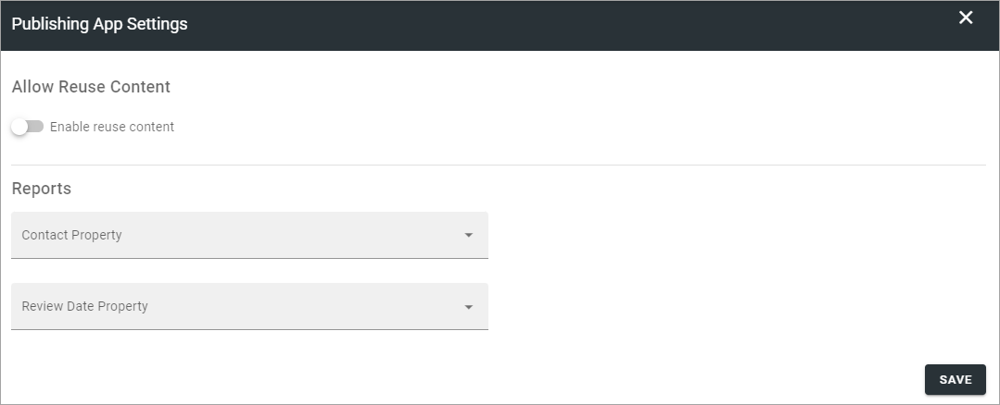
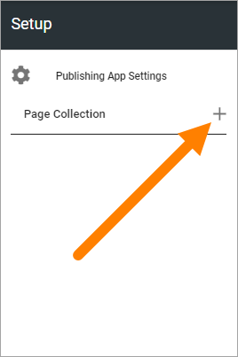
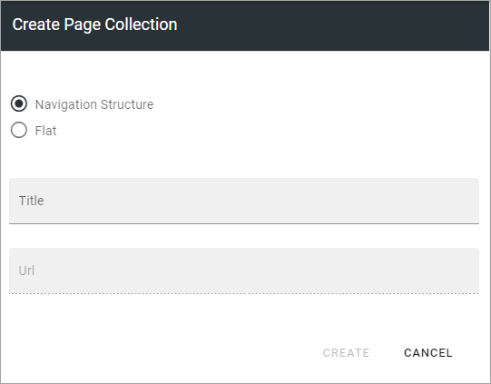
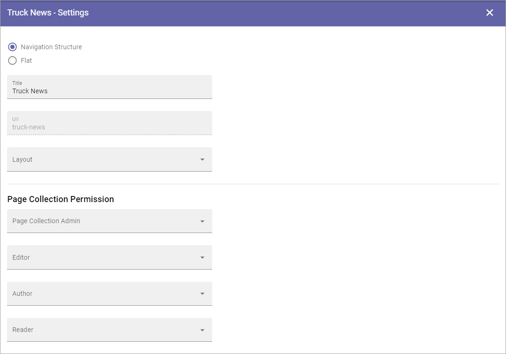
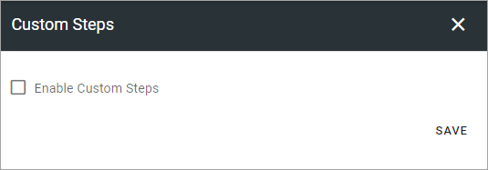
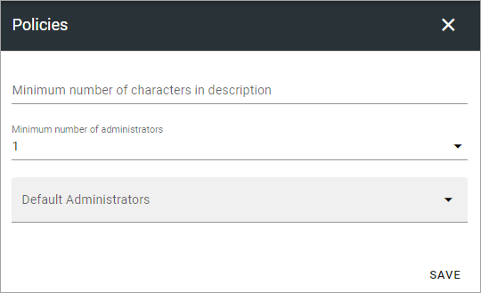

Templates for Publishing Apps
================================

Here you can work with templates for Publishing Apps.

To edit a template, click the name - to delete, click the dust bin. When you edit a template, all options that are described below are available.

Creating a new Publishing App template
****************************************
To create a new template, do the following:

1. Click the plus.

Use the following settings:

+ **Title**: Add a Title for the Template. You can add titles in a number of the languages available in the tenant. Default language is mandatory.
+ **Description**: Add a Description if needed. 
+ **Icon Type**: An icon is always shown for a template. If you would like another icon for this template, select the set of icons here: Font Awesome, Microsoft, Flags or Custom. When selecting Custom you can choose any image as the icon.
+ **Icon**: When you have select Icon Type, use this list to select the icon. If you select Custom, a Url field is shown, where you enter the Url for the image.
+ **Available to All Users**: Select this option if the template should be available for other's than administrators, for example in the user Wizard for creating new teamworks. If this option is NOT selected, the template will be available only for administrators to use in Omnia Admin.
+ **Site Creation Mode**: Here you select if approval is required when users create sites from this template. 

Settings for the template
***************************
There are a lot of settings you can do for the template when it's created.

1. Click the template to edit.

The following is shown:

.. image:: publishing-edit-all.png

General
----------
Here you can edit the information you added and the options you selected when creating the template:

See above for a description.

Properties
------------
You can add a property set to the template. 

.. image:: publishing-edit-properties.png

The properties in the set can or will have to be filled in when a community is created from this template.

The property sets are set up using the Tenant settings. See this page for more information: :doc:`Property sets </admin-settings/tenant-settings/properties/property-sets/index>`

Features
----------
Select the features that should be available for the publishing app (all are not shown in the image):

.. image:: publishing-edit-features.png

Setup
-------
Using the options here you set Publishing App settings and can create one or more Page Collections to be set up automatically when this template is used.

.. image:: publishing-edit-setup-new.png

To edit settings, click "Publishing App Settings" and use the following settings (can be edited later by a Publishing App Administrator):

+ **Enable Reuse Content**: If publishing apps created from this template should allow reuse of content, select this option. 
+ **Contact Property**: Select the default property for page contact.
+ **Review Date Property**: Select the default property for review date.

To create one or more Page Collections, do the following:

1. Click the plus for "Page Collection".

2. Create a page collection using the following settings:

3. Choose to use a Navigation Structure or just Flat, meaning no navigation structure.

One example where “Flat” is a relevant choice, is when creating a Page Collection for News.

4. Type a name (Title) for the new Page Collection.

An Url is added, based on the name. It can be edited if needed.

5. Click “Create”.
6. Edit the settings.

(There's a lot more settings than is shown in the image).

Page Collection Permissions are described on this page: :doc:`Page Collection Permissions </pages/page-collections/page-collection-permissions/index>`

You use the rest of the settings the same way as is described on this page: :doc:`Page Collections </pages/page-collections/index>`

Don't forget to save when you're ready (the "Save" option is located at the bottom, in the low right corner).

To add another Page Collection, just do it the same way.

When you have added one or more Page Collections, you can use the the icons to:

.. image:: publishing-page-collection-settings-icons.png

+ Sort the order in which they are shown (left-most icon).
+ Edit the settings (the cogwheel).
+ Delete a Page Collection.

Custom steps
---------------
If any custom steps has been developed for the creation of publishing apps, you can select them using this option.

Policies
***********
Use this for further policies settings, that will be applied to publishing apps created from this template. 

The following can be set here:

+ **Minimum number of characters in description**: Here you can set a number of characters for the description of the publishing app, to force users to add a description of a certain length. 
+ **Minimim number of administrators**: There must always be at least one administrator for a publishing app, but you can decide that more administrators should be required, up to 5.
+ **Default Administrators**: Use this to add one or more default administrators for publisning apps created from this template. These administrators will always be added, and can not be removed in the Create Publishing App wizard. Must be persons, can not be groups.

