Directory for publishing apps for Omnia v7
================================================

Within a business profile several publishing apps can be active for different settings. To be able to create a publishing app, at least one template for that purpose must be available. If none are, create a template first.

Here you will see a list of publishing apps in the business profile, for example:

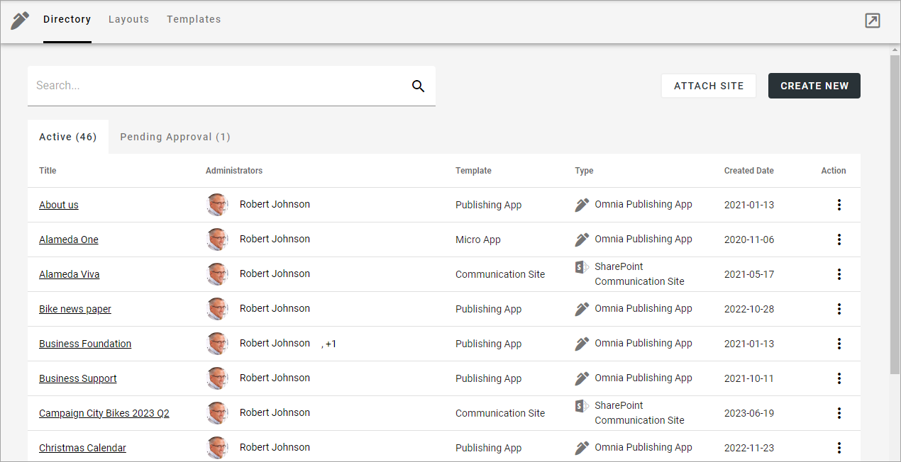

Use this icon to close the menu to the left and work in full window mode:

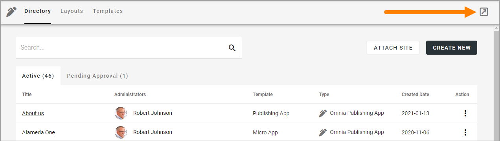

You can click the link to go to an app. You can search for an app and use the headings "Title", "Template" and "Created Date" to sort the list.

The following actions, using the dot menu to the right, are available for an app:

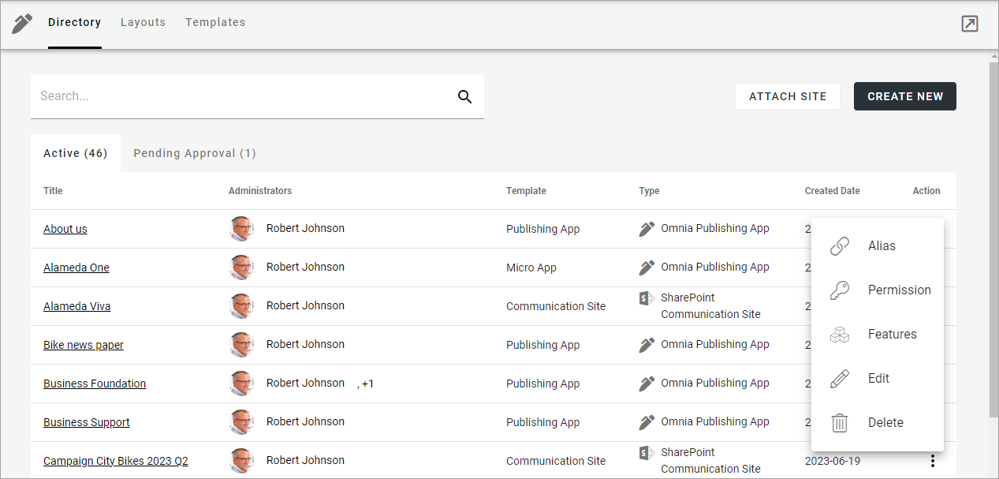

For more information, see below.

**Note!** To be able to delete a publishing app, you must be App Administrator for that publishing app. 

Attach site
**************
This option can be used in a rare setup case. If your organization creates Sharepoint communication sites some other way, they can be attached to Omnia using this option.

**Note!** The communication sites attached this way should be empty, meaning just created but no content (pages or other content) added. The actual usage of the communication sites should be through Omnia.

The following permissions are required to be able to attach: Collection Administrator permissions.

Do the following to attach a site:

1. Copy the Url for the communication site you want to attach.
2. Select ATTACH SITE.

The following is shown:

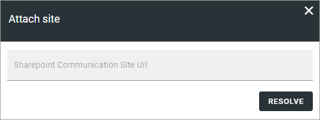

3. Paste the Url and click RESOLVE.

You can "detach" (delete) a site if needed. Then the following permissions are needed: Site Owner or Site Collection Administrator permissions.

**Note!** What actually happens when you click the dust bin to delete a site, is that the site is detached. That is true for all communcation sites, regardless of if they have been created in or attached to Omnia.

**Note!** When a site is detached, an e-mail is sent to the site owner(s).

Create a new Publishing App
*****************************
Do the following:

1. Click CREATE NEW.
2. Select a template (examples).

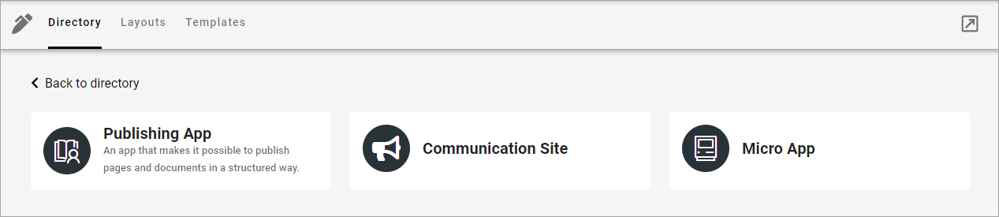

3. Use the following settings:

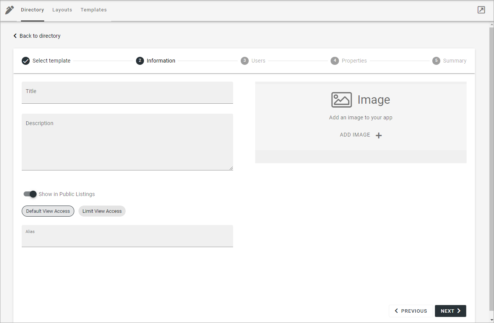

Available settings depends on how the template is set up. Here are some common examples:

+ **Title**: Add a title for the publishing app.
+ **Description**: Add a description if needed.
+ **ADD IMAGE**: The editor setting up a rollup can choose to show images for the apps, both for List and for Card display. Here you can select an image to be shown there, using the Media Picker. When an image has been selected it can be deleted or edited using the X and the pen that is shown then.
+ **Show in Public Listings**: If a link to the app should be available in public listings (meaning listings in Omnia) select this option. If this option is deselected, the app can only be reached by specific links, for example in a Workspace navigation.
+ **Default View Access/Limit View Acess**: If you select “Limit View Access” you can change view permissions for the app to specific users.
+ **Alias**: The last part of the address to the site is created automatically but can be edited if necessary. If the name (address) already exists an alternative address is suggested.

**A note for users of Omnia 6.13 and earlier**: The settings for documents that was available here has moved to the Publish App settings, see the heading "Advanced" on this page: :doc:`Publishing App Settings </pages/page-settings/index>`

4. Click "Next" and use the following settings:

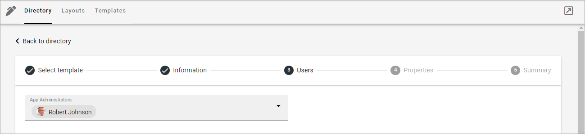

+ **App Administrators**: The active administrator (you) is automatically added as app administrator. Add or delete administrators as needed. There must always be at least one.

3. In the last setp, summary, you cen check the settings you have made, and edit them if necessary.

4. When you're done: click CREATE or SEND FOR APPROVAL, depending on how the temnplate is set up.

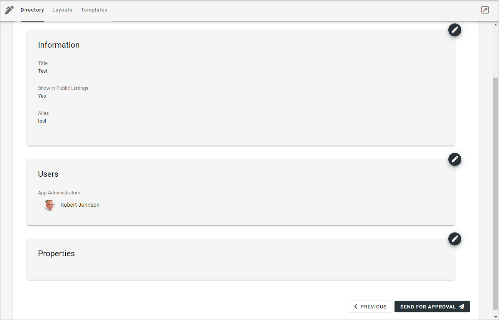

Edit Alias
*****************
If it should be needed to edit the alias, you can do it as part of the actions:

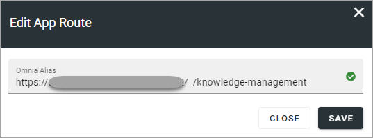

Edit Permissions
*****************
If you need to add or remove administrator(s) for a publishing app, you can do it as part of the actions:

.. image:: publishing-apps-app-premissions-v7-frame.png

Contributor permissions is needed for colleagues that should be able to add comments to publishing pages.

Edit Features
**************
If it's needed to upgrade a feature for the publishing app, you need to go this part of the actions. You also go here to activate or deactivate a feature.

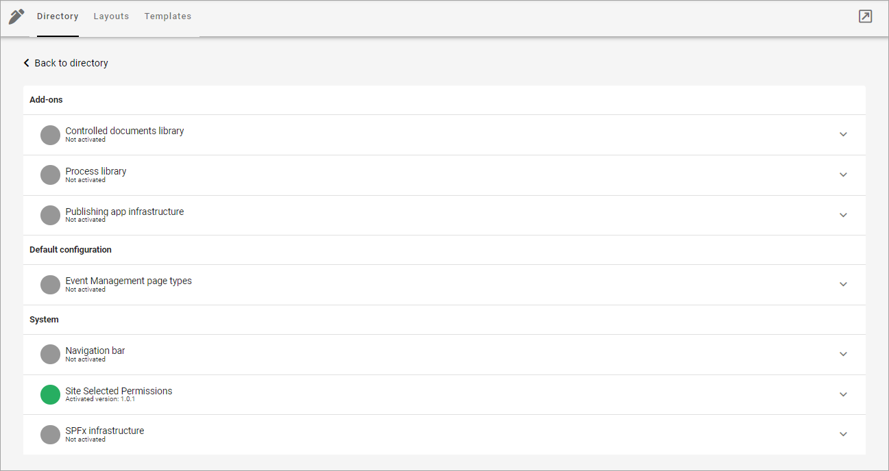

For more information about a feature, expand it.

Edit app settings
*******************
Using the "Edit" option under Actions, you can edit the information part of the app settings:

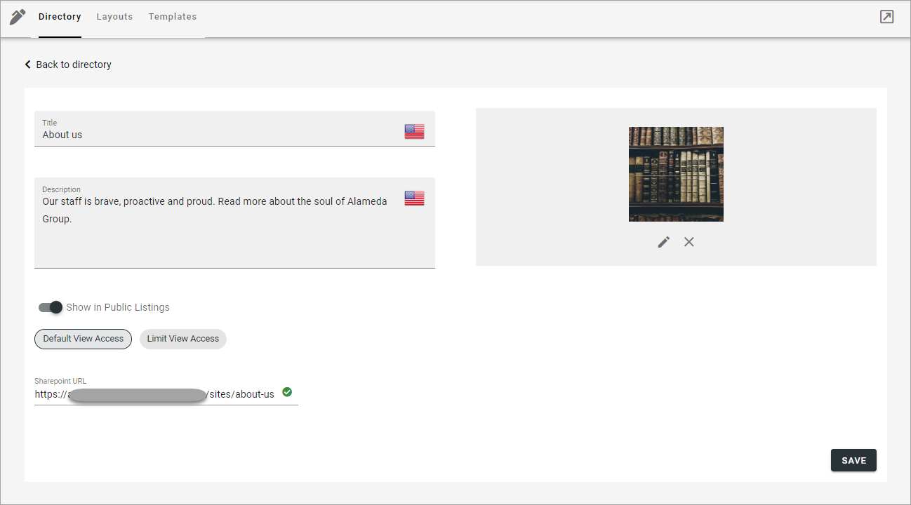

For more information about the options, see above.

A number of additional settings for a publishing app are available in the Settings menu when working with pages, see: :doc:`Publishing App Settings </pages/page-settings/index>`

Pending Approval
*****************
If approval for creation is activated for the template, an administrator uses this list to work with approval or rejection. Here's an example from a test site:

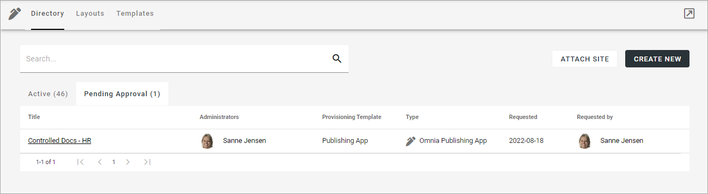

To approve or reject, click the link and browse the settings. Under Summary you decide:

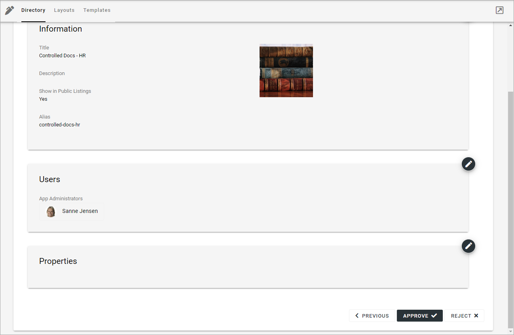

If you click "Approve", the publishing app is created and the colleague requesting the approval is notified. If you click "Reject" you add a comment of what needs to be done before it can be approved:

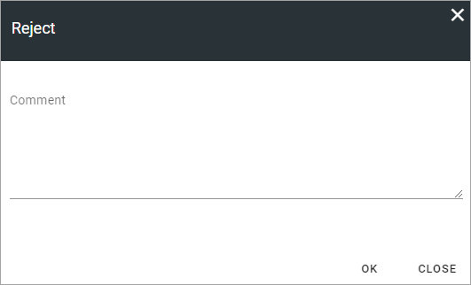

**Note!** Requesting an app must always be done from start each time. If rejected, nothing from the request is saved.

