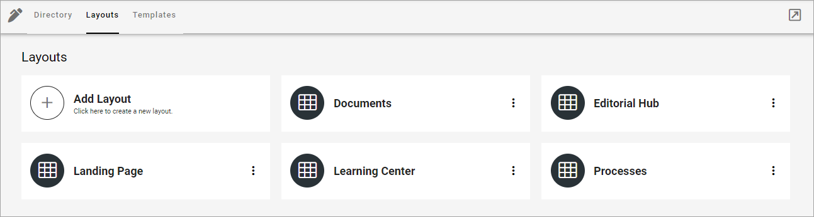
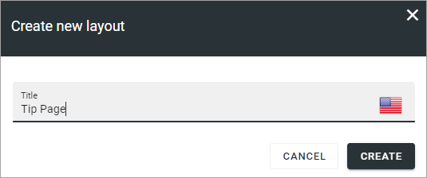
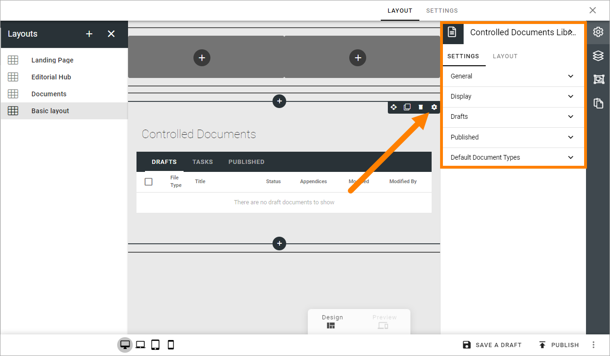

Publishing Layouts for Omnia v7
=============================

Here you can create and edit ready made layouts for publishing pages. If you're planning to add the possibility to work with Controlled Documents in a Publishing App, you use this option to create a layout for that functionality. For more information on how to create a layout for Controlled Documents, see the end of the page.

If there are som publishing layouts created, they will be listed here, for example:

To edit a layout, just click the name. All settings available when creating a new layout can be edited, see below.

Create a new publishing layout
********************************
To create a new layout, do the following:

1. Click "Add Layout".
2. Add a name for the layout in any or all the available tenant languages (click the flag to change language).
3. Click CREATE.

To start working on the layout, continue this way:

4. Click on the name or select "Edit" in the dot menu for the layout.
5. Use the work area to create the layout. 

How to work with layouts in Omnia is described on this page: :doc:`Working with Layouts </general-assets/working-with-layouts/index>`

Create a layout for Controlled Documents editing
*****************************************************************
If the purpose of the layout is to make it possible to work with Controlled Documents in a Publishing App, add this block under Miscellaneous:

.. image:: documents-process-block-new.png

Also note that settings for this block then is available the usual way:

