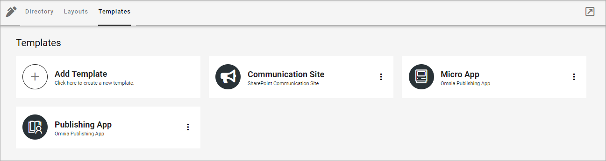
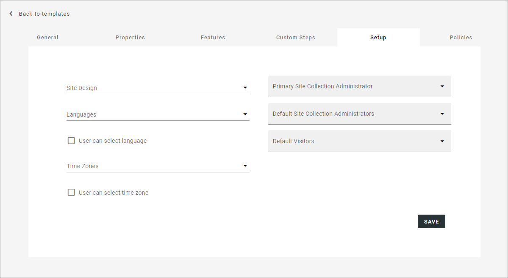

Templates for Publishing Apps in Omnia v7
=============================================

Here you can work with templates for Publishing Apps.

To edit a template, click the name - to delete, click the dust bin. When you edit a template, all options that are described below are available.

You create templates for publishing apps, community sites and Teamwork the same way, see this page: :doc:`Creating app templates in Omnia v7 </general-assets/creating-app-templates/index>`

When creating a template here, you can create a teamplate for an Omnia Publishing App or a Sharepoint Communication Site.

Most settings are the same but Setup is different for a Sharepoint Communication Site:

+ **Site Design**: Here templates can be available, templates made according to Microsoft's standard for Site Design. Such templates can be used in Omnia. Not mandatory. If no such templates are available, the list is empty. For more information about Site Design, see this Microsoft page: https://docs.microsoft.com/en-us/sharepoint/dev/declarative-customization/site-design-overview
+ **Languages**: Select language to be used for system texts in the site.
+ **User can select language**: Select this option to enable language selection by the user creating a site from this template.
+ **Time Zones**: Select the correct time zone here.
+ **Primary Site Collection Administrator**: If empty, the user creating or requesting the site will automatically become the default administrator (Owner) of the site. If a specific group or user should be administrator for all sites created from this template, add that group or user. Only one group or user can be added in this field.
+ **Default Site Collection Administrators**: You can add (several) additional administrators here (users or groups), if needed.
+ **Default Visitors**: You can use this to set a default visitor group(s) or users(s) (read permissions), to all sites created from this template. 

