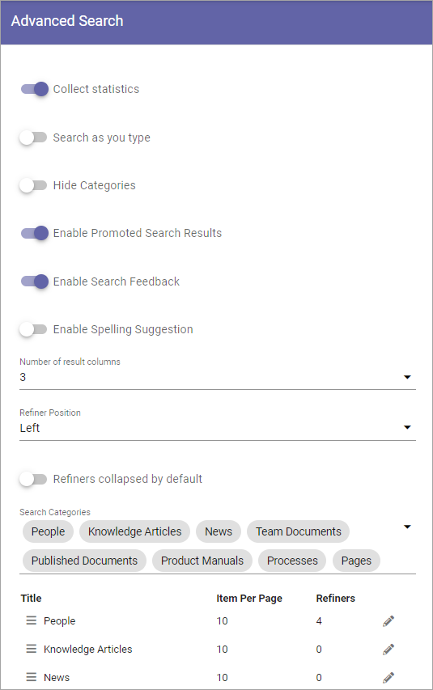
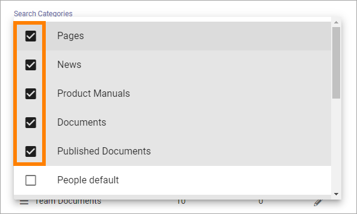
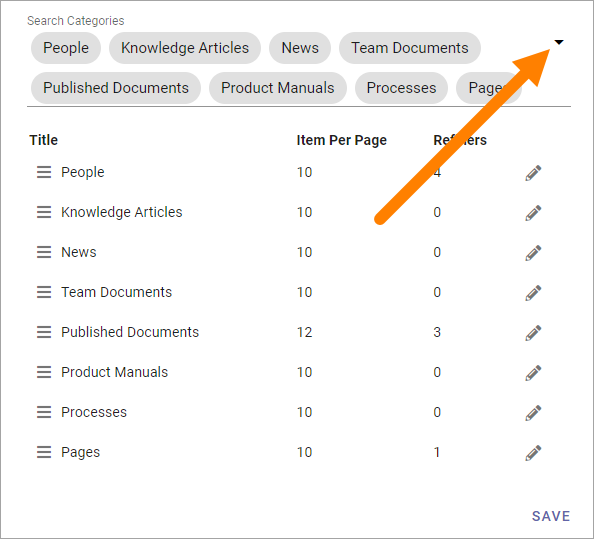
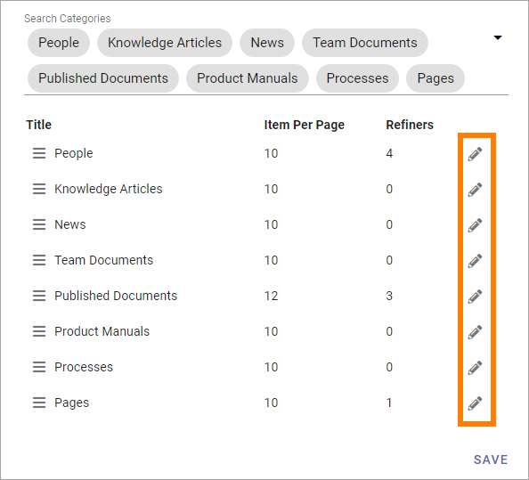
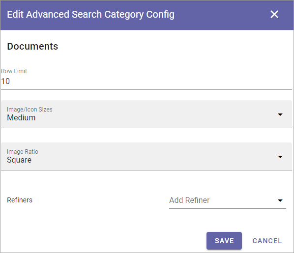
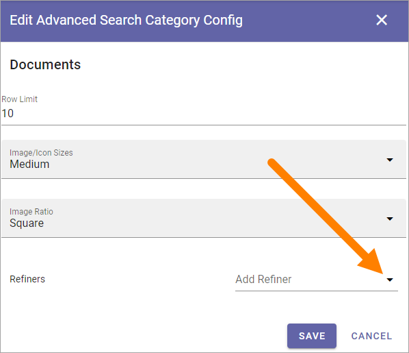
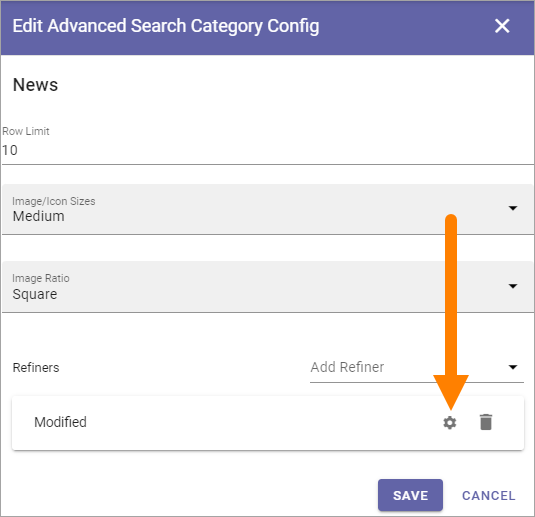
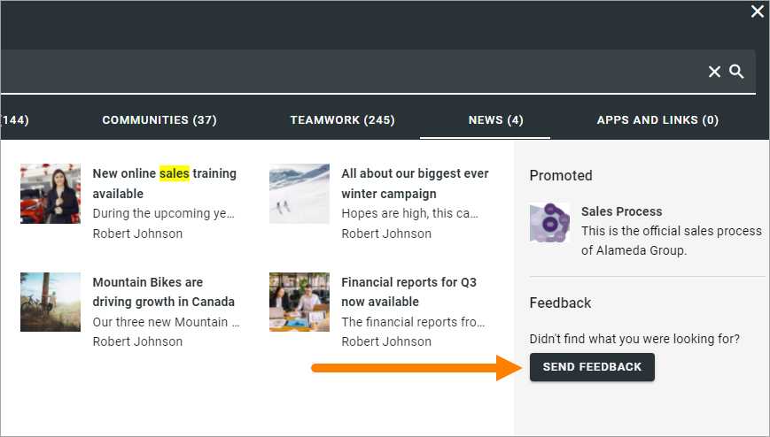

Advanced Search settings in Omnia 6.12
==============================================

In Omnia 6.12 and later, you can use these settings:

+ **Collect statistic**: If search statistics should be collected from Advanced Searh, select this option. Search results can then be displayed in Omnia Admin. For more information, see: :doc:`Search statistics </admin-settings/business-group-settings/search/search-statistics/index>`
+ **Search as you type**: The search can be executed either when the user hits enter or ongoing while the user types in the search field. Decide how it should work here.
+ **Hide Categories**: If categories should not be shown for users, select this option.
+ **Enable Promoted Search Results**: If it should be possible to see a promoted search result, select this option. Default=selected. For more information, see below.
+ **Enable Search Feedback**: If it should be possible for users to send feedback on an advanced search result, select this option. For more information, see below.
+ **Enable Spelling Suggestions**: Select this option to display spelling suggestions in Advanced Search, when users type in the search field. It's the same functionality that Microsoft 365 has. 
+ **Number of Result Columns**: Set the number of columns for the search result here.
+ **Refiner Position**: Select where the Refiners will be placed - Left or Right.
+ **Refiners collapsed by default**: Per default, just the headings for the refiners are displayed. If all all options for the refiners always should be shown, select this option. 
+ **Search Categories**: Open the list to add or remove Search Categories to use in Advanced Search.
+ **Item per page**: Here you can see the Item per page setting for each category.
+ **Refiners**: In this column you can see the number of refiners added for the category. 

The search categories are set up under "Search Config". Here you can decide which of them to use for Advanced search. For more infomation about setting up search categories, see: :doc:`Search Config </admin-settings/business-group-settings/search/search-config/index>`

To edit aettings for a category, click the pen. All settings available when creating a new category can be edited, see below.

You can decide the order for a category and it's refiners by grabbing the left most icon and use drag and drop. 

Removing a search category
****************************
To remove a category (or reather deicde not to use it), do the following:

1. Open the list of categories.

.. image:: categories-list.png

2. Deselect the category.

Adding a search category
*************************
To Add a new category here, and set refiners for it, do the following:

1. Open the list and select a category.

2. Click the pen to enter the settings.

3. Set the following:

+ **Row Limit**: Select number of search result rows to be displayed before a Show more link is displayed. 
+ **Image/Icon size**: Image or Icon size for the search result can set to Small, Medium or Large. Note that category can have a specific size, if needed. 
+ **Image Ratio**: Image ratio for the image used in the search result cam be set to Landscape, Square or Wide. Note that category can have a specific image ratio setting, if needed. 
+ **Refiners**: Use this option to add refiners for the search category.

To add a new refiner for the category, do the following:

4. Open the list and select a property.

When you have added one or more refiners for the category, use the cogwheel to edit settings:

.. image:: new-refiner-6-612-border.png

5. Set the sort order (Alphabetical or Count) and set the Iten per page.

.. image:: new-refiner-7-612.png

To delete a refiner, just click the cogwheel.

Save when you are done here, and save on the Advanced Search settings main page as well.

Default value for date refiners
----------------------------------
In Omnia 6.12 and later, you cen set a default value for date refiners, to filter out old documents by default. Here's how:

1. Add or edit the refiner.
2. Click the cog wheel.

3. Use the slider to set the time frame.

.. image:: refiner-default-slider.png

4. Save the changes

Promoted search results
*************************
If Promoted search results are enabled, such search results, if any are applicable, will be shown here:

.. image:: promoted-search-results-place.png

For information on how to create them, see: :doc:`Promoted Search results </admin-settings/business-group-settings/search/promoted-search-results/index>`

Search feedback
*******************
If Search feedback is enabled, a button will be shown for end users, for example:

When the user clicks the button, something like the following is shown:

.. image:: search-feedback-form.png

If the user do'nt want to send a snapshot of the search results, that option can be deselected.

Administrators can evaluate the feedback here: :doc:`Search feedback </admin-settings/business-group-settings/search/search-feedback/index>`

