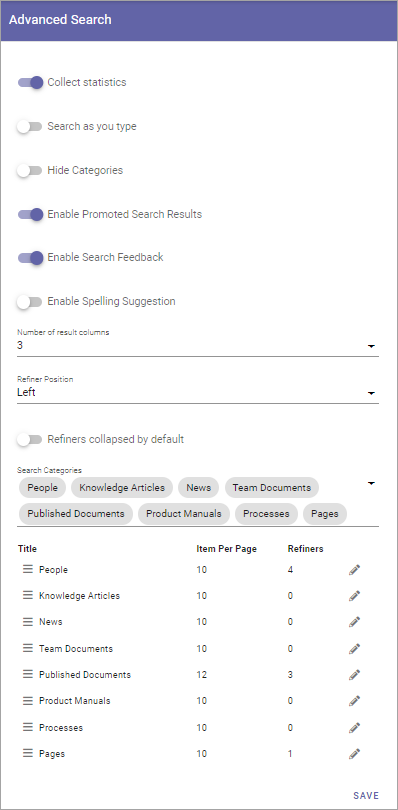

Advanced Search settings in Omnia 6.12
==============================================

**This page is being edited. Will be finished soon.**

In Omnia 6.12 and later, you can use these settings:

+ **Collect statistic**: If search statistics should be collected from Advanced Searh, select this option. Search results can then be displayed in Omnia Admin. For more information, see: :doc:`Search statistics </admin-settings/business-group-settings/search/search-statistics/index>`
+ **Search as you type**: The search can be executed either when the user hits enter or ongoing while the user types in the search field. Decide how it should work here.
+ **Enable Promoted Search Results**: If it should be possible for promoted search results to be displayed in Quick Search, select this option. For more information, see: :doc:`General Block Settings </admin-settings/business-group-settings/search/promoted-search-results/index>`
+ **Enable Spelling Suggestions**: Select this option to display spelling suggestions in Quick Search. It's the same functionality that Microsoft 365 has. 
+ **Hide Categories**: If categories should not be shown for users, select this option.
+ **Enable Promoted Search Results**: If it should be possible to see a promoted search result, select this option. Default=selected. For more information, see below.
+ **Enable Search Feedback**: If it should be possible for users to send feedback on an advanced search result, select this option. For more information, see below.
+ **Number of Result Columns**: Set the number of columns for the search result here.
+ **Refiner Positions**: Select where the Refiners will be placed - Left or Right.
+ **Refiners collapsed by default**: Per default, just the headings for the refiners are displayed. If all all options for the refiners always should be shown, select this option. 
+ **Search Categories**: Open the list to add or remove Search Categories to use in Advanced Search.

Additional settings can be reached by clicking the pen for a Search Category, for example:

.. image:: advanced-search-category-settings-67.png

+ **Row Limit**: Select number of search result rows for each "page". 
+ **Image/Icon size**: You can set this to Small, Medium or Large.
+ **Image Rario**: Image ratio for the image used in the search result cam be set to Landscape, Square or Wide.
+ **Refiners**: Use this option to add refiners for the Search Category (click the plus to add).
+ **Order By**: Set the sorting in the refiner's lists; "Count" (=number of hits) or "Alphabetic".
+ **Refiner Limit**: Set the number of refiner selections to be shown before a "Show more" link is displayed. 

To delete a refiner, just click the dust bin.

To create a new refiner, do the following:

1. Open the list and select a property to use as refiner.

.. image:: new-refiner-1-new2.png

2. Set "order By" and "Refiner Limit" and save.

.. image:: new-refiner-3-new2.png

You can decide the order for the refiners by using tha left-most icon and drag and drop.

Promoted search results
*************************
If Promoted search results are enabled, such search results, if any are applicable, will be shown here:

.. image:: promoted-search-results-place.png

For information on how to create them, see: :doc:`Promoted Search results </admin-settings/business-group-settings/search/promoted-search-results/index>`

Search feedback
*******************
If Search feedback is enabled, a button will be shown for end users, for example:

.. image:: search-feedback-button.png

When the user clicks the button, something like the following is shown:

.. image:: search-feedback-form.png

If the user do'nt want to send a snapshot of the search results, that option can be deselected.

Administrators can evaluate the feedback here: :doc:`Search feedback </admin-settings/business-group-settings/search/search-feedback/index>`

