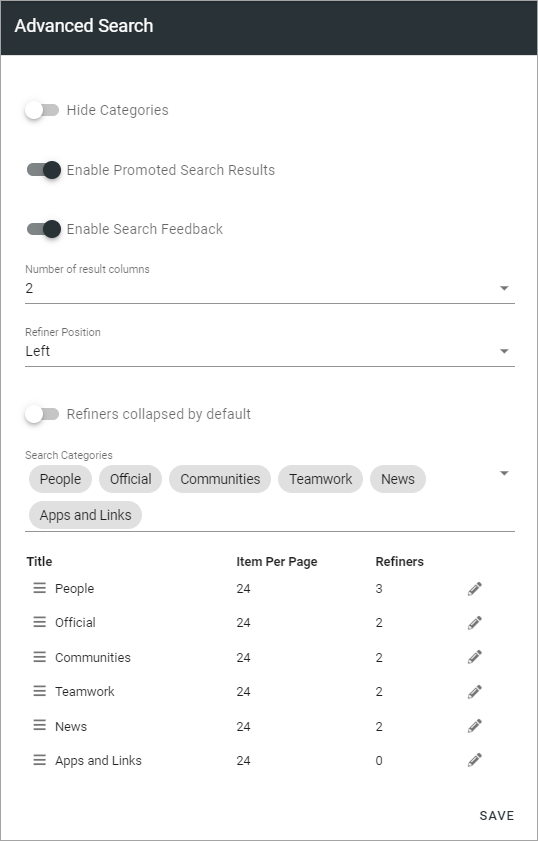
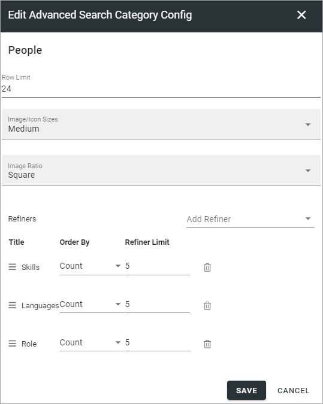

Advanced Search settings in Omnia 6.7
========================================

This is an ongoing preliminary documentation for Advanced Search settings in Omnia 6.7. More will added/edited soon.

You can use these settings:

+ **Hide Categories**: If categories should not be shown for users, select this option.
+ **Enable Promoted Search Results**: (A description will be added soon).
+ **Enable Search Feedback**: (A description will be added soon).
+ **Number of Resut Columns**: (A description will be added soon).
+ **Refiner Positions**: Select where the Refiners will be placed - Left or Right.
+ **Refiners collapsed by default**: (A description will be added soon). 
+ **Search Categories**: Open the list to add or remove Search Categories to use in Advanced Search.

Additional settings can be reached by clicking the pen for a Search Category, for example:

(From here not edited yet)

+ **Row Limit**: Select number of search result rows for each "page". 
+ **Refiners**: Use this option to add refiners for the Search Category (click the plus to add).
+ **Order By**: Set the sorting in the refiner's lists; "Count" (=number of hits) or "Alphabetic".
+ **Refiner Limit**: Set the number of refiner selections to be shown before a "Show more" link is displayed. 

To delete a Refiner, just click the dust bin.

To create a new refiner, do the following:

1. click the plus.

.. image:: new-refiner-1-new.png

2. Select property for the refiner.

.. image:: new-refiner-2-new.png

3. Set "order By" and "Refiner Limit" and save.

.. image:: new-refiner-3-new.png

Here's an example of refiners for Pages, with 43 hits:

.. image:: search-refiners-example-new.png

The user can now use the refiners to the left. Let's say, for example, that the user knows the page is authored by Anna Karlsson - it's just 5 pages:

.. image:: search-refiners-example-refined-new.png

