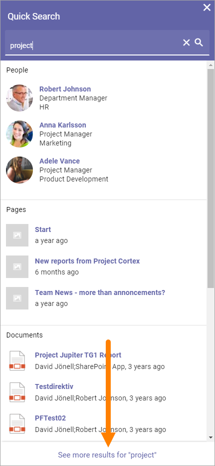
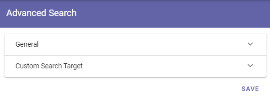
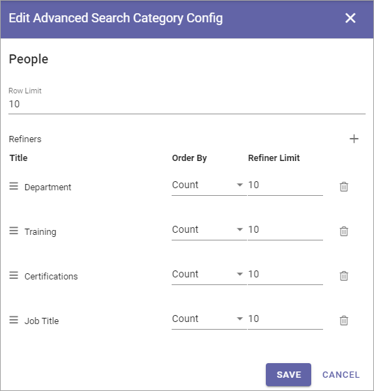
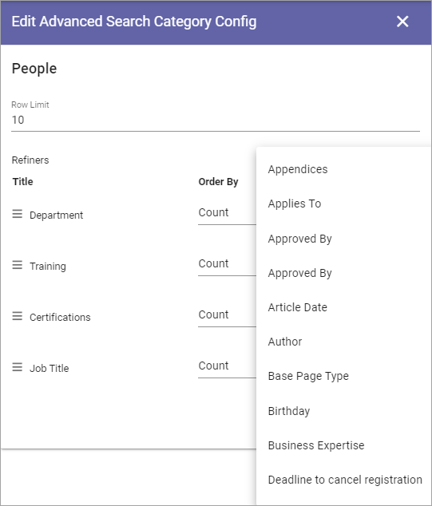

Advanced Search
==================
When a search has been made in Quick Search, Advanced Search is available through a link at the bottom. Advanced search can also be made available using the Search block.

Something like this is shown:

.. image:: advanced-search-example-new2.png

To the left refiners are shown, if any are set up.

For more information on how to make Advanced search available through the Search block, see: :doc:`The Search block </blocks/search/index>`

Use these settings for Advanced Search:

General
************
On this tab the following settings are available:

.. image:: advanced-search-new4.png

+ **Refiner Positions**: Select where the Refiners will be placed - Left or Right.
+ **Search Categories**: Open the list to add or remove Search Categories to use in Advanced Search.

Additional settings can be reached by clicking the pen for a Search Category:

.. image:: advanced-search-pen-new3.png

Then these settings are available:

+ **Row Limit**: Select number of search result rows for each "page". 
+ **Refiners**: Use this option to add refiners for the Search Category (click the plus to add).
+ **Order By**: Set the sorting in the refiner's lists; "Count" (=number of hits) or "Alphabetic".
+ **Refiner Limit**: Set the number of refiner selections to be shown before a "Show more" link is displayed. 

To delete a Refiner, just click the dust bin.

To create a new refiner, do the following:

1. click the plus.

.. image:: new-refiner-1-new.png

2. Select property for the refiner.

3. Set "order By" and "Refiner Limit" and save.

.. image:: new-refiner-3-new.png

Here's an example of refiners for Pages, with 43 hits:

.. image:: search-refiners-example-new.png

The user can now use the refiners to the left. Let's say, for example, that the user knows the page is authored by Anna Karlsson - it's just 5 pages:

.. image:: search-refiners-example-refined-new.png

Custom Search Target
**********************
If you activate this option you can change what will happen when a user clicks the Advanced Search link, for example after having made a Quick Search. This is useful for example if a specific Search Center should be used.

.. image:: custom-search-target-new-url.png

