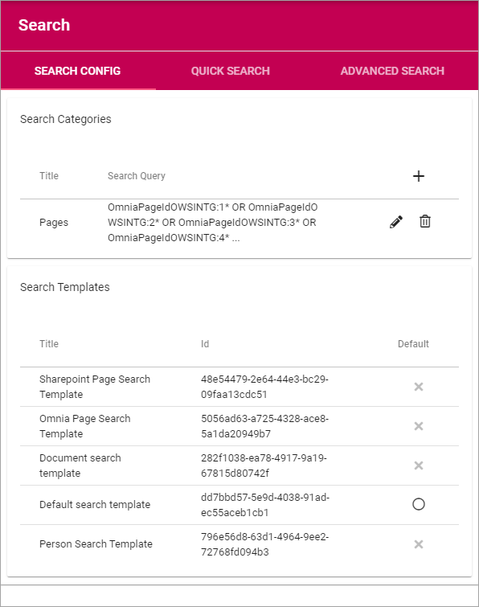
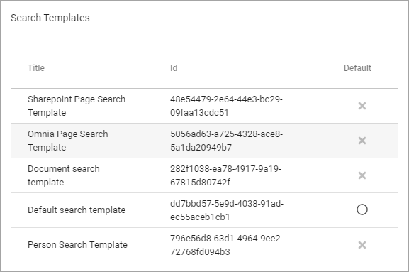
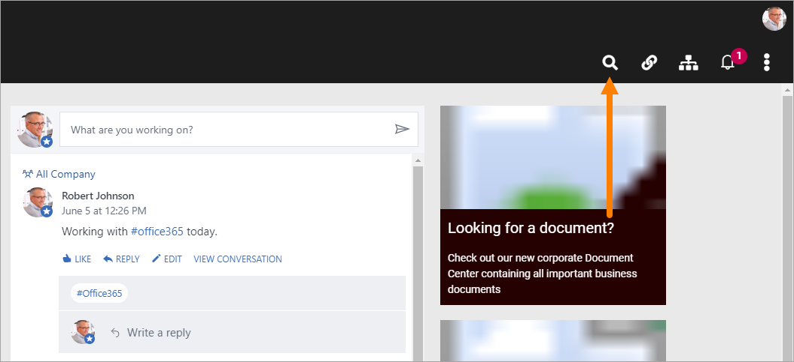
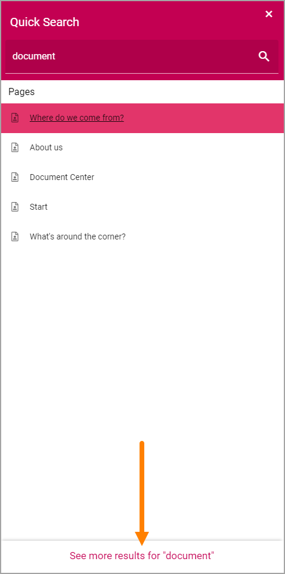
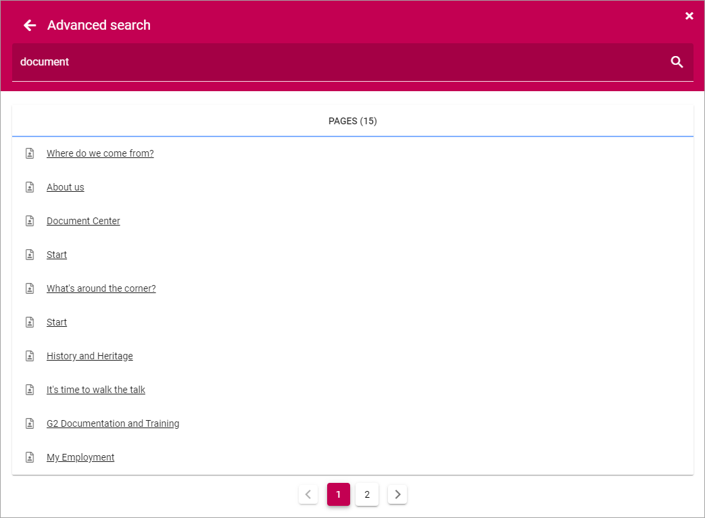
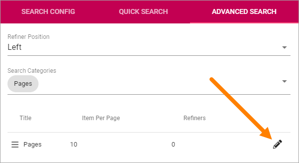
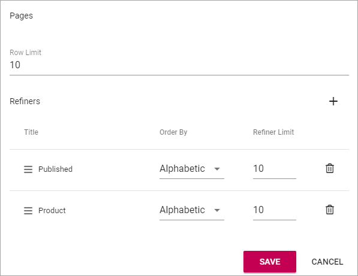

Search
===========================================

Use these options for settings for general Search configuration, Quick Search and Advanced Search.

Search config
***************
Use the settings shown in the image above:

Search Categories
-------------------
Use these settings to add and edit Search Categories.

To create a new Search Category, click the plus and use the following settings:

+ **Title**: Add a title for the Search Category.
+ **Search Result Source**: Select Source from the list.
+ **Search Query**: Add the Search Query here (see below for an example).
+ **Search Templates**: Select one or more Search Templates from the list.

Here's an example of a Search Category:

.. image:: search-example.png

Search Templates
--------------------
Search Templates are created by developers and are simply listed here. If several Search Templates for the same purpose are available, the chosen Search Template can be activated here.

Quick Search
***************
Quick Search is available in the Heading (can be turned off in settings):

For Quick Search, the following settings are available:

.. image:: quick-search-settings.png

+ **Search Categories**: One or more Search Categories can be added (if more than one is available).
+ **Row Limit**: You can set Row Limit for each Search Category. Row Limit is number of objects per Search Results "page".

Advanced Search
*****************
When a search has been made in Quick Search, Advanced Search is available through this link:

Something like this is shown:

Use these settings for Advanced Search:

.. image:: advanced-search.png

+ **Refiner Positions**: Select where the Refiners will be placed - Left or Right.
+ **Search Categories**: Add one or Search Categories to use in Advanced Search.

Additional settings can be reached by clicking the pen for a Search Category:

Then these settings is available:

.. image:: advanced-search-category-settings.png

+ **Row Limit**: Select number of search result rows for each "page".
+ **Refiners**: Use this option to add refiners for the Search Category (click the plsu to add).

Here's an example with two Refiners added:

