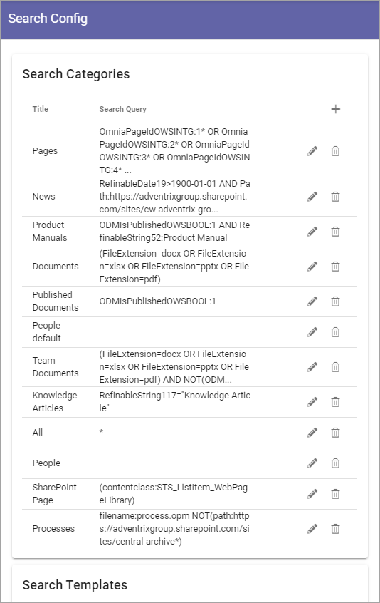
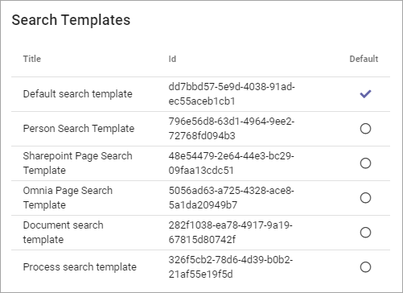
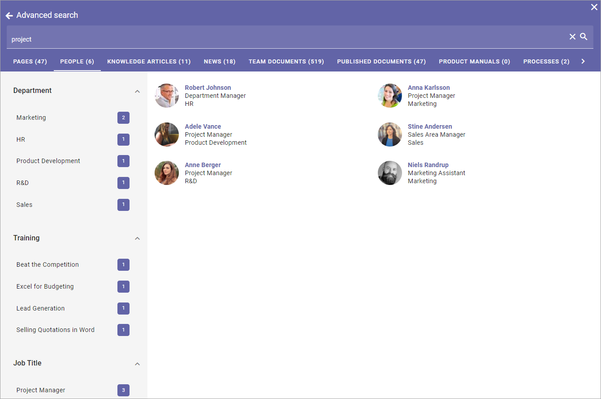
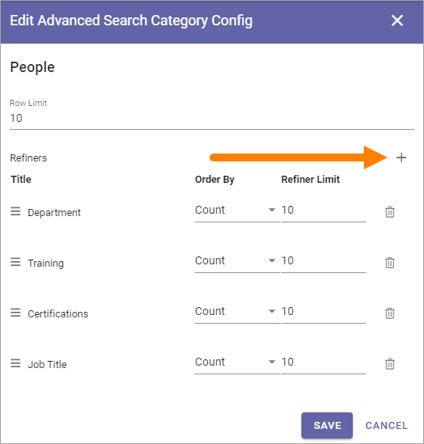
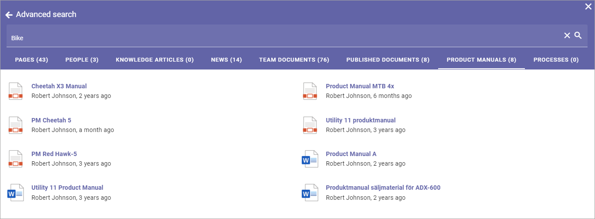

Search
===========================================

Use these options for settings for general Search configuration, Quick Search and Advanced Search.

.. image:: search-new-new2.png

In Omnia 6.7, there will be two additional options:

.. image:: search-67.png

Select section for more information:

Search config
***************
Using the "Search config" tab you can work with Search Categories and set default Search Template.

To edit a Search config, click the pen. To delete a Search config, click the dust bin.

Search Categories
-------------------
To create a new Search Category, click the plus and use the settings available for the Search Provider. All settings listed below.

.. image:: search-config-categories-4-new2.png

+ **Title**: Add a title for the Search Category, in some or all languges available in the tenant (click the flag to change language).
+ **Search Providers**: Select search provider for the category. The following is available: Comments, Shared Links, Sharepoint Search and Microsoft Search. **Note!** In Omnia on-prem only Sharepoint Search and Shared Links can be used as Search Providers.
+ **Search Result Source**: Select Source from the list.
+ **Search Query**: Add the Search Query here.
+ **Enable Query Rules**: Query rules can be set up in Sharepoint. If these query rules should be , used for this category, select this option.
+ **Enable partial word search**: Per default the search will onfly find whole words, so a search for Chris will find just that, not for example Christina. But if you select this option, the search will find parts of words as well, so both Chris, Christina and Christian, for example.
+ **Sort By**: Choose property to sort by, or you can choose to sort by Relevance or Popularity (at the bottom of the list).
+ **Sort Direction**: When you have chosen a property to sort by, you can select a sort direction here.
+ **Search Templates**: Select one or more Search Templates from the list.
+ **Targeting filter**: A search category can be targeted to a specific group of people based on the targeting system in Omnia. This setting will be used both in Quick and Advanced search.

The same settings are available when editing a Search Category.

Search Templates
--------------------
Search Templates are created by developers and are simply listed here. A Search Template defines how to display a search result. If a search result happens to not match any Search Template, the Default search template is used. You can set Default search template by clicking any of the templates in the list.

In this example the selected Default search template is actually named that, but any other template can be selected.

Quick Search
***************
Quick Search is available in the Heading (can be turned off in settings):

.. image:: quick-search-start-page-new2.png

Quick Search can also be available through the Search block.

For Quick Search, the following settings are available:

.. image:: quick-search-settings-new3.png

+ **Search Categories**: One or more Search Categories can be added (if more than one is available).
+ **Row Limit**: You can set Row Limit for each Search Category. Row Limit is the number of objects per Search Results "page".

For more information about the Search block, see: :doc:`The Search block </blocks/search/index>`

Advanced Search
*****************
When a search has been made in Quick Search, Advanced Search is available through a link at the bottom. Advanced search can also be made available using the Search block.

.. image:: advanced-search-in-quick-new2.png

Something like this is shown:

To the left refiners are shown, if any are set up.

For more information on how to make Advanced search available through the Search block, see: :doc:`The Search block </blocks/search/index>`

Use these settings for Advanced Search:

.. image:: advanced-search-all-new.png

General
------------
On this tab the following settings are available:

.. image:: advanced-search-new4.png

+ **Refiner Positions**: Select where the Refiners will be placed - Left or Right.
+ **Search Categories**: Open the list to add or remove Search Categories to use in Advanced Search.

Additional settings can be reached by clicking the pen for a Search Category:

.. image:: advanced-search-pen-new3.png

Then these settings are available:

.. image:: advanced-search-category-settings-new2.png

+ **Row Limit**: Select number of search result rows for each "page". 
+ **Refiners**: Use this option to add refiners for the Search Category (click the plus to add).
+ **Order By**: Set the sorting in the refiner's lists; "Count" (=number of hits) or "Alphabetic".
+ **Refiner Limit**: Set the number of refiner selections to be shown before a "Show more" link is displayed. 

To delete a Refiner, just click the dust bin.

To create a new refiner, do the following:

1. click the plus.

2. Select property for the refiner.

.. image:: new-refiner-2-new.png

3. Set "order By" and "Refiner Limit" and save.

.. image:: new-refiner-3-new.png

Here's an example of refiners for Pages, with 43 hits:

The user can now use the refiners to the left. Let's say, for example, that the user knows the page is authored by Anna Karlsson - it's just 5 pages:

.. image:: search-refiners-example-refined-new.png

Custom Search Target
----------------------
If you activate this option you can change what will happen when a user clicks the Advanced Search link, for example after having made a Quick Search. This is useful for example if a specific Search Center should be used.

.. image:: custom-search-target-new-url.png

