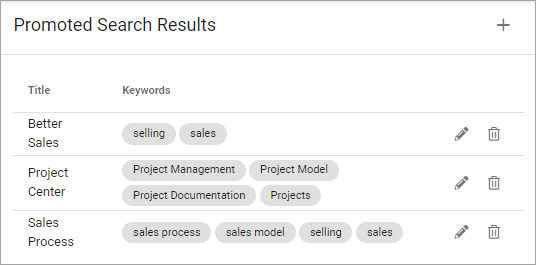
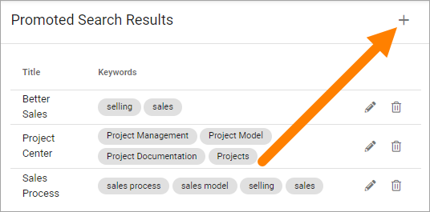

Promoted search results
===========================

Based on search feedback, an administrator can create promoted search results in Omnia admin.

Whenever a user searches on any of the keywords of a promoted search result, it will be available here in advanced search:

.. image:: promoted-search-results-place.png

Or here in quick search:

.. image:: promoted-search-results-quick-new.png

You decide to enable/disable promoted search results in the settings for advanced search and for quick search, respectively.

You create a list of promoted search result to be used for both advanced search and quick search. Here's an example:

To edit, click the pen. To delete, click the dust bin.

When you edit a promoted search result, the same settings are available as when creating a new one, see below.

Create a new promoted search result
************************************
Do the following:

1. Click the plus.

2. Use the following settings:

.. image:: promoted-search-results-settings.png

+ **URL**: Type or paste a URL that a click on the heading should go to.
+ **Title**: Type the clickable heading that will be shown in advanced search, in any tenant language. An example is shown in the top image.
+ **Description**: This text will be shown under the heading, in any tenant language. An example is shown in the top image.
+ **ADD IMAGE**: If you want, you can add an image to be shown by the promoted search result (see example in the top image).
+ **Keywords** Add the keywords that will result in the promoted search result being shown.
+ **On hold**: On hold means it's not active yet. To enable this search result, select "Active".
+ **Active**: When a promoted search result is active, you can set start and end dates if you wish. It's not mandatory.
+ **Targeting**: A promoted search result can be targeted, meaning just shown to some users. See this page for more information: :doc:`Using targeting </general-assets/targeting-in-omnia/index>`

3. Click CREATE when you're done.

